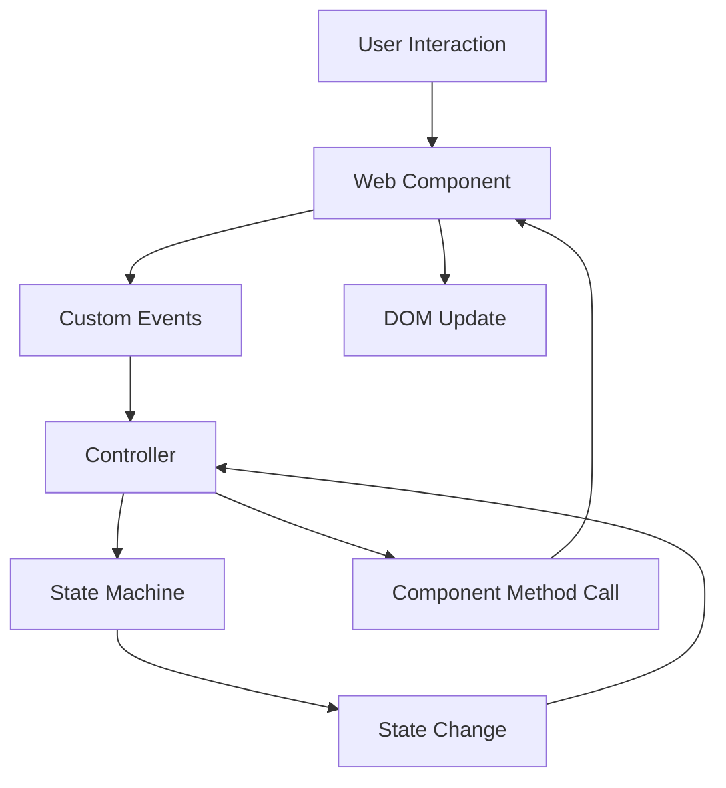

# New Architecture: Proper Separation of Concerns

## Overview

We've refactored the mobile navigation to follow proper architectural patterns with clear separation between the View layer (Web Components) and Controller layer (State Machines).

## Architecture Layers

### 1. View Layer (Web Components)
**File: `src/components/ui/mobile-nav/component.ts`**
- **Responsibility**: Pure presentation and user interaction
- **Contains**: HTML templates, CSS styles, DOM manipulation, event handling
- **Does NOT contain**: Business logic, state management, external dependencies

**Key Features:**
- Custom element `<mobile-nav>` with slots for content
- CSS-in-JS with proper encapsulation
- Accessibility features (ARIA, focus management, keyboard support)
- Touch gesture handling
- Custom events for communication

### 2. Controller Layer (Actor-Based State Management)
**Directory: `src/components/ui/mobile-nav/`**
- **Responsibility**: Pure business logic and state management
- **Contains**: State transitions, data management, analytics tracking, serializable configuration
- **Does NOT contain**: DOM manipulation, styling, HTML

**File Structure:**
- `types.ts` - Type definitions and interfaces
- `machine.ts` - Serializable state machine configuration
- `actions.ts` - Pure action functions, guards, and services
- `controller.ts` - Actor management and view communication
- `index.ts` - Main exports

**Key Features:**
- XState v5 compatible state machine with proper TypeScript support
- Fully serializable state machine configuration
- Separated concerns with proper actor model
- Graceful fallback if XState fails
- Analytics and interaction tracking
- Clean event-based communication

### 3. Integration Layer (Controller Class)
**File: `src/components/ui/mobile-nav/controller.ts` (MobileNavController)**
- **Responsibility**: Connect View and Controller layers
- **Contains**: Actor lifecycle management, event binding, state synchronization
- **Pattern**: Actor model with observer pattern for reactive updates

## Communication Flow



## Implementation Details

### Component Usage
```html
<!-- In navbar component -->
<mobile-nav aria-hidden="true">
  <ul slot="navigation" class="navlist primary-nav">
    <li><a href="/about">About</a></li>
    <!-- ... more links -->
  </ul>
  <ul slot="social" class="navlist secondary-nav">
    <!-- social links -->
  </ul>
</mobile-nav>
```

### Controller Integration
```javascript
// Automatic initialization in navbar component
const mobileNavElement = this.querySelector('mobile-nav');
const controller = new MobileNavController(mobileNavElement);

// Controller handles all communication between view and state machine
```

### Event System
```javascript
// Component emits semantic events
component.dispatchEvent(new CustomEvent('nav-close-requested', {
  detail: { source: 'swipe-right' }
}));

// Controller listens and manages state
controller.close('swipe-right');

// State machine tracks interactions
state.context.closeSource = 'swipe-right';
```

## Benefits

### ✅ Proper Separation of Concerns
- View components handle only presentation
- State machines handle only logic
- Clear boundaries and responsibilities

### ✅ Testability
- Components can be tested in isolation
- State machines can be unit tested without DOM
- Predictable state transitions

### ✅ Maintainability
- Changes to styling don't affect logic
- Business logic changes don't break UI
- Clear code organization

### ✅ Reusability
- Web components can be used anywhere
- State machines can be shared across components
- Modular architecture

### ✅ Progressive Enhancement
- Works without JavaScript (basic fallback)
- Graceful degradation if XState fails
- Multiple fallback layers

## File Structure

```
src/components/ui/
├── mobile-nav/                  # Mobile Navigation Actor (Complete)
│   ├── types.ts                 # Type definitions
│   ├── machine.ts               # State machine configuration
│   ├── actions.ts               # Pure functions (actions, guards, services)
│   ├── controller.ts            # Actor management & view communication
│   ├── component.ts             # View Layer (Web Component)
│   └── index.ts                 # Main exports
├── simple-mobile-nav.js         # Ultimate Fallback
└── navbar.js                    # Integration Point
```

## Migration Benefits

### Before (Problems)
```javascript
// ❌ State machine creating DOM elements
createModal: (context) => {
  const modal = document.createElement('div');
  modal.innerHTML = `<div>...</div>`;
  document.body.appendChild(modal);
}

// ❌ Mixed concerns
// ❌ Hard to test
// ❌ Tight coupling
```

### After (Solution)
```javascript
// ✅ Web component handles DOM
class MobileNavComponent extends HTMLElement {
  render() {
    this.innerHTML = `<nav>...</nav>`;
  }
}

// ✅ State machine handles logic only
const stateMachine = createMachine({
  states: {
    open: { /* pure logic */ },
    closed: { /* pure logic */ }
  }
});

// ✅ Controller connects them
class Controller {
  handleStateChange(state) {
    if (state.value === 'open') {
      this.component.open();
    }
  }
}
```

## TypeScript Migration Path

Now that we have proper separation of concerns, converting to TypeScript will be much easier:

1. **Convert Web Components** (`*.ts`)
   - Add interfaces for component properties
   - Type custom events and their detail objects
   - Add proper DOM element typing

2. **Convert State Machines** (`*.ts`)
   - Use XState's built-in TypeScript support
   - Add context and event type definitions
   - Type-safe state transitions

3. **Convert Controllers** (`*.ts`)
   - Type the component/state machine interfaces
   - Add method signatures
   - Event handler typing

## TypeScript Migration Completed ✅

The mobile navigation has been successfully migrated to TypeScript with an actor-based model:

### New Actor-Based Architecture Features

**✅ Proper Separation of Concerns**
- `types.ts` - Pure type definitions and interfaces
- `machine.ts` - Serializable state machine configuration
- `actions.ts` - Pure business logic functions
- `controller.ts` - Actor lifecycle and view communication
- `index.ts` - Clean public API

**✅ Serializable State Machine**
- Configuration can be serialized/deserialized
- Separate action implementations from configuration
- Testable state machine logic
- Runtime inspection and debugging

**✅ Type Safety**
- Full TypeScript support with XState v5
- Type-safe event handling
- Interface-based component communication
- Compile-time error checking

**✅ Actor Model Benefits**
- Encapsulated state management
- Message-based communication
- Isolated error handling
- Concurrent operation support

### Usage Example

```typescript
// Import the actor
import MobileNavController from './mobile-nav/index.js';

// Create controller with typed component
const controller = new MobileNavController(mobileNavElement);

// Type-safe API calls
controller.open('hamburger-button');
controller.close('backdrop');
controller.selectItem({ href: '/about', text: 'About' });

// Access serializable state
const state = controller.getState();
```

### Benefits Achieved

1. **Maintainability** - Clear file organization with single responsibilities
2. **Testability** - Pure functions and serializable state
3. **Type Safety** - Compile-time error detection
4. **Debuggability** - Runtime state inspection
5. **Reusability** - Modular actor pattern
6. **Performance** - Efficient state management

## Next Steps

1. **Test the new architecture** ✅ - TypeScript compilation successful
2. **Convert to TypeScript** ✅ - Migration completed
3. **Apply pattern to other components** - Code modal, diagrams, forms
4. **Add comprehensive tests** - Unit tests for each layer
5. **Documentation** - Usage examples and API docs

This actor-based architecture provides a robust foundation for building complex, maintainable UI components with proper state management and type safety.

## Modern Web Standards Integration

### Browser-Native Module System

We use **Import Maps** instead of bundlers for dependency resolution:

```html
<script type="importmap">
{
  "imports": {
    "xstate": "https://cdn.jsdelivr.net/npm/xstate@5/+esm"
  }
}
</script>
```

**Benefits:**
- ✅ No build complexity
- ✅ HTTP/2 multiplexing and CDN caching
- ✅ Web standard compliance
- ✅ Fast development cycle
- ✅ Easy dependency updates

### Progressive Enhancement Stack

#### **Visual & UI Standards**
- **Container Queries** - Component-responsive design for state machine diagrams
- **View Transitions API** - Smooth SPA navigation without frameworks
- **CSS Cascade Layers** - Organized styling architecture
- **Declarative Shadow DOM** - SEO-friendly web components

#### **Performance & Monitoring**
- **Performance Observer API** - Advanced analytics beyond Web Vitals
- **Intersection Observer v2** - Visibility tracking for educational content
- **Web Vitals** - Core performance metrics (already implemented)

#### **State Management & Real-time**
- **Broadcast Channel API** - Sync state across browser tabs
- **Web Streams API** - Stream state machine events
- **Server-Sent Events** - Real-time collaborative features
- **Web Locks API** - Atomic state operations

#### **PWA & Native Integration**
- **Web App Manifest** - Enhanced app-like experience
- **File System Access API** - Save/load state machine configurations
- **Permissions API** - Graceful feature degradation
- **Background Sync** - Offline capability

### Implementation Priority

1. **View Transitions API** ✅ - Smooth navigation (implemented in TypeScript)
2. **Container Queries** - Better responsive diagrams
3. **Broadcast Channel** - Multi-tab synchronization
4. **Performance Observer** - Enhanced analytics
5. **File System Access** - Configuration management

### TypeScript-First Development

All new components and utilities are created in TypeScript:

**✅ Completed TypeScript Migrations:**
- `src/scripts/dev-config.ts` - Development configuration system
- `src/scripts/main.ts` - Main application script
- `src/components/ui/mobile-nav/` - Full actor-based mobile navigation
- `src/components/ui/view-transitions.ts` - View Transitions API utility
- `src/components/ui/navbar.ts` - Core navigation component with type-safe integration
- `src/components/ui/ui-orchestrator.ts` - Central UI coordination with viewport monitoring and modal management
- `src/components/sections/about-section.ts` - About page content with typed custom events and interactive features
- `src/components/sections/projects-section.ts` - Portfolio showcase with type-safe project data and attribute escaping
- `src/components/ui/breadcrumbs.ts` - Navigation breadcrumbs with type-safe path parsing and security escaping
- `src/components/sections/blog-posts.ts` - Blog post showcase with type-safe post data and click tracking
- `src/components/ui/search-component.ts` - Site-wide search with type-safe data structures and keyboard shortcuts
- `src/components/ui/related-content.ts` - Content recommendation system with path-based content mapping
- `src/components/ui/brand-icon.ts` - Customizable brand icon with color validation and animation controls
- `src/components/ui/search-modal.ts` - Search modal with type-safe event handling and keyboard navigation
- `src/components/ui/privacy-notice.ts` - Privacy consent management with localStorage type safety and expiry tracking

## 🎉 **Two 100% TypeScript Pages Completed!**

### **✅ Blog Page** - First Fully TypeScript-Powered Page
The Blog page is now our first completely TypeScript-powered page with:
- **Type-safe blog post data structures** (`BlogPost` interface)
- **Custom event type safety** (`BlogPostClickEvent` interface)  
- **Security-focused HTML escaping** (XSS protection)
- **Future-ready API integration** (`BlogPostApiResponse` interface)
- **Clean public API** (search, filter, and access methods)

**Blog Page TypeScript Coverage**: 100% ✅
- Core components: `navbar.ts`, `breadcrumbs.ts`, `blog-posts.ts`

## 🎉 **Second 100% TypeScript Page Completed!**

**About Page TypeScript Coverage**: 100% ✅
- Core components: `navbar.ts`, `breadcrumbs.ts`, `about-section.ts`, `projects-section.ts` 
- Shared components: `search-component.ts`, `related-content.ts`, `brand-icon.ts`, `search-modal.ts`, `privacy-notice.ts`
- **All 8 components migrated!** ✨

### **✅ About Page** - Second Fully TypeScript-Powered Page
The About page is now our second completely TypeScript-powered page with:
- **Advanced search functionality** (`SearchModal`, `SearchComponent` with type-safe data structures)
- **Privacy consent management** (`PrivacyNotice` with localStorage type safety and expiry tracking)
- **Content recommendation system** (`RelatedContent` with path-based content mapping)
- **Interactive brand components** (`BrandIcon` with color validation and animation controls)
- **Navigation components** (`Navbar`, `Breadcrumbs` with type-safe event handling)
- **Content sections** (`AboutSection`, `ProjectsSection` with custom events and data validation)

**🎯 TypeScript Benefits Achieved:**
- Compile-time error detection
- Enhanced IDE support with IntelliSense
- Type-safe API contracts
- Better refactoring capabilities
- Self-documenting code with type annotations
- Security-focused HTML/attribute escaping across all components
- Comprehensive error handling with graceful fallbacks

**📋 TypeScript Development Guidelines:**

1. **New Files**: Always create `.ts` files, never `.js` files
2. **Type Safety**: Use proper TypeScript types, avoid `any` except for DOM API workarounds
3. **Interfaces**: Define clear interfaces for complex objects and API contracts
4. **Compilation**: Run `pnpm compile-scripts` before testing
5. **Import Paths**: Reference compiled `.js` files in dist/ for runtime imports

**Example TypeScript Component Structure:**
```typescript
// src/components/ui/example-component.ts
interface ComponentOptions {
    theme?: 'light' | 'dark';
    autoClose?: boolean;
}

class ExampleComponent extends HTMLElement {
    private options: ComponentOptions;
    
    constructor(options: ComponentOptions = {}) {
        super();
        this.options = { theme: 'dark', autoClose: true, ...options };
    }
    
    // Type-safe method implementations...
}

export default ExampleComponent;
```

### Hybrid Development Approach

Our approach combines:
- **TypeScript compilation** for type safety
- **Import maps** for module resolution
- **Web standards** for functionality
- **No bundling** for simplicity

This gives us modern development experience without build tool complexity. 