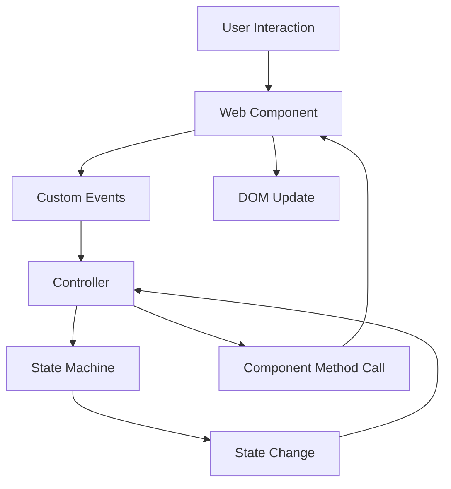

# New Architecture: Proper Separation of Concerns

## Overview

We've refactored the mobile navigation to follow proper architectural patterns with clear separation between the View layer (Web Components) and Controller layer (State Machines).

## Architecture Layers

### 1. View Layer (Web Components)
**File: `src/components/ui/mobile-nav-component.js`**
- **Responsibility**: Pure presentation and user interaction
- **Contains**: HTML templates, CSS styles, DOM manipulation, event handling
- **Does NOT contain**: Business logic, state management, external dependencies

**Key Features:**
- Custom element `<mobile-nav>` with slots for content
- CSS-in-JS with proper encapsulation
- Accessibility features (ARIA, focus management, keyboard support)
- Touch gesture handling
- Custom events for communication

### 2. Controller Layer (State Machine)
**File: `src/components/ui/mobile-nav-state-machine.js`**
- **Responsibility**: Pure business logic and state management
- **Contains**: State transitions, data management, analytics tracking
- **Does NOT contain**: DOM manipulation, styling, HTML

**Key Features:**
- XState v5 compatible state machine
- Graceful fallback if XState fails
- Analytics and interaction tracking
- Clean event-based communication

### 3. Integration Layer (Controller Class)
**File: `src/components/ui/mobile-nav-state-machine.js` (MobileNavController)**
- **Responsibility**: Connect View and Controller layers
- **Contains**: Event binding, state synchronization
- **Pattern**: Observer pattern for reactive updates

## Communication Flow



## Implementation Details

### Component Usage
```html
<!-- In navbar component -->
<mobile-nav aria-hidden="true">
  <ul slot="navigation" class="navlist primary-nav">
    <li><a href="/about">About</a></li>
    <!-- ... more links -->
  </ul>
  <ul slot="social" class="navlist secondary-nav">
    <!-- social links -->
  </ul>
</mobile-nav>
```

### Controller Integration
```javascript
// Automatic initialization in navbar component
const mobileNavElement = this.querySelector('mobile-nav');
const controller = new MobileNavController(mobileNavElement);

// Controller handles all communication between view and state machine
```

### Event System
```javascript
// Component emits semantic events
component.dispatchEvent(new CustomEvent('nav-close-requested', {
  detail: { source: 'swipe-right' }
}));

// Controller listens and manages state
controller.close('swipe-right');

// State machine tracks interactions
state.context.closeSource = 'swipe-right';
```

## Benefits

### ✅ Proper Separation of Concerns
- View components handle only presentation
- State machines handle only logic
- Clear boundaries and responsibilities

### ✅ Testability
- Components can be tested in isolation
- State machines can be unit tested without DOM
- Predictable state transitions

### ✅ Maintainability
- Changes to styling don't affect logic
- Business logic changes don't break UI
- Clear code organization

### ✅ Reusability
- Web components can be used anywhere
- State machines can be shared across components
- Modular architecture

### ✅ Progressive Enhancement
- Works without JavaScript (basic fallback)
- Graceful degradation if XState fails
- Multiple fallback layers

## File Structure

```
src/components/ui/
├── mobile-nav-component.js      # View Layer (Web Component)
├── mobile-nav-state-machine.js  # Controller Layer (State Machine + Controller)
├── simple-mobile-nav.js         # Ultimate Fallback
└── navbar.js                    # Integration Point
```

## Migration Benefits

### Before (Problems)
```javascript
// ❌ State machine creating DOM elements
createModal: (context) => {
  const modal = document.createElement('div');
  modal.innerHTML = `<div>...</div>`;
  document.body.appendChild(modal);
}

// ❌ Mixed concerns
// ❌ Hard to test
// ❌ Tight coupling
```

### After (Solution)
```javascript
// ✅ Web component handles DOM
class MobileNavComponent extends HTMLElement {
  render() {
    this.innerHTML = `<nav>...</nav>`;
  }
}

// ✅ State machine handles logic only
const stateMachine = createMachine({
  states: {
    open: { /* pure logic */ },
    closed: { /* pure logic */ }
  }
});

// ✅ Controller connects them
class Controller {
  handleStateChange(state) {
    if (state.value === 'open') {
      this.component.open();
    }
  }
}
```

## TypeScript Migration Path

Now that we have proper separation of concerns, converting to TypeScript will be much easier:

1. **Convert Web Components** (`*.ts`)
   - Add interfaces for component properties
   - Type custom events and their detail objects
   - Add proper DOM element typing

2. **Convert State Machines** (`*.ts`)
   - Use XState's built-in TypeScript support
   - Add context and event type definitions
   - Type-safe state transitions

3. **Convert Controllers** (`*.ts`)
   - Type the component/state machine interfaces
   - Add method signatures
   - Event handler typing

## Next Steps

1. **Test the new architecture** - Verify mobile navigation works
2. **Convert to TypeScript** - Add proper type safety
3. **Apply pattern to other components** - Code modal, diagrams, forms
4. **Add comprehensive tests** - Unit tests for each layer
5. **Documentation** - Usage examples and API docs

This architecture provides a solid foundation for building complex, maintainable UI components with proper state management. 