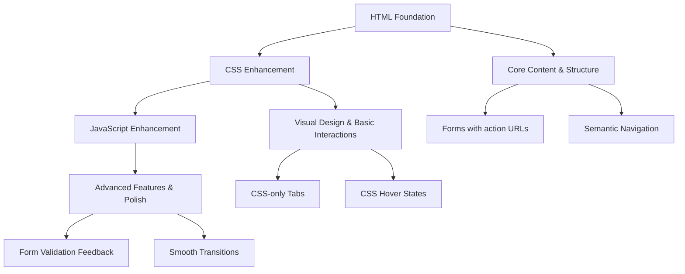

# Progressive Enhancement & JavaScript Performance Design

## Architecture Overview

Our progressive enhancement strategy follows a three-layer approach:



## Technical Design

### Core Components

#### 1. HTML-First Forms
- **Purpose**: Ensure forms work without JavaScript
- **Responsibilities**: 
  - Standard form submission to server endpoints
  - HTML5 validation attributes
  - Semantic markup for accessibility
- **Interface**: 
  ```html
  <form action="/api/contact" method="POST">
    <!-- Works without JS -->
  </form>
  ```

#### 2. CSS-Only Interactive Elements
- **Purpose**: Provide interactivity without JavaScript
- **Responsibilities**:
  - Tab switching using `:target` or radio buttons
  - Hover/focus states for all interactive elements
  - CSS-only carousel with scroll-snap
- **Interface**:
  ```css
  /* Radio button hack for tabs */
  input[type="radio"]:checked ~ .content { display: block; }
  ```

#### 3. Progressive JavaScript Module
- **Purpose**: Enhance experience when JS is available
- **Responsibilities**:
  - Enhance form validation UI
  - Add smooth transitions
  - Improve mobile interactions
- **Interface**: Single inline script or small external module

### State Management
- **No State Required**: CSS handles UI state through pseudo-classes
- **Form State**: Browser native form validation
- **Enhancement Detection**: CSS classes added via JS

### Data Flow
1. **Initial Load**: HTML renders with full content
2. **CSS Applied**: Visual design and basic interactions work
3. **JS Detection**: Check if JS is enabled
4. **Progressive Enhancement**: Add JS-only features if available
5. **Graceful Degradation**: Features work without JS

## Implementation Details

### Technology Stack
- **HTML**: Semantic HTML5 with proper ARIA
- **CSS**: Modern CSS with fallbacks
- **JavaScript**: Vanilla JS, minimal footprint
- **No Dependencies**: Zero external libraries

### JavaScript Architecture

```javascript
// Progressive Enhancement Pattern
(function() {
  'use strict';
  
  // Feature detection
  if (!('classList' in document.documentElement)) return;
  
  // Mark JS as available
  document.documentElement.classList.add('js-enabled');
  
  // Enhance forms
  enhanceForms();
  
  // Enhance navigation
  enhanceNavigation();
  
  function enhanceForms() {
    // Add real-time validation
    // Show/hide error messages
    // Add loading states
  }
  
  function enhanceNavigation() {
    // Smooth scroll
    // Improved mobile interactions
  }
})();
```

### CSS-Only Form Tabs with ARIA (No JS Required)

```html
<!-- Radio button approach with accessibility -->
<div class="form-tabs-container">
  <input type="radio" name="form-tab" id="tab-contact" checked class="visually-hidden">
  <input type="radio" name="form-tab" id="tab-newsletter" class="visually-hidden">
  
  <div class="form-tabs" role="tablist" aria-label="Choose a form">
    <label for="tab-contact" role="tab" id="tab-contact-label" 
           aria-controls="panel-contact" tabindex="0">Contact</label>
    <label for="tab-newsletter" role="tab" id="tab-newsletter-label" 
           aria-controls="panel-newsletter" tabindex="-1">Newsletter</label>
  </div>
  
  <div class="forms-grid">
    <section id="panel-contact" class="form-card contact-form-card" 
             role="tabpanel" aria-labelledby="tab-contact-label">
      <!-- Contact form content -->
    </section>
    <section id="panel-newsletter" class="form-card newsletter-form-card" 
             role="tabpanel" aria-labelledby="tab-newsletter-label">
      <!-- Newsletter form content -->
    </section>
  </div>
</div>
```

```css
/* Visually hidden helper */
.visually-hidden {
  position: absolute !important;
  width: 1px;
  height: 1px;
  overflow: hidden;
  clip: rect(0 0 0 0);
  white-space: nowrap;
  clip-path: inset(50%);
}

/* Tab styling */
.form-tabs {
  display: flex;
  gap: 0.5rem;
}

.form-tabs label {
  cursor: pointer;
  /* Additional styling */
}

/* Show/hide panels */
.forms-grid .form-card {
  display: none;
}

#tab-contact:checked ~ .forms-grid .contact-form-card {
  display: block;
}

#tab-newsletter:checked ~ .forms-grid .newsletter-form-card {
  display: block;
}

/* Reserve space for alerts to avoid CLS */
.form-alert {
  min-height: 1.5rem;
}
```

### Newsletter Form (Mailchimp) - HTML-First Implementation

```html
<form
  action="https://YOUR_DC.list-manage.com/subscribe/post?u=YOUR_U&id=YOUR_ID"
  method="post" novalidate class="pe-form pe-form--newsletter"
>
  <label for="mce-EMAIL">Email address</label>
  <input id="mce-EMAIL" name="EMAIL" type="email" required
         autocomplete="email" inputmode="email" aria-describedby="nl-help">
  
  <!-- Mailchimp honeypot: keep it -->
  <div class="visually-hidden" aria-hidden="true">
    <label for="hp-nl">Leave this field empty</label>
    <input id="hp-nl" type="text" name="b_YOUR_U_YOUR_ID" tabindex="-1" value="">
  </div>

  <button type="submit">Subscribe</button>
  <p id="nl-help" class="form-note">We'll send occasional updates. Unsubscribe anytime.</p>
  <p class="form-alert" role="status" aria-live="polite"></p>

  <noscript>
    <p class="form-note">After you submit, you'll be redirected to a confirmation page.</p>
  </noscript>
</form>
```

### Contact Form - Server Endpoint Implementation

```html
<form action="/api/contact" method="post" class="pe-form pe-form--contact">
  <fieldset>
    <legend>Contact me</legend>

    <label for="name">Name</label>
    <input id="name" name="name" type="text" required
           autocomplete="name" minlength="2" maxlength="70">

    <label for="email">Email</label>
    <input id="email" name="email" type="email" required autocomplete="email">

    <label for="msg">Message</label>
    <textarea id="msg" name="message" required minlength="10" maxlength="5000"></textarea>

    <!-- Honeypot (hidden to users) -->
    <div class="visually-hidden" aria-hidden="true">
      <label for="website">Leave this empty</label>
      <input id="website" name="website" type="text" tabindex="-1" autocomplete="off">
    </div>

    <!-- Optional: timestamp for bot detection -->
    <input type="hidden" name="ts" value="">
  </fieldset>

  <button type="submit">Send</button>
  <div class="form-alert" role="status" aria-live="polite"></div>

  <noscript>
    <p class="form-note">On submit you'll be taken to a confirmation page.  
       Or email me directly at <a href="mailto:consult@joseflores.dev">consult@joseflores.dev</a>.</p>
  </noscript>
</form>
```

### Minimal Enhancement Script (1-1.5KB)

```javascript
// Complete enhancement script - ~1.5KB minified
(()=>{"use strict";
const d=document.documentElement; 
d.classList.add('js-enabled');

// Enhance forms - prevent double submit
for (const f of document.querySelectorAll('.pe-form')) {
  f.addEventListener('submit', e=>{
    const btn=f.querySelector('button[type="submit"]');
    if(btn){ 
      btn.disabled=true; 
      btn.setAttribute('aria-busy','true'); 
      btn.dataset.orig=btn.textContent; 
      btn.textContent='Sending…'; 
    }
  }, {once:true});
}

// Tab focus management for accessibility
const tabs=document.querySelector('.form-tabs'); 
if(tabs){
  const ids={contact:'#panel-contact', newsletter:'#panel-newsletter'};
  function focusPanel(){
    const checked=document.querySelector('input[name="form-tab"]:checked');
    if(!checked) return; 
    const id=checked.id.includes('newsletter')?ids.newsletter:ids.contact;
    const panel=document.querySelector(id); 
    if(panel) {
      panel.setAttribute('tabindex','-1');
      panel.focus();
    }
  }
  document.addEventListener('change', e=>{ 
    if(e.target && e.target.name==='form-tab') focusPanel(); 
  });
}
})();
```

### Performance Strategy

#### 1. Inline Critical JavaScript
```html
<script>
  // Minimal feature detection and class additions
  document.documentElement.className += ' js';
</script>
```

#### 2. Defer Non-Critical JavaScript
```html
<script defer src="enhancements.js"></script>
```

#### 3. JavaScript Budget
- **Core inline script**: < 500 bytes
- **Enhancement module**: < 4.5KB
- **Total**: < 5KB minified

### Testing Strategy
- **No-JS Testing**: Disable JavaScript and verify all features work
- **Performance Testing**: Measure JS parse/execute time
- **Progressive Enhancement**: Test enhancement layers independently
- **Accessibility Testing**: Screen reader and keyboard navigation

## Performance Considerations

### JavaScript Optimizations
1. **Minimal DOM Queries**: Cache selectors
2. **Event Delegation**: Single listener for multiple elements
3. **Passive Listeners**: For scroll/touch events
4. **RequestAnimationFrame**: For animations
5. **Debouncing**: For resize/scroll handlers

### Loading Strategy
1. **Inline Critical JS**: Feature detection only
2. **Defer Enhancements**: Load after DOM ready
3. **Lazy Load**: Non-critical features on demand
4. **No Blocking**: All scripts async or deferred

### Bundle Size Targets
- **Inline script**: 200-500 bytes
- **Enhancement module**: 1-1.5KB minified
- **Gzipped total**: < 1KB

### Server Endpoint Example (Cloudflare Worker)

```javascript
export default {
  async fetch(request, env) {
    if (request.method !== 'POST') 
      return new Response('Method Not Allowed', { status: 405 });

    const url = new URL(request.url);
    const form = await request.formData();
    const name = (form.get('name') || '').toString().trim();
    const email = (form.get('email') || '').toString().trim();
    const message = (form.get('message') || '').toString().trim();
    const website = (form.get('website') || '').toString(); // honeypot

    // Validation
    if (website) // Bot detected
      return Response.redirect(new URL('/contact/thanks', url), 303);
    if (!name || !email || !message) 
      return Response.redirect(new URL('/contact?error=missing', url), 303);

    // Send email via Resend
    const payload = {
      from: 'Website <noreply@joseflores.dev>',
      to: ['consult@joseflores.dev'],
      reply_to: email,
      subject: `Contact from ${name}`,
      text: `From: ${name} <${email}>\n\n${message}`
    };

    const r = await fetch('https://api.resend.com/emails', {
      method: 'POST',
      headers: {
        'Authorization': `Bearer ${env.RESEND_API_KEY}`,
        'Content-Type': 'application/json'
      },
      body: JSON.stringify(payload)
    });

    if (!r.ok) 
      return Response.redirect(new URL('/contact?error=send', url), 303);
    
    return Response.redirect(new URL('/contact/thanks', url), 303);
  }
};
```

## Fallback Strategies

### Forms Without JavaScript
- Server-side validation and error display
- Success page redirect after submission
- Standard HTML5 validation messages

### Navigation Without JavaScript
- Anchor links for page sections
- CSS :target for showing/hiding content
- Standard browser scroll behavior

### Mobile Without JavaScript
- CSS-only touch interactions
- Native scroll and swipe
- Viewport-based responsive design