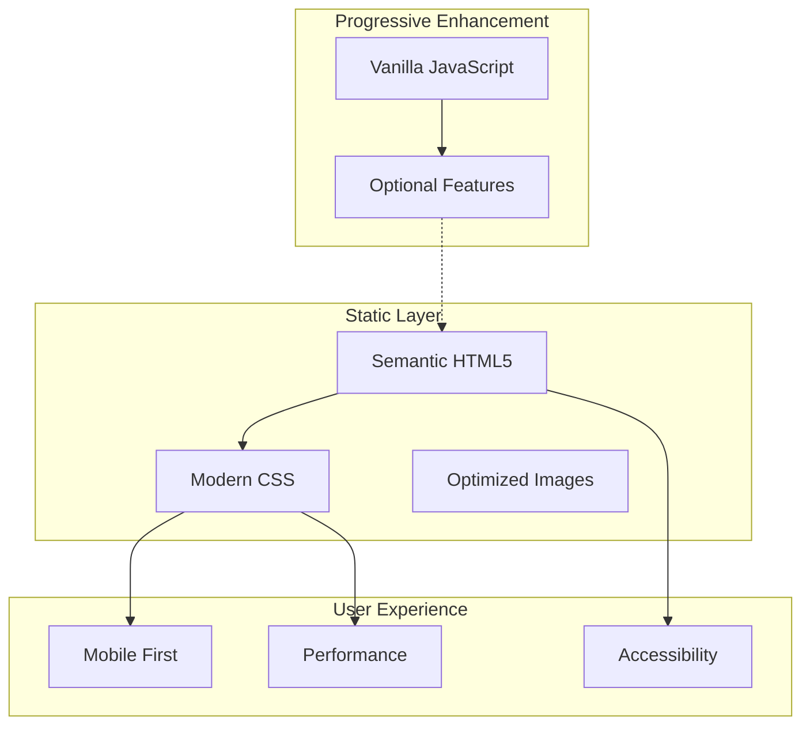

# Simplified Landing Page Design

## Architecture Overview

A static, CSS-first landing page with semantic HTML, modern CSS layouts, and minimal JavaScript for progressive enhancement only.



## Technical Design

### Core Components

#### 1. HTML Structure
- **Purpose**: Semantic, accessible markup
- **Approach**: Mobile-first, progressive enhancement
- **Structure**:
  ```html
  <!DOCTYPE html>
  <html lang="en">
    <head>
      <!-- Minimal, optimized head -->
    </head>
    <body>
      <header role="banner">
        <nav role="navigation">
      </header>
      <main role="main">
        <section id="hero" aria-label="Introduction">
        <section id="about" aria-label="About and Experience">
        <section id="services" aria-label="Services">
        <section id="contact" aria-label="Contact">
      </main>
      <footer role="contentinfo">
    </body>
  </html>
  ```

#### 2. CSS Architecture
- **Purpose**: Fast, maintainable styling
- **Methodology**: CUBE CSS (Composition, Utility, Block, Exception)
- **Organization**:
  ```
  styles/
    reset.css        # Modern CSS reset
    tokens.css       # Design tokens (colors, spacing, typography)
    layout.css       # Grid and composition layers
    blocks.css       # Component styles
    utilities.css    # Utility classes
    theme.css        # Dark/light theme
    print.css        # Print styles
  ```

#### 3. Design Tokens
- **Colors**:
  ```css
  :root {
    /* Neutral palette */
    --color-neutral-000: #ffffff;
    --color-neutral-050: #f8fafc;
    --color-neutral-100: #f1f5f9;
    --color-neutral-200: #e2e8f0;
    --color-neutral-300: #cbd5e1;
    --color-neutral-400: #94a3b8;
    --color-neutral-500: #64748b;
    --color-neutral-600: #475569;
    --color-neutral-700: #334155;
    --color-neutral-800: #1e293b;
    --color-neutral-900: #0f172a;
    
    /* Brand colors */
    --color-primary: #3b82f6;
    --color-primary-dark: #2563eb;
    --color-primary-light: #60a5fa;
    
    /* Semantic colors */
    --color-text: var(--color-neutral-800);
    --color-background: var(--color-neutral-000);
    --color-surface: var(--color-neutral-050);
    --color-border: var(--color-neutral-200);
  }
  
  /* Dark theme */
  @media (prefers-color-scheme: dark) {
    :root {
      --color-text: var(--color-neutral-100);
      --color-background: var(--color-neutral-900);
      --color-surface: var(--color-neutral-800);
      --color-border: var(--color-neutral-700);
    }
  }
  ```

- **Typography**:
  ```css
  :root {
    /* System font stack */
    --font-sans: -apple-system, BlinkMacSystemFont, "Segoe UI", Roboto, 
                 "Helvetica Neue", Arial, sans-serif;
    --font-mono: ui-monospace, "SF Mono", "Cascadia Code", "Roboto Mono", 
                 Consolas, monospace;
    
    /* Type scale */
    --text-xs: clamp(0.75rem, 2vw, 0.875rem);
    --text-sm: clamp(0.875rem, 2.5vw, 1rem);
    --text-base: clamp(1rem, 3vw, 1.125rem);
    --text-lg: clamp(1.125rem, 3.5vw, 1.25rem);
    --text-xl: clamp(1.25rem, 4vw, 1.5rem);
    --text-2xl: clamp(1.5rem, 5vw, 2rem);
    --text-3xl: clamp(2rem, 6vw, 3rem);
    --text-4xl: clamp(2.5rem, 8vw, 4rem);
    
    /* Line heights */
    --leading-tight: 1.2;
    --leading-normal: 1.5;
    --leading-relaxed: 1.75;
    
    /* Font weights */
    --font-light: 300;
    --font-normal: 400;
    --font-medium: 500;
    --font-semibold: 600;
    --font-bold: 700;
  }
  ```

- **Spacing**:
  ```css
  :root {
    /* Spacing scale */
    --space-1: 0.25rem;
    --space-2: 0.5rem;
    --space-3: 0.75rem;
    --space-4: 1rem;
    --space-5: 1.25rem;
    --space-6: 1.5rem;
    --space-8: 2rem;
    --space-10: 2.5rem;
    --space-12: 3rem;
    --space-16: 4rem;
    --space-20: 5rem;
    --space-24: 6rem;
    
    /* Container */
    --container-max: 1200px;
    --container-padding: clamp(1rem, 5vw, 2rem);
  }
  ```

### Layout System

#### CSS Grid Main Layout
```css
/* Main page grid */
.page-layout {
  display: grid;
  grid-template-rows: auto 1fr auto;
  min-height: 100vh;
}

/* Content sections */
.content-grid {
  display: grid;
  gap: var(--space-16);
  max-width: var(--container-max);
  margin-inline: auto;
  padding-inline: var(--container-padding);
}

/* Service cards grid */
.services-grid {
  display: grid;
  grid-template-columns: repeat(auto-fit, minmax(280px, 1fr));
  gap: var(--space-8);
}
```

#### Component Patterns

##### Hero Section
```html
<section class="hero" aria-label="Introduction">
  <div class="hero__content">
    <h1 class="hero__title">
      <span class="hero__name">Michael Wilson</span>
      <span class="hero__role">Strategic Consultant</span>
    </h1>
    <p class="hero__tagline">
      Helping businesses grow through careful planning, 
      genuine collaboration, and solutions that actually work.
    </p>
    <a href="#contact" class="button button--primary">
      Let's Talk
      <span aria-hidden="true">→</span>
    </a>
  </div>
  <div class="hero__decoration" aria-hidden="true"></div>
</section>
```

```css
.hero {
  position: relative;
  min-height: 100vh;
  display: grid;
  place-items: center;
  background: linear-gradient(135deg, 
    var(--color-neutral-050) 0%, 
    var(--color-neutral-100) 100%);
}

.hero__content {
  text-align: center;
  max-width: 60ch;
  padding: var(--space-8);
}

.hero__title {
  display: grid;
  gap: var(--space-4);
  margin-bottom: var(--space-8);
}

.hero__name {
  font-size: var(--text-4xl);
  font-weight: var(--font-light);
  line-height: var(--leading-tight);
}

.hero__role {
  font-size: var(--text-2xl);
  font-weight: var(--font-semibold);
  background: linear-gradient(90deg, 
    var(--color-primary) 0%, 
    var(--color-primary-light) 100%);
  -webkit-background-clip: text;
  -webkit-text-fill-color: transparent;
  background-clip: text;
}
```

##### Service Cards
```html
<div class="service-card">
  <div class="service-card__icon" aria-hidden="true">
    <svg><!-- Icon --></svg>
  </div>
  <h3 class="service-card__title">Strategic Planning</h3>
  <p class="service-card__description">
    Transform your vision into actionable roadmaps with 
    clear milestones and measurable outcomes.
  </p>
</div>
```

```css
.service-card {
  padding: var(--space-8);
  background: var(--color-surface);
  border-radius: 12px;
  border: 1px solid var(--color-border);
  transition: transform 0.2s ease, box-shadow 0.2s ease;
}

.service-card:hover {
  transform: translateY(-2px);
  box-shadow: 0 10px 30px rgba(0, 0, 0, 0.1);
}

.service-card__icon {
  width: 48px;
  height: 48px;
  margin-bottom: var(--space-4);
  color: var(--color-primary);
}

.service-card__title {
  font-size: var(--text-xl);
  font-weight: var(--font-semibold);
  margin-bottom: var(--space-3);
}
```

### Progressive Enhancement JavaScript

#### Smooth Scroll (CSS-only fallback)
```css
/* CSS-only smooth scroll */
html {
  scroll-behavior: smooth;
}

/* Respect motion preferences */
@media (prefers-reduced-motion: reduce) {
  html {
    scroll-behavior: auto;
  }
}
```

#### Optional Theme Toggle
```javascript
// Only if CSS prefers-color-scheme isn't sufficient
(function() {
  const toggle = document.querySelector('[data-theme-toggle]');
  if (!toggle) return;
  
  const theme = localStorage.getItem('theme') || 'auto';
  document.documentElement.dataset.theme = theme;
  
  toggle.addEventListener('click', () => {
    const current = document.documentElement.dataset.theme;
    const next = current === 'light' ? 'dark' : 
                 current === 'dark' ? 'auto' : 'light';
    document.documentElement.dataset.theme = next;
    localStorage.setItem('theme', next);
  });
})();
```

## Implementation Details

### File Structure
```
simplified-landing-page/
├── index.html              # Main HTML file
├── styles/
│   ├── reset.css          # CSS reset
│   ├── tokens.css         # Design tokens
│   ├── layout.css         # Layout compositions
│   ├── blocks.css         # Component styles
│   ├── utilities.css      # Utility classes
│   ├── theme.css          # Theme variations
│   └── print.css          # Print styles
├── images/
│   └── (optimized images)
└── enhance.js             # Optional progressive enhancement
```

### HTML Template Structure
```html
<!DOCTYPE html>
<html lang="en">
<head>
  <meta charset="UTF-8">
  <meta name="viewport" content="width=device-width, initial-scale=1.0">
  <title>Michael Wilson - Strategic Consultant</title>
  <meta name="description" content="Strategic consulting services...">
  
  <!-- Preload critical fonts -->
  <link rel="preconnect" href="https://fonts.gstatic.com" crossorigin>
  
  <!-- Critical CSS inline -->
  <style>
    /* Inline critical CSS for above-the-fold content */
  </style>
  
  <!-- Load rest of CSS -->
  <link rel="stylesheet" href="styles/main.css">
  
  <!-- Theme color -->
  <meta name="theme-color" content="#3b82f6">
</head>
<body>
  <!-- Skip to main content link -->
  <a href="#main" class="skip-link">Skip to main content</a>
  
  <!-- Main content here -->
  
  <!-- Optional enhancement script -->
  <script src="enhance.js" defer></script>
</body>
</html>
```

## Testing Strategy

### Validation
- HTML validation with W3C validator
- CSS validation with W3C CSS validator
- Accessibility audit with axe DevTools
- Lighthouse performance testing

### Cross-browser Testing
- Chrome/Edge (latest)
- Firefox (latest)
- Safari (latest)
- Mobile browsers (iOS Safari, Chrome Android)

### Performance Testing
- First Contentful Paint < 1s
- Time to Interactive < 2s
- Cumulative Layout Shift < 0.1
- Total page weight < 100KB

## Performance Considerations

### Critical CSS
- Inline above-the-fold styles
- Load remaining CSS asynchronously
- Minimize CSS file size (< 20KB)

### Image Optimization
- Use modern formats (WebP, AVIF)
- Responsive images with srcset
- Lazy loading for below-fold images
- Appropriate compression levels

### Font Strategy
- System fonts by default
- Optional web font with font-display: swap
- Preload critical font files

### Caching Strategy
- Long cache headers for assets
- Versioned file names
- Service worker for offline support (optional)

## Accessibility Checklist
- [ ] Semantic HTML structure
- [ ] Proper heading hierarchy
- [ ] ARIA labels where needed
- [ ] Keyboard navigation support
- [ ] Focus indicators visible
- [ ] Color contrast ratios meet WCAG AA
- [ ] Images have alt text
- [ ] Links have descriptive text
- [ ] Form inputs have labels
- [ ] Error messages are clear

## Security Considerations
- CSP headers for XSS protection
- No inline JavaScript (except theme toggle)
- No external dependencies in MVP
- HTTPS enforcement
- Input sanitization for any forms