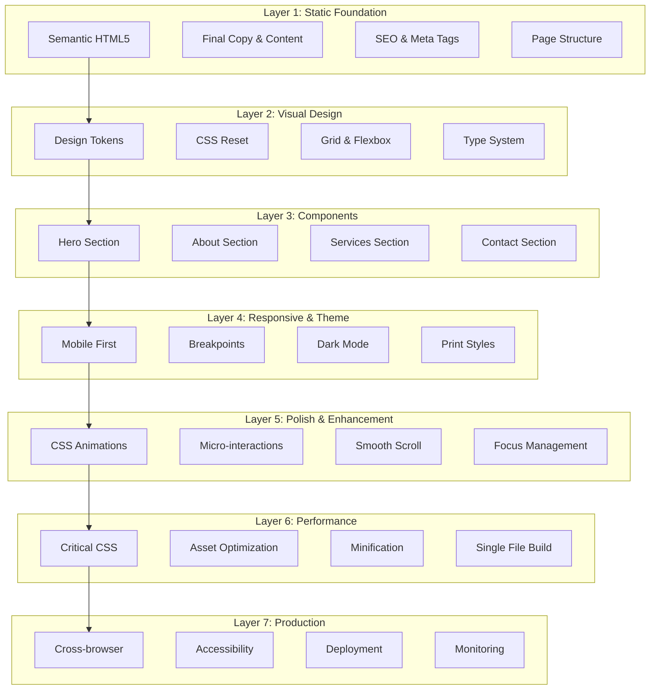

# Layered Development Workflow - Simplified Landing Page

## Overview

This document outlines the layered development approach for transforming the complex portfolio into a clean, performant landing page, progressing from static HTML/CSS foundation to minimal progressive enhancements.

## Development Layers



## Layer 1: Static Foundation (Day 1 Morning)

### Objectives
- Lock down all content and copy
- Create semantic HTML structure
- Implement SEO and meta tags
- Zero CSS, pure HTML functionality

### Implementation Steps

#### Pre-Layer Setup (Day 0)
```markdown
# Content Checklist
- [ ] Professional headline and tagline
- [ ] About section copy (2-3 paragraphs)
- [ ] Service descriptions (3-4 services)
- [ ] Contact information
- [ ] Social links
- [ ] Meta descriptions
```

#### HTML Structure
```html
<!DOCTYPE html>
<html lang="en">
<head>
    <meta charset="UTF-8">
    <meta name="viewport" content="width=device-width, initial-scale=1.0">
    <title>Michael Wilson - Strategic Consultant</title>
    <meta name="description" content="Strategic consulting services helping businesses grow through careful planning and genuine collaboration">
    
    <!-- Open Graph / Twitter Cards -->
    <meta property="og:title" content="Michael Wilson - Strategic Consultant">
    <meta property="og:description" content="Strategic consulting services...">
    <meta property="og:type" content="website">
    <meta property="og:url" content="https://example.com">
    <meta name="twitter:card" content="summary_large_image">
    
    <!-- Structured Data -->
    <script type="application/ld+json">
    {
      "@context": "https://schema.org",
      "@type": "ConsultingBusiness",
      "name": "Michael Wilson Consulting",
      "description": "Strategic consulting services",
      "url": "https://example.com"
    }
    </script>
</head>
<body>
    <!-- Skip to main content -->
    <a href="#main" class="skip-link">Skip to main content</a>
    
    <header role="banner">
        <nav role="navigation" aria-label="Main navigation">
            <ul>
                <li><a href="#about">About</a></li>
                <li><a href="#services">Services</a></li>
                <li><a href="#contact">Contact</a></li>
            </ul>
        </nav>
    </header>
    
    <main id="main" role="main">
        <section id="hero" aria-label="Introduction">
            <h1>Michael Wilson</h1>
            <p>Strategic Consultant</p>
            <p>Helping businesses grow through careful planning...</p>
            <a href="#contact">Let's Talk</a>
        </section>
        
        <section id="about" aria-label="About and Experience">
            <h2>About</h2>
            <!-- Content here -->
        </section>
        
        <section id="services" aria-label="Services">
            <h2>Services</h2>
            <!-- Service cards -->
        </section>
        
        <section id="contact" aria-label="Contact">
            <h2>Get in Touch</h2>
            <!-- Contact info -->
        </section>
    </main>
    
    <footer role="contentinfo">
        <p>&copy; 2024 Michael Wilson. All rights reserved.</p>
    </footer>
</body>
</html>
```

### Deliverables
- ✅ Complete HTML with all final content
- ✅ SEO meta tags and Open Graph
- ✅ Structured data (JSON-LD)
- ✅ Semantic markup and ARIA labels
- ✅ Skip navigation link
- ✅ Valid HTML5 (W3C validated)

### Success Criteria
- [ ] Page renders all content without CSS
- [ ] All links functional
- [ ] Screen reader navigable
- [ ] HTML validates with zero errors

## Layer 2: Visual Design System (Day 1 Afternoon)

### Objectives
- Establish design tokens
- Create CSS reset and base styles
- Set up layout system
- Define typography scale

### Implementation Steps

#### CSS Architecture
```
styles/
  01-reset.css       # Modern reset
  02-tokens.css      # Design tokens
  03-layout.css      # Grid system
  04-typography.css  # Type system
  05-utilities.css   # Helper classes
  main.css          # Import aggregator
```

#### Design Tokens
```css
/* 02-tokens.css */
:root {
  /* Colors */
  --color-neutral-000: #ffffff;
  --color-neutral-100: #f1f5f9;
  --color-neutral-200: #e2e8f0;
  --color-neutral-300: #cbd5e1;
  --color-neutral-400: #94a3b8;
  --color-neutral-500: #64748b;
  --color-neutral-600: #475569;
  --color-neutral-700: #334155;
  --color-neutral-800: #1e293b;
  --color-neutral-900: #0f172a;
  
  --color-primary: #3b82f6;
  --color-primary-dark: #2563eb;
  --color-primary-light: #60a5fa;
  
  /* Typography */
  --font-sans: -apple-system, BlinkMacSystemFont, "Segoe UI", Roboto, sans-serif;
  
  --text-xs: 0.75rem;
  --text-sm: 0.875rem;
  --text-base: 1rem;
  --text-lg: 1.125rem;
  --text-xl: 1.25rem;
  --text-2xl: 1.5rem;
  --text-3xl: 2rem;
  --text-4xl: 3rem;
  --text-5xl: 4rem;
  
  /* Spacing */
  --space-1: 0.25rem;
  --space-2: 0.5rem;
  --space-3: 0.75rem;
  --space-4: 1rem;
  --space-6: 1.5rem;
  --space-8: 2rem;
  --space-12: 3rem;
  --space-16: 4rem;
  --space-20: 5rem;
  --space-24: 6rem;
  
  /* Layout */
  --container-max: 1200px;
  --container-padding: var(--space-4);
  
  /* Shadows */
  --shadow-sm: 0 1px 2px rgba(0, 0, 0, 0.05);
  --shadow-md: 0 4px 6px rgba(0, 0, 0, 0.07);
  --shadow-lg: 0 10px 15px rgba(0, 0, 0, 0.1);
  --shadow-xl: 0 20px 25px rgba(0, 0, 0, 0.1);
  
  /* Border Radius */
  --radius-sm: 0.25rem;
  --radius-md: 0.5rem;
  --radius-lg: 1rem;
  --radius-full: 9999px;
  
  /* Transitions */
  --transition-fast: 150ms ease;
  --transition-base: 250ms ease;
  --transition-slow: 350ms ease;
}
```

#### Layout System
```css
/* 03-layout.css */
.container {
  width: 100%;
  max-width: var(--container-max);
  margin-inline: auto;
  padding-inline: var(--container-padding);
}

.grid {
  display: grid;
  gap: var(--space-8);
}

.flex {
  display: flex;
  gap: var(--space-4);
}

/* Responsive breakpoints */
@media (min-width: 640px) {
  :root {
    --container-padding: var(--space-6);
  }
}

@media (min-width: 768px) {
  :root {
    --container-padding: var(--space-8);
  }
}

@media (min-width: 1024px) {
  :root {
    --container-padding: var(--space-12);
  }
}
```

### Deliverables
- ✅ CSS reset implemented
- ✅ Design tokens defined
- ✅ Layout system created
- ✅ Typography scale established
- ✅ Base styles applied
- ✅ CSS validates (W3C)

### Success Criteria
- [ ] Consistent spacing system
- [ ] Readable typography
- [ ] Flexible layout containers
- [ ] Token-based design system

## Layer 3: Component Implementation (Day 2-3)

### Objectives
- Build each section with styling
- Implement component patterns
- Create responsive layouts
- Apply visual hierarchy

### Implementation Steps

#### Day 2: Hero & About Sections

##### Hero Section
```css
/* components/hero.css */
.hero {
  min-height: 100vh;
  display: grid;
  place-items: center;
  text-align: center;
  padding: var(--space-8);
  background: linear-gradient(
    135deg,
    var(--color-neutral-050),
    var(--color-neutral-100)
  );
}

.hero__title {
  font-size: clamp(var(--text-3xl), 8vw, var(--text-5xl));
  font-weight: 200;
  line-height: 1.1;
  margin-bottom: var(--space-4);
}

.hero__role {
  font-size: clamp(var(--text-xl), 4vw, var(--text-3xl));
  font-weight: 600;
  background: linear-gradient(
    90deg,
    var(--color-primary),
    var(--color-primary-light)
  );
  -webkit-background-clip: text;
  -webkit-text-fill-color: transparent;
  background-clip: text;
  margin-bottom: var(--space-6);
}

.hero__tagline {
  font-size: clamp(var(--text-base), 2vw, var(--text-lg));
  max-width: 60ch;
  margin-inline: auto;
  margin-bottom: var(--space-8);
  color: var(--color-neutral-600);
}

.button {
  display: inline-block;
  padding: var(--space-4) var(--space-8);
  background: var(--color-primary);
  color: white;
  text-decoration: none;
  border-radius: var(--radius-lg);
  font-weight: 500;
  transition: all var(--transition-base);
}

.button:hover {
  background: var(--color-primary-dark);
  transform: translateY(-2px);
  box-shadow: var(--shadow-lg);
}
```

#### Day 3: Services & Contact Sections

##### Services Grid
```css
/* components/services.css */
.services {
  padding: var(--space-20) 0;
}

.services__grid {
  display: grid;
  grid-template-columns: repeat(auto-fit, minmax(280px, 1fr));
  gap: var(--space-6);
  margin-top: var(--space-12);
}

.service-card {
  padding: var(--space-8);
  background: var(--color-neutral-000);
  border: 1px solid var(--color-neutral-200);
  border-radius: var(--radius-lg);
  transition: all var(--transition-base);
}

.service-card:hover {
  transform: translateY(-4px);
  box-shadow: var(--shadow-xl);
  border-color: var(--color-primary-light);
}

.service-card__title {
  font-size: var(--text-xl);
  font-weight: 600;
  margin-bottom: var(--space-3);
}

.service-card__description {
  color: var(--color-neutral-600);
  line-height: 1.6;
}
```

### Deliverables
- ✅ Hero section styled and responsive
- ✅ About section with layout
- ✅ Services grid implemented
- ✅ Contact section styled
- ✅ Footer completed
- ✅ All sections mobile-first

### Success Criteria
- [ ] All sections visually complete
- [ ] Responsive at all breakpoints
- [ ] Consistent component styling
- [ ] Clear visual hierarchy

## Layer 4: Responsive & Theme (Day 4)

### Objectives
- Refine responsive behavior
- Implement dark mode
- Add print styles
- Ensure mobile excellence

### Implementation Steps

#### Dark Mode Implementation
```css
/* theme.css */
@media (prefers-color-scheme: dark) {
  :root {
    --color-neutral-000: #0f172a;
    --color-neutral-100: #1e293b;
    --color-neutral-200: #334155;
    --color-neutral-300: #475569;
    --color-neutral-400: #64748b;
    --color-neutral-500: #94a3b8;
    --color-neutral-600: #cbd5e1;
    --color-neutral-700: #e2e8f0;
    --color-neutral-800: #f1f5f9;
    --color-neutral-900: #ffffff;
    
    --color-primary: #60a5fa;
    --color-primary-dark: #3b82f6;
    --color-primary-light: #93c5fd;
  }
  
  .hero {
    background: linear-gradient(
      135deg,
      var(--color-neutral-100),
      var(--color-neutral-200)
    );
  }
}

/* Optional manual toggle */
[data-theme="dark"] {
  /* Same overrides as prefers-color-scheme */
}
```

#### Print Styles
```css
/* print.css */
@media print {
  /* Hide non-essential elements */
  nav,
  .button,
  .skip-link,
  footer {
    display: none;
  }
  
  /* Reset colors for print */
  * {
    color: black !important;
    background: white !important;
  }
  
  /* Show URLs */
  a[href]:after {
    content: " (" attr(href) ")";
  }
  
  /* Page breaks */
  section {
    page-break-inside: avoid;
  }
  
  h1, h2, h3 {
    page-break-after: avoid;
  }
}
```

#### Mobile Refinements
```css
/* Mobile-specific adjustments */
@media (max-width: 640px) {
  .hero {
    min-height: 100svh; /* Use small viewport height */
  }
  
  .services__grid {
    grid-template-columns: 1fr;
  }
  
  .button {
    width: 100%;
    text-align: center;
  }
}

/* Touch target sizing */
@media (pointer: coarse) {
  a, button {
    min-height: 44px;
    min-width: 44px;
  }
}
```

### Deliverables
- ✅ Dark mode via prefers-color-scheme
- ✅ Optional theme toggle (JS)
- ✅ Print stylesheet
- ✅ Mobile-specific optimizations
- ✅ Touch target compliance
- ✅ Landscape orientation handled

### Success Criteria
- [ ] Dark mode looks professional
- [ ] Print output is clean
- [ ] Mobile experience excellent
- [ ] All breakpoints tested

## Layer 5: Polish & Enhancement (Day 5)

### Objectives
- Add CSS animations
- Implement micro-interactions
- Enhance focus states
- Progressive enhancements

### Implementation Steps

#### CSS Animations
```css
/* animations.css */
@keyframes fadeInUp {
  from {
    opacity: 0;
    transform: translateY(20px);
  }
  to {
    opacity: 1;
    transform: translateY(0);
  }
}

@keyframes pulse {
  0%, 100% {
    transform: scale(1);
  }
  50% {
    transform: scale(1.05);
  }
}

/* Apply animations */
.hero__title {
  animation: fadeInUp 0.8s ease-out;
}

.hero__role {
  animation: fadeInUp 0.8s ease-out 0.2s both;
}

.hero__tagline {
  animation: fadeInUp 0.8s ease-out 0.4s both;
}

/* Respect motion preferences */
@media (prefers-reduced-motion: reduce) {
  *,
  *::before,
  *::after {
    animation-duration: 0.01ms !important;
    animation-iteration-count: 1 !important;
    transition-duration: 0.01ms !important;
  }
}
```

#### Micro-interactions
```css
/* interactions.css */
/* Link hover effects */
a:not(.button) {
  position: relative;
  text-decoration: none;
  background-image: linear-gradient(
    var(--color-primary),
    var(--color-primary)
  );
  background-position: 0 100%;
  background-repeat: no-repeat;
  background-size: 0 2px;
  transition: background-size var(--transition-base);
}

a:not(.button):hover {
  background-size: 100% 2px;
}

/* Card lift effect */
.service-card {
  transform: translateY(0);
  transition: all var(--transition-base);
}

.service-card:hover {
  transform: translateY(-4px);
}

/* Focus states */
:focus-visible {
  outline: 2px solid var(--color-primary);
  outline-offset: 2px;
  border-radius: var(--radius-sm);
}
```

#### Optional JavaScript Enhancements
```javascript
// enhance.js (optional, progressive enhancement only)
(function() {
  'use strict';
  
  // Smooth scroll polyfill check
  if (!CSS.supports('scroll-behavior', 'smooth')) {
    // Implement polyfill
  }
  
  // Optional theme toggle
  const toggle = document.querySelector('[data-theme-toggle]');
  if (toggle) {
    const stored = localStorage.getItem('theme');
    if (stored) {
      document.documentElement.dataset.theme = stored;
    }
    
    toggle.addEventListener('click', () => {
      const current = document.documentElement.dataset.theme || 'auto';
      const next = current === 'light' ? 'dark' : 
                   current === 'dark' ? 'auto' : 'light';
      document.documentElement.dataset.theme = next;
      localStorage.setItem('theme', next);
    });
  }
  
  // Intersection observer for animations
  if ('IntersectionObserver' in window) {
    const observer = new IntersectionObserver((entries) => {
      entries.forEach(entry => {
        if (entry.isIntersecting) {
          entry.target.classList.add('animate');
        }
      });
    });
    
    document.querySelectorAll('[data-animate]').forEach(el => {
      observer.observe(el);
    });
  }
})();
```

### Deliverables
- ✅ Subtle entrance animations
- ✅ Hover states for all interactive elements
- ✅ Focus indicators accessible
- ✅ Smooth scroll (CSS)
- ✅ Optional theme toggle
- ✅ Reduced motion respected

### Success Criteria
- [ ] Animations enhance, not distract
- [ ] All interactions feel smooth
- [ ] Focus states clearly visible
- [ ] Works without JavaScript

## Layer 6: Performance Optimization (Day 6)

### Objectives
- Extract and inline critical CSS
- Optimize all assets
- Minify code
- Create production build

### Implementation Steps

#### Critical CSS Extraction
```html
<!-- index.html -->
<head>
  <!-- Inline critical CSS -->
  <style>
    /* Critical above-the-fold styles */
    :root { /* tokens */ }
    .hero { /* hero styles */ }
    /* Only what's needed for initial paint */
  </style>
  
  <!-- Load remaining CSS async -->
  <link rel="preload" href="styles/main.css" as="style">
  <link rel="stylesheet" href="styles/main.css" media="print" onload="this.media='all'">
  <noscript><link rel="stylesheet" href="styles/main.css"></noscript>
</head>
```

#### Build Script
```bash
#!/bin/bash
# build.sh

# Create dist directory
mkdir -p dist

# Copy HTML
cp index.html dist/

# Minify CSS
npx cssnano styles/main.css dist/styles.min.css

# Minify HTML
npx html-minifier-terser index.html \
  --collapse-whitespace \
  --remove-comments \
  --minify-css true \
  -o dist/index.html

# Optimize images
npx imagemin images/* --out-dir=dist/images

# Create single-file build (optional)
node scripts/single-file-build.js
```

#### Single File Build
```javascript
// scripts/single-file-build.js
const fs = require('fs');
const path = require('path');
const postcss = require('postcss');
const cssnano = require('cssnano');

async function buildSingleFile() {
  // Read HTML
  let html = fs.readFileSync('index.html', 'utf8');
  
  // Read and minify CSS
  const css = fs.readFileSync('styles/main.css', 'utf8');
  const result = await postcss([cssnano]).process(css);
  
  // Inline CSS
  html = html.replace(
    '<link rel="stylesheet" href="styles/main.css">',
    `<style>${result.css}</style>`
  );
  
  // Inline small images as data URIs
  const imageRegex = /src="images\/(.*?)"/g;
  html = html.replace(imageRegex, (match, filename) => {
    const imagePath = path.join('images', filename);
    if (fs.statSync(imagePath).size < 10000) { // < 10KB
      const base64 = fs.readFileSync(imagePath, 'base64');
      const ext = path.extname(filename).slice(1);
      return `src="data:image/${ext};base64,${base64}"`;
    }
    return match;
  });
  
  // Write single file
  fs.writeFileSync('dist/index-single.html', html);
}

buildSingleFile();
```

### Deliverables
- ✅ Critical CSS identified and inlined
- ✅ CSS minified
- ✅ HTML minified
- ✅ Images optimized
- ✅ Single-file build option
- ✅ Production build script

### Success Criteria
- [ ] Page weight < 100KB (excluding images)
- [ ] First paint < 1s
- [ ] CSS < 20KB minified
- [ ] Images optimized (WebP/AVIF)

## Layer 7: Testing & Deployment (Day 7)

### Objectives
- Cross-browser testing
- Accessibility audit
- Performance validation
- Deploy to production

### Implementation Steps

#### Testing Checklist
```markdown
# Pre-Launch Testing

## Validation
- [ ] HTML validates (W3C)
- [ ] CSS validates (W3C)
- [ ] No console errors

## Accessibility
- [ ] Keyboard navigation works
- [ ] Screen reader tested (NVDA/JAWS)
- [ ] Color contrast passes WCAG AA
- [ ] Focus indicators visible
- [ ] ARIA labels correct
- [ ] Skip link functional

## Cross-Browser
- [ ] Chrome (latest)
- [ ] Firefox (latest)
- [ ] Safari (latest)
- [ ] Edge (latest)
- [ ] Mobile Safari (iOS)
- [ ] Chrome Android

## Performance
- [ ] Lighthouse score > 95
- [ ] FCP < 1s
- [ ] TTI < 2s
- [ ] CLS < 0.1
- [ ] Page weight checked

## Responsive
- [ ] 320px (mobile)
- [ ] 768px (tablet)
- [ ] 1024px (laptop)
- [ ] 1920px (desktop)
- [ ] Landscape orientation

## Functionality
- [ ] All links work
- [ ] Smooth scroll functions
- [ ] Theme toggle (if implemented)
- [ ] Print view clean
- [ ] Contact methods verified
```

#### Deployment Configuration
```nginx
# nginx.conf
server {
  listen 80;
  server_name example.com;
  
  # Redirect to HTTPS
  return 301 https://$server_name$request_uri;
}

server {
  listen 443 ssl http2;
  server_name example.com;
  
  # SSL configuration
  ssl_certificate /path/to/cert.pem;
  ssl_certificate_key /path/to/key.pem;
  
  # Security headers
  add_header X-Frame-Options "SAMEORIGIN";
  add_header X-Content-Type-Options "nosniff";
  add_header X-XSS-Protection "1; mode=block";
  add_header Content-Security-Policy "default-src 'self'";
  
  # Compression
  gzip on;
  gzip_types text/css application/javascript;
  
  # Caching
  location ~* \.(css|js|jpg|jpeg|png|gif|ico|woff|woff2)$ {
    expires 30d;
    add_header Cache-Control "public, immutable";
  }
  
  # Serve site
  root /var/www/landing-page;
  index index.html;
}
```

### Deliverables
- ✅ All tests passing
- ✅ Accessibility audit complete
- ✅ Performance validated
- ✅ Cross-browser tested
- ✅ Site deployed
- ✅ Monitoring configured

### Success Criteria
- [ ] Zero critical issues
- [ ] Lighthouse 95+ achieved
- [ ] WCAG AA compliant
- [ ] Live and accessible

## Success Metrics & KPIs

### Technical Metrics
- **Page Load Time**: <1s on 3G
- **First Contentful Paint**: <0.8s
- **Time to Interactive**: <2s
- **Lighthouse Score**: >95
- **Page Weight**: <100KB (excluding images)
- **CSS Size**: <20KB minified

### User Experience Metrics
- **Bounce Rate**: <30%
- **Contact Click Rate**: >5%
- **Mobile Usage**: >60%
- **Theme Toggle Usage**: Track if implemented
- **Print Usage**: Monitor if needed

### Business Metrics
- **Contact Form Submissions**: Track weekly
- **Service Inquiries**: Monitor types
- **Conversion Rate**: Visitor to contact
- **Geographic Reach**: Analytics data

## Risk Mitigation Throughout Layers

### Technical Risks
- **Browser Compatibility**: Test early and often
- **Performance Regression**: Monitor at each layer
- **Mobile Issues**: Test on real devices
- **SEO Problems**: Validate meta tags early

### Content Risks
- **Copy Changes**: Lock content before Layer 1
- **Image Quality**: Optimize before Layer 6
- **Contact Info**: Verify accuracy
- **Legal Compliance**: Check requirements

### Timeline Risks
- **Scope Creep**: Stick to MVP features
- **Perfectionism**: Good enough for launch
- **Testing Delays**: Parallel testing
- **Deployment Issues**: Test deployment early

## Post-Launch Roadmap

### Phase 1: Monitor & Refine (Week 1-2)
- Monitor analytics
- Gather user feedback
- Fix any issues
- Optimize based on data

### Phase 2: Content Enhancement (Week 3-4)
- Add case studies
- Include testimonials
- Expand service details
- Blog integration planning

### Phase 3: Feature Addition (Month 2)
- Contact form backend
- Newsletter signup
- Service calculator
- Booking system

### Phase 4: Scale & Grow (Month 3+)
- Multi-page expansion
- CMS integration
- Advanced analytics
- A/B testing

## Conclusion

This layered development workflow ensures:

1. **Content First**: All copy finalized before design
2. **Progressive Enhancement**: Each layer adds value
3. **Performance Focus**: Optimization at every step
4. **Accessibility Built-in**: Not an afterthought
5. **Maintainable Code**: Clean, documented structure
6. **Quick Delivery**: 7-day MVP achievable
7. **Future-Proof**: Easy to enhance post-launch

The approach prioritizes simplicity, performance, and user experience while maintaining professional quality and preparing for future growth.