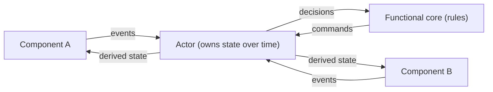

## Actors

So far, we’ve talked about the functional core.

Deterministic behavior.  
Explicit states.  
Clear transitions.

That gives us rules.

But rules alone are not enough.

Behavior needs a place to live over time.

That place kept ending up being an actor.

---

## The problem actors solve

Without actors, behavior floats.

It exists as definitions, reducers, machines, or logic, but nothing actually *owns* it.

And when no one owns behavior, responsibility leaks.

You start seeing questions like:

- Who is responsible for this state?
- Why did this reset?
- Why are there two copies of this data?
- What happens when this component unmounts?
- Why did this logic run twice?

Those questions are not about correctness.

They are about **ownership**.

Actors started answering those questions for me.

---

## What an actor actually is

An actor is not a pattern.  
It is not a framework feature.  
It is not a buzzword.

An actor is simply:

A runtime instance that owns state and receives events over time.

That’s it.

It has a lifecycle.  
It has a boundary.  
It processes messages sequentially.  

And because of that, it becomes accountable.

---

## Behavior versus instance

This distinction matters.

The functional core defines behavior.

The actor is an instance of that behavior running in the world.

One describes rules.  
The other enforces them over time.

This is the same difference as:

- A class versus an object
- A blueprint versus a building
- A recipe versus a meal being cooked

Without the actor, behavior has no memory.

Here’s the boundary I kept finding in practice:

---

## Why lifecycle matters more than persistence

A common misconception is that actors are about persistence.

Sometimes they are.

But persistence is optional.

Lifecycle is not.

An actor must answer questions like:

- When does this start?
- When does this stop?
- What happens when it restarts?
- What state does it carry forward?
- What happens when it receives events too early or too late?

If a piece of behavior had a lifecycle, it kept needing an actor.

When it didn’t, adding one felt like ceremony.

---

## Where actors show up in UI systems

In UI-heavy systems, actors often represent:

- a single data query
- a form in progress
- a connection to a wallet
- a session
- a background task
- a long-running interaction

These are not components.

Components render.

Actors persist.

That difference is subtle, and it kept being the one that mattered.

---

## Actors create real boundaries

Once something is an actor, a few things become true automatically.

It owns its state.  
It processes events in order.  
It cannot be half-alive.  
It cannot be accidentally duplicated without intent.

That boundary is what kept hidden coupling in check.

It becomes clearer who is allowed to touch what, and how.

---

## Actors are not adapters

This is where confusion often creeps in.

Actors do not talk to the network.  
Actors do not subscribe to external systems.  
Actors do not perform side effects.

Actors decide.

Something else executes.

That separation is what keeps behavior deterministic even when the world is not.

---

## Why actors pair so well with state machines

State machines define what is allowed.

Actors enforce it over time.

A machine without an actor is a rulebook on a shelf.

An actor without a machine is improvisation.

Together, they form something stable.

You get explicit behavior and clear ownership at the same time.

---

## A practical example

Think about a data query.

The behavior says:

- idle
- loading
- success
- error
- refreshing

The actor answers:

- Are we loading right now?
- What data do we currently have?
- What happens if a refresh arrives during loading?
- What happens if the component unmounts?
- What happens if the user retries twice?

Those questions are about time, not logic.

That is the actor’s job.

---

## What happens without actors

Without actors, state leaks upward.

Components start owning state they should not.  
Hooks coordinate things they cannot see.  
Effects run based on timing instead of intent.

Eventually, no one can say where the truth lives.

That is not a scaling problem.

It is an ownership problem.

---

## The quiet benefit of actors

Actors make systems calmer.

Not faster.  
Not smaller.  

Calmer.

When something goes wrong, there is a place to look.

When behavior changes, there is a place to change it.

When something restarts, there is a defined outcome.

That calm compounds as systems grow.

---

## Final thought

The functional core defines what should happen.

The actor makes sure that behavior actually happens, in order, over time.

Without actors, behavior has no home.

With them, responsibility becomes visible.

---

## Next in the series

Next, we’ll talk about the **imperative shell**.

The part of the system that does the messy work of talking to the world, without being allowed to decide what anything means.

That boundary turns out to be where most systems quietly fail.

## Series Context

This essay builds on:
- [Lifecycle Is the Real Boundary](/writing/lifecycle-is-the-real-boundary)

Related deep dives:
- [Why Adapters Exist](/writing/why-adapters-exist)

## Further Reading

- Carl Hewitt, Peter Bishop, Richard Steiger — Actor Model (https://www.ijcai.org/Proceedings/73/Papers/027.pdf)
