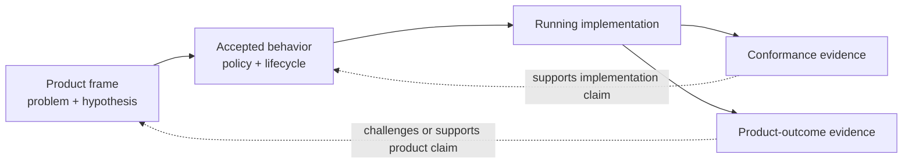

The series began with a product question:

Who is trying to make progress, what is difficult today, and what result would tell us the change helped?

Since then, most of the examples have focused on a different question:

Does the implementation follow the behavior we accepted?

Both questions need evidence. They do not need the same evidence.

I use **conformance evidence** for proof that the system follows an accepted contract, policy, or lifecycle.

I use **product-outcome evidence** for observations that tell us whether the behavior helped with the human problem that motivated it.

Passing one category does not settle the other.

## Conformance asks whether the system did what we specified

The router resolver has a narrow policy:

```ts
expect(
  resolveNavigation("/dashboard", false).route,
).toBe("login");
```

That test is evidence that this implementation conforms to the accepted authentication rule.

Other conformance evidence in the router might include:

- the actor keeps the previous route when a commit fails;
- a newer request stops the previous commit actor;
- stopping the router removes the navigation observer;
- browser and memory adapters satisfy the same navigation contract;
- projection exposes the last reconciled route rather than the pending destination.

Each item supports a specific architectural claim.

The stronger the claim, the more closely the evidence should resemble the boundary being claimed. A resolver unit test cannot prove observer cleanup. A machine test with a stubbed port cannot prove the browser adapter calls the platform correctly.

## Outcome asks whether the accepted behavior helped

Suppose every router test passes and an unauthenticated `/dashboard` request consistently redirects to `/login`.

We still do not know:

- whether people understand why they were redirected;
- whether they can return to the intended destination after signing in;
- whether the redirect reduces or increases abandonment;
- whether `/login` is the right recovery path for this product.

Those are product questions.

Useful outcome evidence might come from:

- observing someone attempt the task;
- completion and recovery rates for the flow;
- support reports tied to the interaction;
- interviews that explain why people abandoned or recovered;
- comparison with the outcome signal written in the product frame.

No single method is automatically authoritative. The evidence has to match the question.

An analytics event can tell us that a redirect happened. It may not tell us whether the person understood it. An interview can explain confusion but may not tell us how common it is.

## The `startModule` example contains both questions

The first article changed this:

```ts
startModule();
```

where the command discovered `moduleId` from a host element, into this:

```ts
startModule(moduleId);
```

Conformance evidence can prove:

- browser and headless callers use the same command signature;
- the command sends `START_MODULE` with the supplied ID;
- the actor remains the only part allowed to interpret the request;
- the projection reports the resulting module state.

That evidence supports the architectural claim that intent is no longer hidden in one DOM representation.

Product-outcome evidence would address a different claim:

- Do developers understand the command more quickly?
- Can they exercise the behavior without learning an unrelated presentation convention?
- Does the contract reduce setup mistakes or duplicated bindings?

We have a reasonable hypothesis. Unless we have observed those outcomes, we should call it a hypothesis.

## Evidence needs provenance and freshness

“Tests passed” is often too vague to review.

Useful conformance evidence should identify:

- which behavior or contract was exercised;
- which implementation and revision produced the result;
- which environment or adapter was involved;
- when the evidence was produced;
- what the test did not cover.

The same applies to outcome evidence.

A usability observation from an earlier interface may no longer support the current flow. A completion metric without the relevant user segment or time range may answer a different question.

Evidence becomes more trustworthy when we can trace it back to the claim it supports.



The feedback arrows return to different owners.

A conformance failure usually sends us back to the implementation, contract, or accepted behavior.

An outcome failure may send us back to the product frame even when the implementation is correct.

## A trace is useful when it preserves the distinction

For behavior that unfolds over time, a trace can connect:

- the semantic command received;
- the transition selected;
- the capability requested;
- the adapter result returned;
- the projection produced.

That is valuable conformance evidence because it shows the implemented path through the boundaries.

The trace still cannot declare that the product outcome was good.

It can record that a navigation completed, a revision was saved, or an artifact was produced. Whether that result helped someone requires a product interpretation backed by suitable evidence.

Tools can make the chain easier to review. They should not collapse product judgment into a green runtime receipt.

## Do not solve a failed outcome by weakening conformance

Imagine people are abandoning the login redirect.

One response is to add a browser-only exception that occasionally skips the authentication policy. That may improve one metric while making the behavior inconsistent and harder to review.

The better sequence is:

1. Revisit the product frame and evidence.
2. Decide whether the accepted policy should change.
3. Update the authoritative behavior.
4. Produce new conformance evidence for the revised rule.
5. Continue observing the product outcome.

Architecture should make a product change easier to apply consistently. It should not prevent the product decision from changing.

## A practical evidence matrix

For a meaningful behavior, I now try to write both sides:

| Claim | Evidence that fits |
| --- | --- |
| The resolver redirects protected routes when signed out | Resolver policy tests |
| A failed commit preserves the current route | Actor lifecycle test |
| Browser and memory implementations satisfy the port | Adapter contract tests |
| The view receives the reconciled route | Projection test |
| People understand the redirect | Task observation or targeted research |
| People return to the intended destination | Flow completion and recovery evidence |

The table prevents a broad statement such as “the feature is validated” from hiding which question was actually answered.

## An evidence check

Before treating a result as proof, I ask:

- What exact claim does this evidence support?
- Is that claim about implementation conformance or product outcome?
- Was the relevant boundary exercised?
- Can I identify the implementation, environment, and time that produced it?
- What remains an assumption?
- If this evidence fails, which decision owner should reconsider its work?

Those questions make evidence part of the architecture rather than an attachment added after implementation.

## Next in the series

We now have distinct owners for product framing, behavior, lifecycle, capability execution, projection, and evidence.

The final article asks what each of those parts may depend on. That dependency direction is what prevents a convenient edge implementation from becoming a second source of authority.
