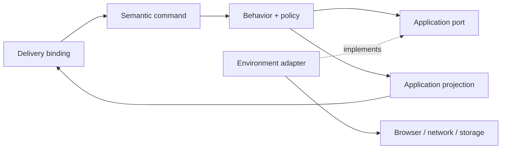

The series has assigned several responsibilities:

- the product frame describes a human problem and an outcome hypothesis;
- semantic commands carry application intent;
- the functional core applies accepted policy;
- actors own behavior over time;
- ports name environmental capabilities;
- adapters translate concrete environments;
- the shell assembles the runtime;
- projection exposes an application-facing contract;
- evidence supports specific conformance or product claims.

Those names help only if the dependencies preserve the authority we assigned.

If a browser adapter imports router policy and decides redirects, the router is no longer authoritative. If a component interprets pending state differently from the projection, there are two view contracts. If a passing test is presented as product validation, implementation evidence has taken authority over a product question.

Dependency direction is how we stop those shortcuts from becoming the architecture.

## Code dependencies and decision dependencies

An import is one kind of dependency.

There is also a decision dependency: one part cannot do its job without knowing a choice made somewhere else.

The browser adapter may import the application-owned `NavigationPort` type. That code dependency points toward the contract.

The router may call a value satisfying that port. Its behavior does not depend on the Navigation API or the memory adapter.

The relationship looks like this:



The outward data flow does not reverse authority.

An adapter result flows back to the actor, but the adapter does not become the owner of what that result means. A projection flows toward a UI, but the UI does not gain permission to mutate the actor.

## The owner defines the contract

The useful part of dependency inversion is not “put an interface in front of everything.”

It is that the code needing a capability defines the contract in its own language.

The router needs:

```ts
type NavigationPort = {
  currentPath(): string;
  observe(
    listener: (path: string) => void,
  ): () => void;
  commit(
    instruction: NavigationInstruction,
    signal: AbortSignal,
  ): Promise<NavigationCommit>;
};
```

The browser adapter conforms to that contract. The router does not conform its policy to whichever methods the current platform happens to expose.

That direction protects the router’s vocabulary:

- `push` and `replace` are application instructions;
- `aborted` and `unavailable` are results the application understands;
- Navigation API objects remain inside the browser adapter.

If the port starts copying an entire provider API, the type may point inward while the concepts still point outward. Dependency direction is semantic as well as syntactic.

## Commands point toward authority

A delivery surface may know that a link was clicked. It translates that interaction into:

```ts
{ type: "NAVIGATE_REQUESTED", to }
```

The event points toward the router actor because the actor is allowed to interpret the request.

The binding should not ask the adapter to commit first and then notify the actor. That would place execution before policy.

The order established through the series is:

```text
interaction
→ semantic command
→ accepted behavior
→ capability instruction
→ environmental result
→ behavior update
→ projection
```

This is not a requirement for every function call in the application. It is a review tool for operations where ownership has been split before.

## Facts may flow inward without bringing policy with them

External results have to enter the system.

The adapter can report:

```ts
{ ok: false, reason: "aborted" }
```

The actor may interpret an abort as expected replacement while `committing`, and as an error in another workflow.

The fact crosses the boundary. The adapter’s assumptions do not.

The same rule applies to time, provider responses, storage records, and user input. Boundary code validates and translates them before authoritative behavior uses them.

That does not mean the core must distrust every value through layers of generic wrappers. It means external concepts should not quietly become policy simply because they arrived first.

## Projection points outward without giving authority away

Projection depends on authoritative actor state and produces a public read model.

A component can depend on:

```ts
{
  path: string;
  isNavigating: boolean;
  canRetry: boolean;
}
```

It should not reproduce route reconciliation by reading browser history beside the projection.

When consumers need a new value, we can decide whether it belongs in the public contract. That review is easier than allowing each consumer to create a local interpretation.

The dependency points from presentation toward the application contract, even though rendered output flows toward the person using the interface.

## The shell depends on concrete choices

The imperative shell is allowed to know the concrete implementations:

```ts
const navigation =
  createBrowserNavigation(browser);

const source = createRouterSource({
  navigation,
});

const actor = createActor(source);
actor.start();
```

The shell depends on the adapter, source, and runtime because its job is to assemble them.

Nothing should depend on the shell for policy. It is the end of the dependency graph, not a reusable behavior service.

This is one reason a small, explicit composition function is often easier to maintain than a container that can resolve dependencies from anywhere.

## Evidence attaches to claims

Conformance evidence depends on the contract it claims to exercise.

- resolver tests depend on route policy;
- actor tests depend on lifecycle behavior;
- contract tests depend on the port;
- projection tests depend on the public read model.

Product-outcome evidence points back to the product frame.

Neither evidence category should become runtime authority. A test describes and checks accepted behavior; the application does not import the test to decide what to do. An analytics metric may challenge a product policy; the browser adapter should not rewrite that policy on its own.

Keeping those directions clear lets evidence cause a deliberate revision instead of an unreviewed exception.

## Volatility is a clue, not the rule

Architecture advice often says stable things should not depend on volatile things.

That is a useful warning, but it does not decide the design by itself.

Some product policies change frequently. Some platform contracts remain stable for years. A new interface around every dependency can add more maintenance than it removes.

The stronger question is:

> If this dependency changes, which part is allowed to reinterpret the application’s meaning?

An adapter may absorb a platform API change. A product decision may intentionally revise policy. A projection may evolve its public contract.

The boundary helps us identify the owner of that change; it does not promise that the owner never changes.

## A dependency-direction check

For a meaningful behavior, I ask:

- Which part is allowed to interpret the semantic command?
- Does the capability contract use application or provider vocabulary?
- Can an adapter return a fact without deciding its meaning?
- Does lifecycle policy remain visible in the actor that owns it?
- Does presentation depend on a deliberate projection contract?
- Does the shell assemble behavior without reenacting it?
- Is each piece of evidence attached to the claim it can actually support?

If the answer moves across several owners, that is where I look for an accidental second source of truth.

## End of the series

The series began with a small command that discovered intent from the DOM.

Following that one dependency led outward to the product problem and inward to behavior, lifecycle, capabilities, adapters, projection, and evidence.

The final structure is not a demand that every feature use ten layers. Most functions need nothing this elaborate.

The useful habit is smaller: name the decision, identify its owner, and make dependencies point toward that authority.

When the next implementation arrives quickly, that gives us a concrete way to decide whether it belongs.
