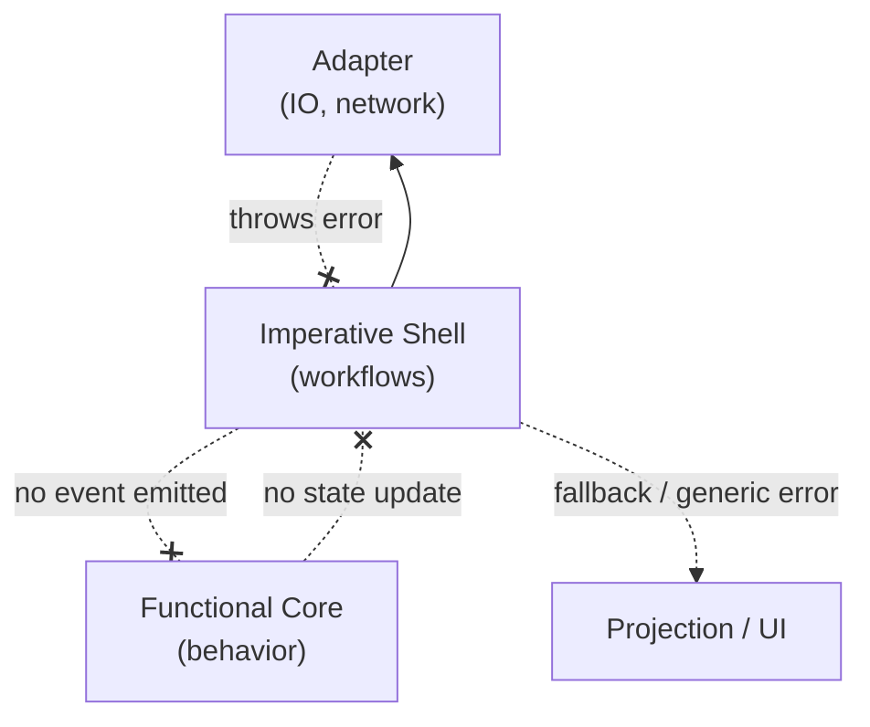
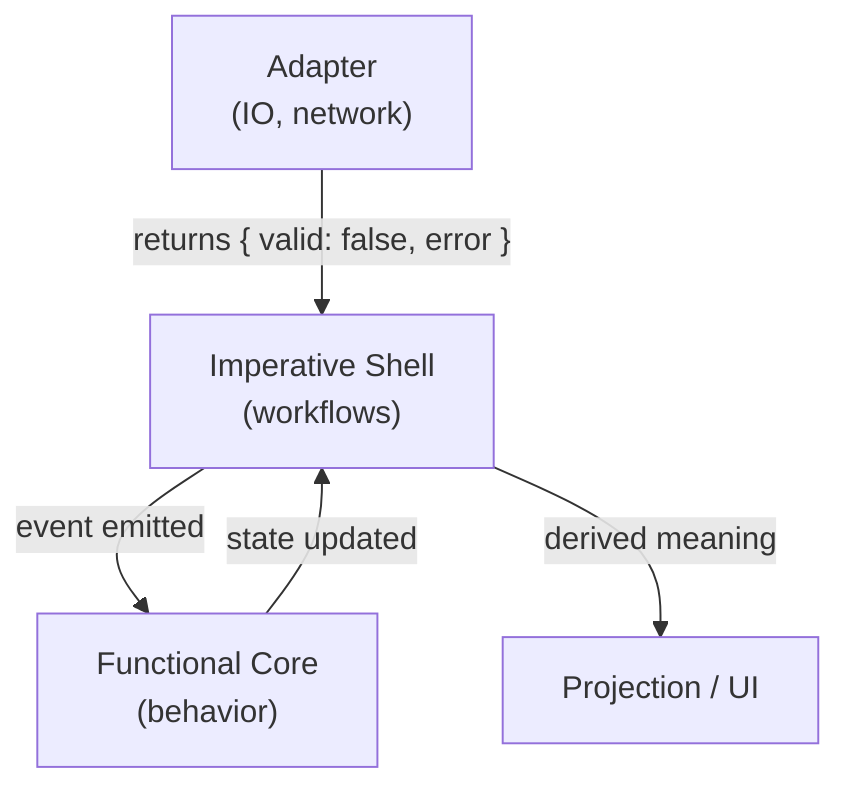

I didn’t sit down one day and decide to change how I handle errors.

It happened gradually, while working in systems that looked fine on the surface but were surprisingly hard to reason about once something went wrong.

The code wasn’t obviously bad.  
Tests were passing.  
Features were shipping.

But whenever a failure showed up, it felt like I was always one step behind it.

---

## Where the discomfort started

The pattern I kept noticing was this:

Something would fail.  
The system would respond.  
But the reason for the failure would already be gone.

This is what that usually looks like in practice.

```mermaid
flowchart LR
  OP["Operation completes<br/>(rejects / resolves)"]
  RI["Reason / Intent<br/>(derived meaning)"]
  UI["UI updates"]
  ERR["Generic error message"]

  OP --> RI --> UI --> ERR
  OP -. thrown error bypasses meaning .-> UI
````

By the time I went looking for the cause, I was reconstructing intent instead of reading it.

That’s when I started paying attention to how errors were actually flowing through the system.

---

## The pattern I was used to

Most of the code I’d worked in used `try / catch` in some form.

```ts
try {
  const response = await fetch(endpoint);
  return { valid: response.ok };
} catch {
  return { valid: false };
}
```

Sometimes the `catch` logged.
Sometimes it wrapped the error.
Sometimes it just returned a fallback value.

This pattern is everywhere, and for a long time it felt reasonable.

It keeps the happy path clean.  
It centralizes failure handling.  
It avoids threading error values through every call.  

At least, that’s what it looks like from the call site.

I didn’t think much about it.

---

## Why throwing often feels like the right move

In other codebases, the same block would look like this instead.

```ts
catch (error) {
  throw error;
}
```

That often feels more correct.

If something went wrong, let it bubble.
Let the caller decide.
Don’t pretend everything is fine.

I’ve written that code plenty of times.

What I hadn’t considered was **how throwing changes the structure of the system**.

---

## Before we go further

> **It helps to clarify a distinction that’s easy to blur.**
>
> The *imperative shell* and *adapters* both deal with side effects, but they are not the same thing. The imperative shell is responsible for **coordination** — deciding what to do next, sequencing steps, and translating outcomes into events the system can reason about.
>
>Adapters are responsible for **execution** — performing IO, talking to networks, reading clocks, and interacting with the environment. The shell decides *what* should happen; adapters simply attempt it and report *what actually happened*.

*This difference matters because when an adapter throws, the shell never regains control. No outcome is returned, no decision is made, and behavior is silently skipped.*

---

## Failure and boundaries

What finally made this click for me was noticing where thrown errors actually go.

When an adapter throws, the error doesn’t just signal failure.
It changes the path the system takes.

Instead of flowing through the layers we designed, it **skips them**.

The shell never sees a concrete outcome it can act on.

The behavior never gets a chance to decide what that failure means.
Whatever logic we expected to run next simply doesn’t.

The system still responds.  
But it does so through stack unwinding, not through behavior we can inspect or reason about.

At that point, control flow is happening, but responsibility is not.

### Before: when adapters throw

This is the failure mode I kept running into.  
Not a crash, but a missing return path.

The important detail is this:

The adapter *is* called by the workflow.
But when it throws, **no value is returned**.

Because there’s no returned value:

- the workflow emits **no event**.
- the functional core produces **no state update**.
- and there’s **no derived meaning** for the system to act on.

At that point, the workflow never gets a chance to decide what the failure means.  
The only thing left is a generic fallback.

This is what that looks like structurally.



Seeing it laid out this way made it easier to articulate why things felt off.

Nothing was technically broken.
But the system was no longer behaving the way it was designed to.

---

## Why Go’s approach stood out

Around the same time, I found myself thinking back to how Go handles errors.

I’ll be honest — I used to see that style as overkill.
Too verbose.
Too opinionated.

I was very much in the camp that thought exceptions were cleaner and more idiomatic.

What changed wasn’t the syntax.
It was spending enough time in systems where failure mattered, and realizing what that explicitness was buying.

---

## Treating failure as data

I started experimenting with the same idea in TypeScript.

Not inline.
Inside functions that had a clear responsibility.

That distinction turned out to matter more than I expected.

Here’s the shape I settled on for adapter-level code that reports facts back to the system.

```ts
async function validateSession(token: string): Promise<
  | { valid: true }
  | { valid: false; error: string }
> {
  const response = await this.http.fetch(endpoint, {
    headers: { Cookie: token }
  });

  if (!response.ok) {
    return { valid: false, error: `HTTP ${response.status}` };
  }

  return { valid: true };
}
```

### After: when failure is treated as data

Here’s that same interaction when failure is treated as data instead.

The difference isn’t stylistic.
In the first case, behavior is skipped.
In the second, behavior completes and reaches a decision.



Failure is reported as a fact, interpreted as behavior, and only then translated into something user-facing.

Nothing is skipped.
Nothing is implicit.
Every layer participates.

---

## A distinction that mattered more than I expected

At some point I realized this wasn’t about syntax.
It was about intent.

Returning `{ valid: false }` is not inherently better than throwing.
It answers a different question.

Returning a value says:

> this outcome is expected, and someone else should decide what to do with it.

Throwing says:

> this should not have happened, and the system cannot safely continue.

The issue wasn’t that exceptions existed.
It was that I had been using them to model behavior.

Once I started separating those two cases, things became clearer.

---

## Expected failure versus bug

Putting the difference side by side helped me internalize it.

### Expected failure

```ts
const result = await validateSession();

if (!result.valid) {
  actor.send({ type: "SESSION_INVALID", reason: result.error });
}
```

This is a normal outcome.
The system stays intact.
Behavior continues.

### Bug or invariant violation

```ts
const user = await getCurrentUser();

if (!user) {
  throw new Error("User must exist at this point");
}
```

This indicates a broken assumption.
Continuing would make the system less safe.

Both cases matter.
They just don’t belong in the same category.

---

## What this changed in practice

Once errors became data, workflows got easier to follow.

```ts
const result = await validateSession();

if (!result.valid) {
  actor.send({ type: "SESSION_INVALID", reason: result.error });
  return;
}

actor.send({ type: "SESSION_VALID" });
```

There’s no guessing which layer handled the failure.
No wondering whether something was swallowed.
No surprise exits.

You can read this top to bottom and understand what happens.

That made debugging feel easier to me.

---

## The functional core stayed simpler

One side effect I didn’t expect was how much this simplified the functional core.

The core never sees exceptions.
It only sees events.

Success.
Failure.
Timeout.
Invalid input.

Those are all things the system is designed to reason about.

If something throws inside the core now, I treat it as a bug, not a branch.

Here’s what that looks like in practice.

```typescript
type Event =
  | { type: "SESSION_VALID" }
  | { type: "SESSION_INVALID"; reason: string }
  | { type: "TIMEOUT" };
  
type State =
  | { status: "idle" }
  | { status: "authenticated" }
  | { status: "error"; message: string };
  
function reduce(state: State, event: Event): State {
  switch (event.type) {
    case "SESSION_VALID":
      return { status: "authenticated" };

    case "SESSION_INVALID":
      return { status: "error", message: event.reason };

    case "TIMEOUT":
      return { status: "error", message: "Request timed out" };

    default:
      // If this ever happens, it's a bug — not a recoverable case.
      throw new Error("Unhandled event");
  }
}
```

---

## A rule I keep coming back to

The rule I use now is simple.

If a failure is part of expected behavior, represent it as data.
If it isn’t expected, treat it as a bug.

That one distinction clarified a lot of gray areas.

---

## Where `try / catch` still fits

I still use `try / catch`.

Just not for modeling behavior.

I use it for:

- broken invariants
- impossible states
- programmer mistakes
- things that genuinely should never happen

Those cases are rare.
When they happen, I want them to be loud.

Network failures, validation issues, and permission checks are not rare.
They are part of the system’s reality.

---

## Why this matters more now

As code becomes easier to generate, hidden behavior becomes more costly.

It’s easy to produce code that works.
It’s much harder to produce code that communicates intent.

Treating errors as data forces you to be explicit about failure paths.
That makes systems easier to reason about when they change.

---

## Final thought

Throwing errors doesn’t just signal failure.
It skips the moment where a system is supposed to decide what that failure means.

Once I stopped using exceptions to model behavior, decisions moved back into the places designed to make them.
Workflows coordinated.
The functional core reasoned.
The UI reflected meaning instead of reacting to surprise.

Failure didn’t disappear.
It was routed back into behavior, where decisions belong.

## Series Context

This essay builds on:

- [Why Adapters Exist](/writing/why-adapters-exist/)

Related deep dives:

- [The Imperative Shell](/writing/imperative-shell/)

## Further Reading

- Rob Pike — Errors are Values ([Errors are Values](https://go.dev/blog/errors-are-values))
- Andrew Gerrand — Error Handling and Go ([Error Handling and Go](https://go.dev/blog/error-handling-and-go))
