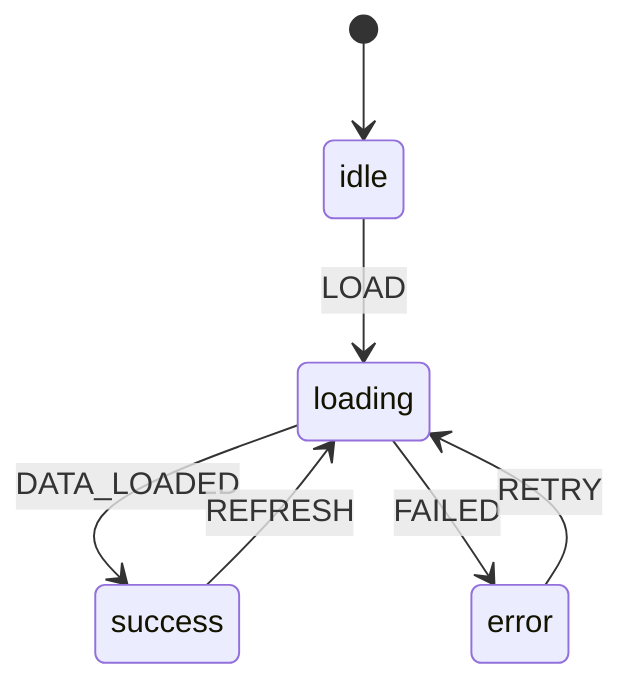

## The Functional Core

When I first heard “functional core,” I assumed it meant functional programming.

It didn’t.

This isn’t about monads, immutability, or academic purity.

It’s about **determinism**.

More specifically, I needed a place in the system where behavior stayed predictable no matter what the world was doing around it.

---

## What problem the functional core actually solves

In the systems I struggled with, the code wasn’t the failure point.

They fail because no one can answer simple questions anymore:

- What state are we in right now?
- What is allowed to happen next?
- Why did this screen end up like this?
- Is this behavior intentional or accidental?

When behavior is spread across components, effects, callbacks, and adapters, those questions become impossible to answer confidently.

The functional core exists to stop that drift.

It is the part of the system where I decide what should happen, without actually doing anything.

---

## Determinism over time

The key idea is not purity in the mathematical sense.

It’s **determinism over time**.

If I replay the same sequence of events, I should get the same outcome.

Every time.

That became the contract.

That’s what let me reason about behavior instead of debugging symptoms.

---

## What lives in the functional core

In the systems I build now, the functional core contains:

- explicit states
- explicit transitions
- guards and rules
- decisions about what is allowed and what is not

That list stays short on purpose.

No network calls.  
No timers.  
No subscriptions.  
No environment knowledge.

Just behavior.

---

## Why state machines fit this role so well

State machines forced me to answer uncomfortable questions up front.

What states actually exist?  
What events are allowed?  
What transitions are valid?  
What happens if something unexpected arrives?

I couldn’t hand-wave these away.

That friction is a feature.

It pushed behavior into a place where it could be seen, named, and tested.

This is why state machines work so well as a functional core, even if the rest of the system is not “functional” at all.

---

## A concrete example

Consider a simple data loading flow.

Not the code. The behavior.

Are we idle?  
Are we loading for the first time?  
Are we refreshing existing data?  
Did something fail?  
Can the user retry?

Those questions have nothing to do with fetch, TanStack, or Web3.

They are pure behavior.

That behavior belongs in one place, and one place only.

Here’s that shape when I draw it out:

---

## What does not belong in the functional core

This is just as important.

The functional core should not:

- call APIs
- read from storage
- subscribe to observers
- decide how often to retry
- depend on the browser, the network, or the wallet

Every time I let those in, determinism was gone.

At that point, behavior started depending on timing, environment, and side effects.

That’s how systems became fragile even when they looked clean.

---

## Behavior first, wiring second

One of the biggest shifts for me was changing the order of decisions.

I no longer start by asking:

How do I fetch this?  
Which library should I use?  
Where does this effect live?

I start by asking:

What states exist?  
What transitions are valid?  
What is allowed to happen next?  
What must never happen?

Only after those answers are clear do I wire the system to the world.

That ordering kept mattering more than the tools.

---

## The functional core is not optional

You can build without this layer.

I did for years.

What I lost was the ability to reason locally.

Every change became global.  
Every fix risked a regression.  
Every refactor felt dangerous.

The functional core gave me a stable center when everything else changed.

And right now, everything else is changing fast.

---

## Why this matters more now

AI can generate code faster than we can review it.

That made determinism more valuable, not less.

If behavior is implicit, AI will happily reproduce your mistakes at scale.

If behavior is explicit, AI becomes a force multiplier instead of a liability.

The functional core is what makes that possible.

---

## Final thought

The functional core is not about style.

It’s about responsibility.

It is the place where behavior is owned, named, and protected.

Everything else exists to support it.

---

## Next in the series

Next, we’ll look at **actors**.

Not as a buzzword, but as the thing that gives behavior a lifecycle and a place to live over time.

That distinction turns out to matter more than most people expect.

## Series Context

This essay builds on:

- [Lifecycle Is the Real Boundary](/writing/lifecycle-is-the-real-boundary/)

Related deep dives:

- [Actors](/writing/actors/)

## Further Reading

- Gary Bernhardt — Functional Core, Imperative Shell ([Functional Core, Imperative Shell](https://www.destroyallsoftware.com/screencasts/catalog/functional-core-imperative-shell))
- Scott Wlaschin — Moving I/O to the Edges ([Moving I/O to the Edges](https://www.youtube.com/watch?v=P1vES9AgfC4))
