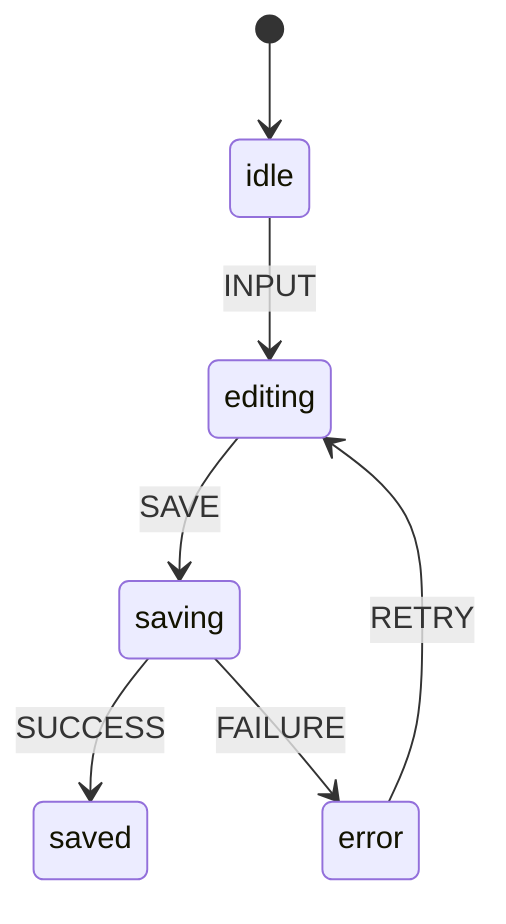
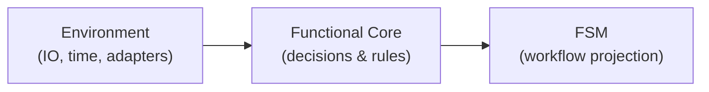
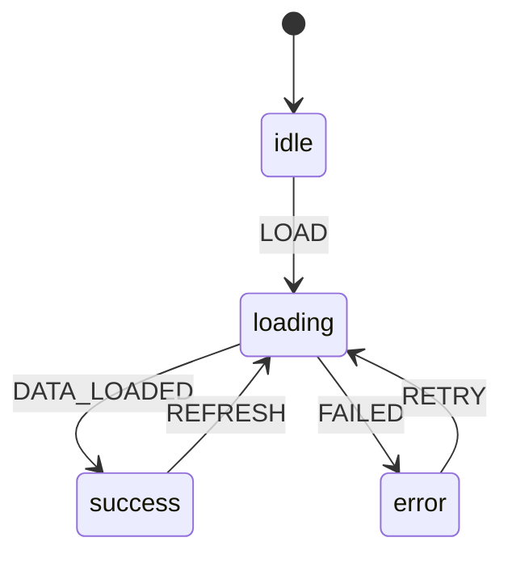
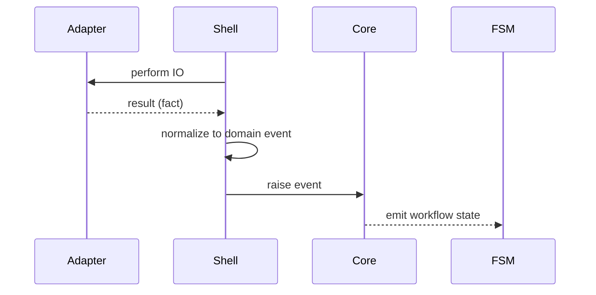
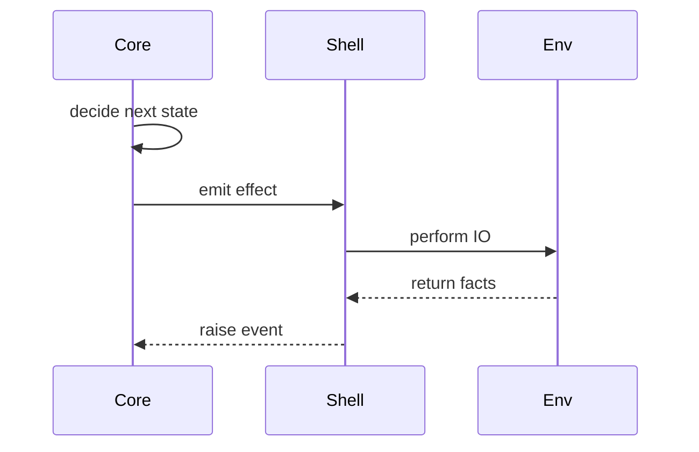

In the last essay, *Lifecycle Is the Real Boundary*, I argued that boundaries earn their keep only when they protect behavior over time. This one picks up that thread and asks the next question I couldn’t avoid:

**If a lifecycle needs protection, what has to remain constant — and what doesn’t?**

What I was looking for wasn’t a new pattern or a better abstraction.
It was a way to keep behavior coherent even as the environment changed — without time, retries, and transports quietly reshaping outcomes behind my back.

That search eventually led me to the idea of a functional core.

When I first heard the phrase “functional core,” I assumed it meant functional programming.

It didn’t.

---

## The questions I couldn’t answer anymore

In the systems I struggled with, the code itself wasn’t obviously broken.

What broke first was my ability to answer simple questions:

What state are we in right now?  
What is allowed to happen next?  
Why did this screen end up like this?  
Was this behavior intentional — or did it just emerge?  

As behavior spread across components, effects, callbacks, and adapters, those questions stopped having clear answers.

Nothing crashed.
Nothing screamed.

But reasoning became guesswork.

And once that happened, I no longer had a reliable way to tell whether the system was behaving correctly — or just coincidentally.

---

## What all those moments had in common

At first, I treated each incident as its own problem.

A messy reducer here.  
An overgrown hook there.  
A side effect in the wrong place.  

But over time, the pattern became impossible to ignore.

Whenever a system felt unpredictable, the same thing was true:
behavior depended on *when* something happened, *where* it happened, or *what environment* it happened in.

If I replayed the same sequence of events, I didn’t always get the same outcome.

That’s when the word *determinism* finally stuck.

---

## Determinism over time

This isn’t determinism in the mathematical sense.

It’s determinism over time.

Given the same inputs, the same events, and the same starting state, the system should reach the same conclusions — every time.

Once I started treating that as a requirement instead of a preference, everything else fell into place. It gave me a way to reason about behavior directly, instead of debugging symptoms after the fact.

Without that property, no amount of structure made the system easier to understand — it only made failures harder to trace.

---

## What lives in the functional core

In the systems I build now, the functional core contains a very specific set of things — the parts of the system that need to remain stable for behavior to make sense over time:

* explicit states
* explicit transitions
* guards and rules
* decisions about what is allowed and what is not

That list stays short on purpose.

The functional core doesn’t execute work.  
It doesn’t coordinate time.  
And it doesn’t adapt to its environment.

There are no network calls.  
No timers.  
No subscriptions.  
No knowledge of where it’s running or what it’s talking to.

Just behavior.

Anything that could vary depending on timing, infrastructure, or execution context stays out — not because it’s unimportant, but because letting it in would quietly change the meaning of decisions.

---

## Why I kept ending up with state machines

I didn’t start using state machines because I was looking for a new abstraction.

I started because XState gave me a visualizer.

Being able to map the entire system as a statechart — before writing a single line of code — changed how I reasoned about behavior. For the first time, I could see all the states, all the transitions, and all the places uncertainty could enter the system, laid out explicitly.

That experience made something click.

It wasn’t about machines.  
It was about making behavior visible.



Statecharts make behavior observable over time by showing how an actor responds to events; the authority to decide what those events mean lives in the actor, not in the chart.

Over time, something else happened.

The statechart stopped being just a design tool and started becoming a runtime artifact. Instead of living only in diagrams, it became a small, pure finite state machine that could observe decisions made elsewhere and reflect that back to the system.

The functional core decided what happened.  
The FSM showed where we were.

That separation mattered.

The FSM didn’t own business rules. It didn’t talk to the network. It didn’t decide policy. It existed to make workflow and lifecycle explicit — and observable.

Around the same time, *Constructing the User Interface with Statecharts* reframed how I thought about UIs altogether. Screens weren’t components anymore; they were states. User actions weren’t callbacks; they were events. Rendering became a consequence of state, not something to orchestrate by hand.

Once you start thinking that way, it’s hard to go back.

From there, the path forward became clearer.  
Statecharts led me to the actor model.  
Actors led me to clearer boundaries.  
and those boundaries eventually forced me to separate deciding what should happen from executing it.

---

## When the core takes over

What I didn’t realize at the time was that making behavior visible also made its fragility obvious.

Once you can see every state and every transition, you start noticing something else: the behavior you carefully mapped out is still being reinterpreted by the environment around it. Network timing changes outcomes. Adapters leak meaning. Effects quietly rewrite intent.

The statechart shows you what should happen.  
The architecture decides whether that behavior survives contact with reality.

That’s where the functional core comes in.



**The functional core is where decisions are enforced; the FSM projects those decisions over time, and the environment supplies facts without being allowed to redefine meaning.**

It’s the place where behavior stops being advisory and starts being authoritative — where the rules implied by the diagram become rules the system is not allowed to violate.

The statechart made behavior visible.  
The functional core was where it finally stopped shifting underneath me.

---

## Why this became the only stable shape

At first, I treated the state machine as the source of truth.

That worked — until it didn’t.

The moment the machine started caring about network timing, retries, cancellation, or adapter quirks, it stopped being a description of behavior and started becoming a negotiation with the environment. States that were meant to be stable began to reflect execution details instead of intent. Transitions accumulated guards that had nothing to do with what the system was actually trying to decide.

The machine was still correct.  
But it was no longer authoritative.

What finally clicked was this: a statechart can only stay trustworthy if it reflects decisions made somewhere else.

Behavior has to be decided in a place that is:

* deterministic
* free of time
* free of IO
* free of implementation detail

Once those decisions exist, the machine becomes what it was always best at being: a projection of behavior over time.

The functional core decides what happened.  
The FSM answers where we are now.

That separation wasn’t aesthetic.  
It was the only way to keep the diagram honest as the system grew.

After that, every system that lasted ended up with the same shape.

A pure core that owned meaning,  
and a small machine that made workflow visible.

---

## A concrete example

Consider a simple data loading flow.

Not the code.  
The behavior.

Are we idle?  
Are we loading for the first time?  
Are we refreshing existing data?  
Did something fail?  
Can the user retry?

Those questions have nothing to do with `fetch`, caching libraries, or frameworks.

They are questions about behavior.

And that behavior needs a single place where its meaning doesn’t shift depending on timing or environment.

When I sketch it out, it usually looks something like this:



---

## What does not belong in the functional core

This part mattered just as much.

The functional core should not:

* call APIs
* read from storage
* subscribe to observers
* decide how often to retry
* depend on the browser, the network, or a provider

Every time I let those concerns in, the meaning of behavior started to depend on execution details instead of intent.

The system could still look clean.
But it stopped being something I could trust.

---

## When behavior stops being interchangeable

Even after moving logic into a “core,” I ran into another failure mode.

Things looked deterministic, but swapping implementations quietly changed behavior.

A mock behaved differently than production.  
A new transport required conditionals upstream.  
A retry policy leaked into places that weren’t supposed to care.

Nothing crashed.

But behavior stopped being interchangeable — the same inputs no longer led to the same outcomes once the implementation changed.

And once that happened, reasoning collapsed again.

---

## Where substitution actually breaks

There’s a formal name for this idea.

Barbara Liskov described it as substitution.

If two implementations can accept the same inputs but produce different decisions implied by those inputs, they are not interchangeable — even if the interface looks clean.

Two payment adapters can expose the same method, return the same shape, and still encode different meanings for failure.

Once the rest of the system needs to know *which* adapter it’s talking to in order to behave correctly, meaning has already fractured.

That usually shows up as logic branching on the adapter itself.

And once behavior branches there, substitution has already failed.

---

## Normalize inputs at the boundary (not inside the core)


Before behavior can be centralized, adapter-specific meaning has to be collapsed into something the system actually understands. This is a **boundary responsibility**, not core logic.

UI components and editors are adapters too. They produce values you don’t control and can’t fully trust — often typed as `unknown`, often shaped by plugin behavior, versions, or timing.

If that raw output reaches the core, determinism is already gone. The core is no longer deciding — it’s reacting to ambiguity.

Instead, treat the boundary like any other port:

1. Validate the unknown value
2. Normalize it into domain events
3. Only then let it enter the core

Here’s the same idea from this project: <https://github.com/0xjcf/editor-save-loop>

```ts
type DocChangedEvent = { type: "DOC_CHANGED"; doc: DocSnapshot };
type DocInvalidEvent = { type: "DOC_INVALID"; message: string };
type DocChangeEvent = DocChangedEvent | DocInvalidEvent;
  
function toDocEvent(input: unknown): DocChangeEvent {
  if (isDocSnapshot(input)) {
    return { type: "DOC_CHANGED", doc: input };
  }
  
  return {
    type: "DOC_INVALID",
    message: "Editor produced an invalid document snapshot.",
  };
}
```

Adapters still return facts.  
The shell still orchestrates.  
But the core only ever sees **events**.

---

## From facts to authority

Once inputs are normalized, something important changes.

The shell stops deciding.

It doesn’t interpret results.  
It doesn’t branch on adapter meaning.  
It doesn’t encode policy.

It simply raises events and hands them to the functional core.

That’s where decisions finally live — not as helper functions scattered across the system, but in a single place that owns how state is allowed to change.



In the editor-save-loop project, this boundary is explicit.

The editor produces values the system doesn’t control — JSON snapshots shaped by plugins, versions, and timing. The shell treats those values as *facts*, not intent, and normalizes them before the core ever sees them:

By the time an event reaches the core, adapter-specific meaning has already been resolved.

The core doesn’t validate.  
It doesn’t parse.  
It doesn’t guess.  

It decides.

In practice, that decision-making core often takes the shape of a reducer — a pure function that accepts the current state and a domain event, and returns the next state:

```ts
export function reduceDoc(
  state: DocState,
  event: DocEvent
): DocState {
  switch (event.type) {
    case "DOC_CHANGED":
      return {
        ...state,
        status: "dirty",
        doc: event.doc,
        error: null,
      };
  
    case "DOC_INVALID":
      return {
        ...state,
        status: "error",
        error: event.message,
      };
  
    case "SAVE_SUCCEEDED":
      return {
        ...state,
        status: "saved",
        revision: state.revision + 1,
        lastSavedAt: event.at,
      };
  }
}
```

There are no network calls here.  
No retries.  
No timing logic.

Just decisions about what the system is allowed to do next.

The shell’s role is now purely mechanical: perform work, normalize results, and raise events. It no longer needs to know *why* something happened — only *what* happened.

That’s the shift from facts to authority.

Once behavior is decided in one place, the rest of the system stops caring which adapter produced the result. Adapter-specific meaning was collapsed **once**, at the boundary.

That’s what makes substitution possible — and reasoning local again.

> Want to see this end-to-end in real code?  
> The **[editor-save-loop](<https://github.com/0xjcf/editor-save-loop>)** project implements this architecture directly.
> (boundary mapper → reducer core → FSM projection → shell orchestration).

---

## The functional core is where substitution is enforced

This is where the functional core earns its keep.

It’s where rules live.  
Where decisions are made.  
Where failure has a consistent meaning.

Same inputs.  
Same rules.  
Same outcomes.

Anything else isn’t a substitute — it’s a fork in behavior, whether you acknowledge it or not.

---

## Why the imperative shell exists at all

If behavior is deterministic and rules are consistent, then all nondeterminism has to go somewhere else.

Networks fail.
Requests arrive out of order.
Time passes.
Things restart.

None of that belongs in the functional core.

But pretending it doesn’t exist doesn’t work either.

The imperative shell exists to absorb that nondeterminism — to perform side effects, coordinate time, and interact with the environment — without being allowed to rewrite the rules.



This separation is what keeps the core authoritative while still allowing the system to function in the real world.

The details of how the shell does this — and what it must never be allowed to decide — deserve their own discussion.  
That’s the focus of the next article in this series.

---

## Behavior first, wiring second

That shift changed the order I approach problems.

I no longer start with:

How do I fetch this?  
Which library should I use?  
Where does this effect live?

I start with:

What states exist?  
What transitions are valid?  
What is allowed to happen next?  
What must never happen?

Only after those answers are clear do I wire the system to the world.

---

## Why the functional core isn’t optional

You can build without this layer.

I did for years.

What I lost was local reasoning.

Every change became global.
Every fix risked a regression.
Every refactor felt dangerous.

The functional core gave me a stable center while everything else changed.

And right now, the pace of change in our field is accelerating — driven by AI and the rapid evolution of tech stacks.

---

## Why this matters more now

AI can generate code faster than we can review it.

That doesn’t make architecture less important.  
It makes it impossible to fake.

If behavior is implicit, AI will happily reproduce your mistakes at scale.

If behavior is explicit, AI becomes a force multiplier instead of a liability.

The functional core can make the difference.

---

## Final thought

The functional core isn’t about style.

It’s about responsibility.

It’s the place where behavior is owned, named, and protected.

Everything else exists to support that responsibility.

---

## Series continuation

**Next in Behavior & Boundaries:**
**The Imperative Shell**
*Where nondeterminism is absorbed without being allowed to decide.*
