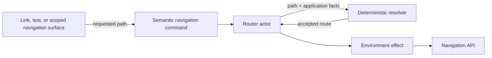

The previous article ended with a semantic navigation request:

```ts
{ type: "NAVIGATE_REQUESTED", to: "/dashboard" }
```

That gave the router a stable message. A link, a test, or another interface could request the same destination without sending a click event or reconstructing browser markup.

I thought the next step would be straightforward. I wanted to build the router around the browser's [Navigation API](https://developer.mozilla.org/en-US/docs/Web/API/Navigation_API), which is now available as `window.navigation`. It gives applications one place to observe, intercept, and initiate navigation without rebuilding everything around `popstate` and the History API.

It seemed like a good project for dogfooding the [Ignite Element v3 beta](https://0xjcf.github.io/ignite-element/).

The beta already contained SPA and nested-router examples built around the History API. I used the Navigation API iteration described here to revisit the same route-policy and lifecycle questions.

What I did not know was where the browser's responsibility should end.

The Navigation API could tell me which destination was requested. It could update browser history and report how navigation progressed. It could not decide whether `/dashboard` was a route this application recognized or whether a signed-out user should be redirected to `/login`.

I had started with one routing problem. The native API made me see at least two:

- What route does the application accept?
- How does the current environment observe and commit that route?

The first question is a decision. The second is a capability and a lifecycle.

## The first bridge was an Ignite effect

My first instinct was to keep the browser update close to Ignite Element. A command would carry the request to the router actor, and an Ignite effect would observe the resulting snapshot and update the Navigation API.

A reduced version of that direction looked like this:

```ts
const browserNavigation = window.navigation;

const routerCore = igniteCore({
  source: routerActor,

  commands: ({ actor }) => ({
    navigate: (to: string) => {
      actor.send({
        type: "NAVIGATE_REQUESTED",
        to,
      });
    },
  }),

  effects: ({ snapshot, prevSnapshot }) => {
    const nextPath = snapshot.context.route.path;
    const previousPath = prevSnapshot.context.route.path;

    if (nextPath !== previousPath) {
      void browserNavigation.navigate(nextPath).finished;
    }
  },
});
```

This was a reasonable place to begin. The command expressed intent. The effect synchronized accepted router state with the browser. The machine did not import `window`.

It also exposed a problem in Ignite Element's API.

At the time, command and effect callbacks received the custom element as `host`. That made it possible for a command to discover intent from `host.dataset`, which was the problem the `startModule` example exposed earlier in the series. It also gave effects a convenient path back into the element and its browser environment.

The router made the broader issue easier to see. A navigation effect did not need a rendered element. It needed a navigation capability. Giving it `host` encouraged the component to become a service locator for whichever browser details the effect wanted to reach.

That pressure led me to remove `host` from the `igniteCore` command and effect callbacks on the v3 beta line. This was not only a preference in the router example. It became part of the beta API.

The custom element still owns rendering and browser interaction at its boundary. What changed is that core callbacks no longer receive the element simply because one happens to exist. A command must receive the application value it needs:

```ts
commands: ({ actor }) => ({
  navigate: (to: string) => {
    actor.send({
      type: "NAVIGATE_REQUESTED",
      to,
    });
  },
});
```

The [v3 beta documentation](https://0xjcf.github.io/ignite-element/) introduces the current runtime, and the [beta branch on GitHub](https://github.com/0xjcf/ignite-element/tree/beta) contains the implementation and dogfooding projects as they evolve.

An effect that needs an environment capability must receive or close over that capability explicitly. It should not discover the environment by reaching sideways through the rendered host.

Removing `host` did not solve routing by itself. It made the unanswered responsibility visible.

The effect knew which accepted path to send to the browser because router state already contained one. Something still had to decide which path belonged in that state.

## The browser request was not the application decision

Consider an unauthenticated request for `/dashboard`.

The browser can report `/dashboard` as the destination. The semantic command can carry that path to the router. Neither one has enough authority to say whether the application accepts it.

That answer depends on application facts:

- Which routes exist?
- Which route matched the requested path?
- Does it require authentication?
- Is the current user authenticated?
- Should the application redirect to `/login`?

I initially described this as "policy equals decisions." That is close, but it helps to be more specific. Policy is the rule that chooses an answer from the current state and facts. The state transition records that answer. The running actor then carries the behavior forward over time.

For the [SPA router dogfooding project](https://github.com/0xjcf/ignite-element/tree/beta/examples/apps/spa-router), the smallest useful policy became a pure function named `resolveNavigation`:

```ts
const requiresAuth = (name: RouteName): boolean =>
  routes.find((route) => route.name === name)
    ?.requiresAuth ?? false;

export const resolveNavigation = (
  toPath: string,
  authed: boolean,
): Resolved => {
  const match = matchRoute(toPath);

  if (requiresAuth(match.name) && !authed) {
    const login = matchRoute(LOGIN_PATH);

    return {
      path: login.path,
      route: login.name,
      params: login.params,
      redirected: true,
    };
  }

  return {
    path: match.path,
    route: match.name,
    params: match.params,
    redirected: false,
  };
};
```

The route table, dynamic path matching, and authentication redirect are application policy in this project. `resolveNavigation` does not observe `window.navigation`, inspect an element, or commit browser history. It receives the requested path and authentication fact, then returns the route the application accepts.

That gives the decision a small test surface:

```ts
expect(
  resolveNavigation("/dashboard", false).route,
).toBe("login");

expect(
  resolveNavigation("/dashboard", true).route,
).toBe("dashboard");

expect(
  resolveNavigation("/missing", false).route,
).toBe("not-found");
```

These tests do not prove that the browser navigated. They prove that the same path and authentication state produce the same application answer.

That is what made the phrase functional core useful to me. I am not using it to mean that the whole application must adopt functional programming. I mean the deterministic part of the system that owns an application decision.

The effect can perform an outward update. The Navigation API can perform browser navigation. Neither one should quietly create route policy while doing that work.

## The nested router tested the same boundary again

The SPA example gave me a clean resolver, but I wondered whether the boundary would hold once navigation was divided across parent and child surfaces.

That became the [nested child-router dogfooding project](https://github.com/0xjcf/ignite-element/tree/beta/examples/apps/nested-child-router).

The name can make it sound like a child router runs inside a parent router. That is not how the example works. One application-owned XState router source is shared by the parent and child outlets. Parent navigation, documentation sections, and settings panels expose commands scoped to the choices available in each surface, but all of those requests reach the same router actor.

The nested resolver owns a different route policy. Instead of applying authentication redirects, it maps a root-relative path into the `parent`, `child`, and `label` the outlets need.

The important result was not that both projects shared one generic resolver. They do not. Each project owns a stable, closed route policy for the behavior it is testing.

What they share is the responsibility split:


```mermaid
flowchart LR
  Surface["Link, test, or scoped navigation surface"]
  Command["Semantic navigation command"]
  Actor["Router actor"]
  Policy["Deterministic resolver"]
  Effect["Environment effect"]
  Browser["Navigation API"]

  Surface -->|"requested path"| Command
  Command --> Actor
  Actor -->|"path + application facts"| Policy
  Policy -->|"accepted route"| Actor
  Actor --> Effect
  Effect --> Browser
```

Different surfaces may offer different commands. Different projects may apply different route rules. The route decision still has one application authority.

This answered one of the questions I had while working through ports and policies. A port does not make the decision deterministic. The resolver does that. A port gives the running behavior a provider-neutral way to reach the environment after the decision is made.

## What the functional core changed

Before this project, it was easy for me to think about routing as one feature. The application receives a path and the browser moves.

Dogfooding the Navigation API forced me to slow that sentence down.

The interface captures a destination. The command carries the request. The resolver applies route policy. The actor records the accepted route. An environment capability performs the browser work.

Those steps can live close together in a small implementation. They still own different decisions.

This also explains why removing `host` from `igniteCore` mattered. The change was not only about making headless tests easier. It prevented command and effect callbacks from treating the current custom element as the source of application intent or environment capability.

The current router source still uses an optimistic commit. It updates router context with the accepted route, asks its navigation capability to commit the path, and records a failure if that promise rejects. A successful commit does not return an application fact, and the source does not keep separate pending and confirmed routes.

I do not want to describe a stronger protocol than the example implements. The resolver gives us a deterministic application decision. It does not prove that the browser and application state have been reconciled after every commit.

That limit led to the next question.

The Ignite effect could update the browser after router state changed, but the router also needed to observe browser navigation, own the subscription, handle commit failures, and clean everything up when it stopped. Those responsibilities did not belong to one route decision, and tying them to whichever element rendered the route gave them the wrong lifetime.

The next post, [*Lifecycle Boundaries in Actor and State Machine Architecture*](/writing/lifecycle-is-the-real-boundary/), follows the router from the Ignite effect into the running source that owns observation, commits, failure, and cleanup.
