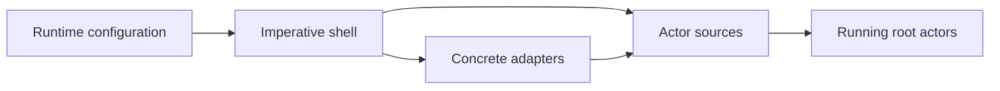

The previous article gave the router an application-facing `NavigationPort` and two implementations.

The actor logic still does not choose which implementation to use. A browser application needs the browser adapter. A headless runtime needs the memory adapter.

Something has to make that choice, supply the implementation, start the root actor, and eventually stop it.

That small effectful boundary is what I mean by the imperative shell.

## The shell is the application’s assembly point

The shell sits where configuration becomes a running application.

For the browser router, the assembly can remain direct:

```ts
export function startBrowserApplication() {
  const navigation = createBrowserNavigation(
    resolveBrowserNavigation(),
  );

  const routerSource = createRouterSource({
    navigation,
  });

  const routerActor = createActor(routerSource, {
    input: {
      path: navigation.currentPath(),
    },
  });

  routerActor.start();

  return () => {
    routerActor.stop();
  };
}
```

This code is imperative. It creates concrete objects, starts a runtime, and returns cleanup.

It does not decide whether `/dashboard` requires authentication. It does not keep `pending` and `current` routes synchronized. It does not decide what an aborted commit means.

Those decisions remain inside the router’s behavior.

## The shell should not become the workflow

It is tempting to put the sequence in the startup code:

```ts
const route = resolveNavigation(to, authed);
const result = await navigation.commit(route);

if (result.ok) {
  routerActor.send({
    type: "ROUTE_CHANGED",
    route,
  });
}
```

That code now owns the order of the navigation lifecycle. It decides when work starts, which result changes state, and which event represents success.

The actor becomes a passive store while the shell becomes the real workflow.

In the architecture developed through this series, the direction is different:

1. The shell supplies `navigation`.
2. A semantic command sends `NAVIGATE_REQUESTED`.
3. The router actor resolves the request.
4. Entering `committing` invokes the supplied commit actor.
5. Completion or failure returns to the router.
6. The router decides how its state changes.

The shell assembles the participants. It does not reenact their behavior.

## What belongs in the shell

The shell may:

- read startup configuration;
- choose concrete adapters;
- supply implementations to actor logic;
- create and start root actors;
- attach top-level delivery integrations;
- stop actors and release application-level resources.

Those operations depend on the runtime in which the application starts.

The shell should not:

- decide application policy;
- maintain a second copy of actor state;
- interpret capability results;
- own retries, replacement, or completion rules already modeled by behavior;
- translate snapshots into UI meaning.

The last responsibility belongs to projection, which we will address next.

## Time is not owned by one miscellaneous layer

An earlier version of this article described the shell as the place where time lives.

That was too broad.

Clocks, delays, cancellation, and asynchronous operations are environmental mechanisms. Their concrete implementations belong outside deterministic decision code.

But their meaning may still be application policy:

- a session expires after a particular duration;
- a retry is allowed only three times;
- a newer save replaces an older pending save;
- an aborted navigation should not appear as a user-facing failure.

In an actor-based system, the actor lifecycle often owns those rules. XState can invoke cancellable work, model delays, and stop child actors when their state exits. The shell can supply a clock, scheduler, or adapter without taking authority over the workflow.

The more precise rule is:

> Environmental mechanisms are supplied at the edge. The behavior that owns the lifecycle decides what their results and timing mean.

## Autosave shows the distinction

Consider a document editor with autosave.

The application may need concrete capabilities for measuring a document and saving it:

```ts
type DocumentPort = {
  measure(document: Document): SizeResult;
  save(
    document: Document,
    signal: AbortSignal,
  ): Promise<SaveResult>;
};
```

The shell can choose implementations and supply them:

```ts
const documentPort = createBrowserDocumentPort({
  storage,
  serializer,
});

const editorSource = createEditorSource({
  documentPort,
});

const editorActor = createActor(editorSource);
editorActor.start();
```

The editor actor still owns:

- whether the document is allowed to save;
- when an autosave attempt begins;
- whether a newer edit replaces pending work;
- whether an abort is expected;
- when a successful save creates a revision.

The adapter measures and attempts. The actor interprets.

Moving the latest-request rule into a shell counter may work locally, but it hides lifecycle policy from the machine that claims to own saving. If latest-wins is part of the accepted behavior, it should be visible in that behavior and its tests.

## The shell is not an adapter

An adapter implements one application-facing port.

The shell chooses and connects several implementations to create one running application.

For example:

- `createBrowserNavigation` implements `NavigationPort`;
- `createHttpSession` implements `SessionPort`;
- `startBrowserApplication` supplies both and starts the root actors.

The adapter translates a capability. The shell composes the runtime.

They may live near one another in a small project. The distinction is about responsibility, not folders.

## The shell does not need a framework

“Imperative shell” can sound like another architectural layer that needs interfaces and base classes.

Often it is one short startup function.

Its value comes from keeping concrete assembly visible:



The diagram does not require every application to use a dependency-injection container. Plain constructors and function arguments usually make the decisions easier to see.

## An imperative-shell check

When I review startup and orchestration code, I ask:

- Is this selecting implementations or deciding application behavior?
- Does the actor own the progression after a semantic command arrives?
- Can I replace the browser adapter without rewriting the policy?
- Does stopping the root actor release the resources started under it?
- Is the shell maintaining state that should belong to an actor?
- Could this assembly be understood without tracing through a framework container?

The shell is doing its job when the answers point back toward one behavior owner.

## Next in the series

The application is now assembled and running. Ignite Element still needs a stable contract for rendering that actor state and exposing commands to a delivery interface.

The next article treats projection as that public application contract rather than a collection of UI-specific flags.
