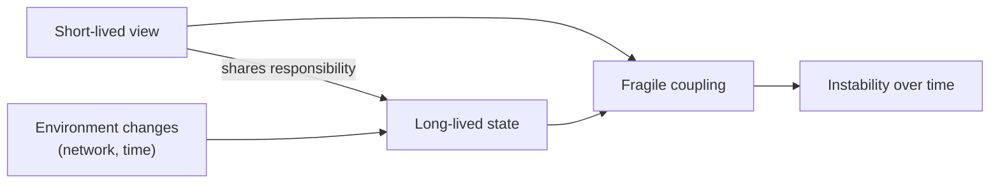

By this point in the series, a pattern kept showing up.

Boundaries kept mattering.
Adapters helped protect them until they didn’t.
And when adapters failed, responsibility leaked back into the system.

But there’s still an unanswered question:

**How do you know where a boundary belongs in the first place?**

The answer isn’t a framework.
It isn’t a pattern library.
It isn’t even a technical decision.

What kept deciding it was lifecycle.

---

## The mistake most architectures make

Most systems draw boundaries based on *structure*.

Files.
Folders.
Components.
Services.
Databases.

Those structures are visible, so they feel like natural boundaries.

But structure is not where systems fail.

Systems fail where **lifecycles collide**.

---

## What a lifecycle actually is

A lifecycle exists wherever something:

* starts
* changes over time
* can fail
* can recover
* must remain consistent while other things change

A lifecycle is not a class.
It’s not a module.
It’s not a function.

It’s **a promise that something will behave coherently over time**.

Where that promise exists, responsibility must exist too.

---

## Boundaries don’t isolate; they protect lifecycles

This is the mistake that kept driving over-engineering:

> “Everything should be an actor.”
> “Everything needs its own state machine.”
> “Everything deserves isolation.”

That’s not how boundaries work.

A boundary is earned, not granted.

Something earns a boundary **only when its lifecycle must be protected from the rest of the system**.

If there’s no lifecycle, there’s nothing to protect.

---

## The simplest rule I know

The closest thing to a rule I design around now:

> **If something has a lifecycle, it deserves a boundary.**
> **If it doesn’t, it probably shouldn’t have one.**

That single rule collapsed a surprising amount of architectural debate for me.

It tells you:

* when to introduce an actor
* when a function is enough
* when state should exist
* when it should be derived

And just as importantly, it tells you when *not* to model something.

---

## Why helpers don’t need boundaries

Most code does not have a lifecycle.

Pure functions.
Formatters.
Mappers.
Calculations.
Stateless transforms.

They don’t start or stop.
They don’t recover.
They don’t evolve independently.

Giving them boundaries adds ceremony without protection.

This is how architectures become heavy without becoming resilient.

---

## Why actors exist

Actors showed up because something needed to:

* remember what happened before
* respond differently over time
* survive partial failure
* remain stable while the environment changes

Actors aren’t an abstraction choice.

They’re a **lifecycle containment strategy**.

When you introduce an actor without a lifecycle, it feels academic.
When you ignore a lifecycle that exists, the system feels fragile.

---

## A concrete example you already know

Consider a modal that:

* opens, closes, and reopens
* retries a request
* survives route changes
* reacts differently after a failure

That modal has a lifecycle, whether you model it or not.

If you don’t protect it, something else will try:
a component, a hook, a reducer, or an adapter.

None of them are wrong.

They’re compensating for a boundary that was never drawn.

---

## The cost of missing a lifecycle boundary

When a lifecycle isn’t protected, responsibility spills outward.

You’ll see:

* UI components managing retries
* reducers tracking async phases
* hooks coordinating side effects
* adapters compensating for unstable behavior

None of these pieces are wrong in isolation.

They’re compensating for a boundary that was never drawn.

---

## Lifecycle mismatches are where systems crack

Most architectural pain comes from **lifecycle mismatch**:

* long-lived state coupled to short-lived UI
* environment concerns embedded in stable behavior
* temporal logic mixed with declarative intent

When lifecycles evolve at different speeds but share responsibility, instability is inevitable.

Boundaries exist to prevent that.

Here’s what that mismatch looks like when it isn’t caught early:

---

## A moment of recognition

You might already see this if:

* UI state survives longer than the view that created it
* retries live in components instead of behavior
* unmounting cancels logic you expected to persist
* timing affects correctness

None of this looks like an architectural mistake.

Until it does.

---

## Discovery, not design

This is the part that changed how I work the most:

I no longer *design* boundaries.

I **discover** them.

I look for:

* where state must persist
* where failure must be handled
* where time matters
* where independence is required

Those points reveal themselves.

Actors aren’t invented.
They’re uncovered.

---

## Why lifecycle comes before dependency direction

Dependency direction matters.
We’ll get to that next.

But dependency direction only works *after* lifecycles are correctly bounded.

If you don’t know what must remain stable,
you can’t know what should depend on what.

Lifecycle is the prerequisite.

---

## Where this leaves us

So far, the series has established:

* boundaries assign responsibility
* adapters enforce boundaries
* adapters fail when responsibility drifts
* lifecycles determine where boundaries belong

There’s one final question left:

**What allows a system to change without collapsing once those boundaries exist?**

That answer isn’t flexibility.

It’s direction.

---

## Series continuation

Next in *Behavior & Boundaries*:
**[Dependency Direction Is What Decides Whether Systems Age Gracefully or Rot](/writing/dependency-direction)**

## Series Context

This essay builds on:

* [When Code Becomes Cheap, Architecture Becomes Everything](/writing/when-code-becomes-cheap)

Related deep dives:

* [Actors](/writing/actors)

## Further Reading

* Erlang/OTP — Design Principles & Supervision ([Design Principles & Supervision](https://www.erlang.org/doc/design_principles/des_princ.html))
