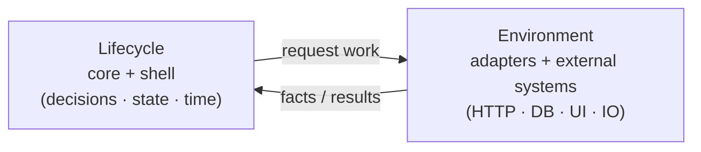
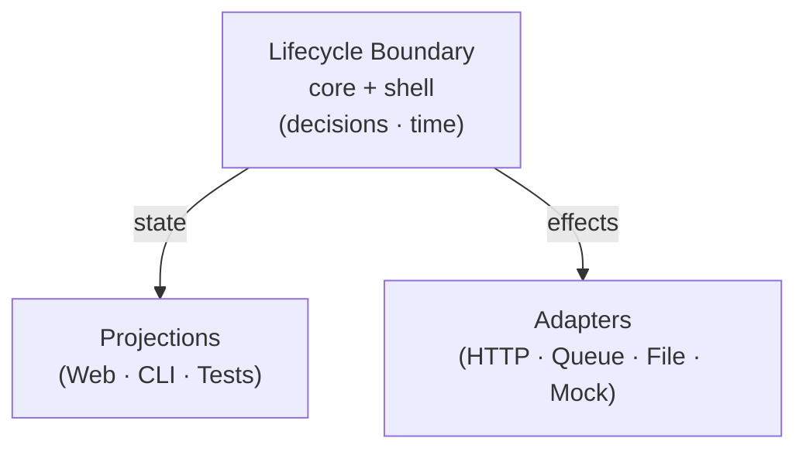

Over time, I kept running into the same kind of discomfort.

Systems would start out clean. The structure made sense. The abstractions felt reasonable.

But a few months in, it became harder to answer simple questions.

Where does this decision actually live?
Why does this behavior exist here instead of there?
And why does fixing one thing keep forcing changes somewhere else?

Nothing was obviously broken.
It just felt like the system was slowly losing its shape.

At first, I assumed this was just how things go as systems grow.  

But the same feeling kept showing up in different systems, written by different teams, using different tools.

Eventually, I stopped looking at the structure and started paying attention to time.

---

## What I kept getting wrong about boundaries

For a long time, I drew boundaries based on what I could see.

Files.
Folders.
Components.
Services.
Databases.

Those things are tangible. You can point at them. You can move them around.

But when the system became hard to reason about, it wasn’t because anything was obviously misplaced.

It was because something needed to keep working while everything else around it kept changing.

I’d fix a problem in one place, feel good about it, and then later run into a related issue somewhere else. Not the same bug—just the same uncertainty about where a decision was actually supposed to live.

That’s when it stopped feeling like a structural problem and started feeling like an ownership problem that played out over time.

---

## What a lifecycle actually is

I didn’t start with a definition.

What I noticed first was a pattern.

Whenever things felt unstable, there was usually something in the system that:

* had a beginning and an end
* changed behavior over time
* could fail and recover
* needed to stay coherent while other parts moved around

Eventually, I started calling that a lifecycle.

Not in the academic sense. Just as a way to name the thing that kept needing protection.

A lifecycle isn’t a class.
It isn’t a module.
It isn’t a function.

It’s the part of the system you’re trusting to keep its behavior straight as time passes.  

And once I started seeing systems that way, it became obvious that every promise already implied responsibility—whether I acknowledged it or not.

---

## Boundaries don’t isolate; they protect lifecycles

I used to think boundaries were mostly about separation.

Split things up. Isolate concerns. Reduce surface area.

That helps—up to a point.

What surprised me was how little abstraction actually helped.

The systems that held up weren’t the ones with the most structure. They were the ones where the parts that couldn’t afford to break were kept out of the blast radius.

That’s when it clicked for me: boundaries aren’t about isolation for its own sake.

They’re about protecting lifecycles that can’t afford to be interrupted every time the environment changes.

If nothing needs that protection, a boundary doesn’t really do anything.

---

## The simplest rule I design around now

I eventually needed a shorter way to describe what I was seeing.

This was the version that stuck:

**If something has a lifecycle, it probably needs a boundary.
If it doesn’t, adding one usually just creates noise.**

It’s not a hard rule.
It’s more of a check I run on my own designs.

It helps me decide:

* when introducing an actor makes sense
* when a function is enough
* when state needs to exist
* and when state should just be derived

More importantly, it helps me avoid modeling things too early, just because the tools make it easy.

---

## Why helpers don’t need boundaries

Most code I touch doesn’t actually have a lifecycle.

Pure functions.
Formatters.
Mappers.
Calculations.
Stateless transforms.

They don’t evolve independently.
They don’t recover.
They don’t need to stay consistent while the rest of the system changes.

I used to wrap these things in structure anyway, hoping it would make the system feel more “architected.”  

I did this a lot early on with Redux, and later with XState, modeling state and events for things that never actually needed to change meaningfully over time.

```ts
import { createSlice, PayloadAction } from "@reduxjs/toolkit";
  
declare function formatPhone(input: string): string;
declare function validatePhone(input: string): string | null;
  
type CheckoutState = {
  phoneInput: string;
  formattedPhone: string;
  phoneError: string | null;
};
  
const initialState: CheckoutState = {
  phoneInput: "",
  formattedPhone: "",
  phoneError: null
};
  
const checkoutSlice = createSlice({
  name: "checkout",
  initialState,
  reducers: {
    phoneChanged(state, action: PayloadAction<string>) {
      state.phoneInput = action.payload;
      state.formattedPhone = formatPhone(action.payload);
      state.phoneError = null;
    },
    phoneBlurred(state) {
      state.phoneError = validatePhone(state.phoneInput);
    }
  }
});
  
export const checkoutReducer = checkoutSlice.reducer;
export const { phoneChanged, phoneBlurred } = checkoutSlice.actions;
```

It usually did the opposite.

The system got heavier.
There was more ceremony.
But nothing felt more stable.

Once I stopped giving boundaries to things that didn’t have a lifecycle, a lot of that weight disappeared.

---

## Why actors exist

Actors started showing up in my designs for a very practical reason.

I kept running into behavior that needed to remember what happened before, behave differently over time, survive partial failure, and stay stable while the rest of the system kept changing.

Actors weren’t something I reached for because they were elegant.

They showed up because I kept tripping over the same kind of instability—and this was the shape that contained it.

Once I saw that pattern clearly, it wasn’t surprising that other systems had already landed here.

Actor-based systems created with Erlang and Elixir assume from the start that behavior will live over time and that failure is normal, not exceptional. On the frontend, XState was where this finally clicked for me—not as a framework choice, but as a way of being forced to name lifecycles, decisions, and invalid states explicitly instead of letting them drift across components, hooks, and effects.

Whenever I introduced an actor where no lifecycle existed, it felt like unnecessary ceremony. And whenever I ignored a lifecycle that was already there, the system felt fragile—no matter how clean the code looked.

---

## A concrete example you already know

One of the first places I noticed this clearly was in UI work.

Think about a modal that:

* opens, closes, and reopens
* retries a request
* survives route changes
* behaves differently after a failure

That modal has a lifecycle whether you model it or not.

If you don’t protect it, something else will try.

A component.
A hook.
A reducer.
An adapter.

None of those choices are wrong in isolation.

They’re all just compensating for a lifecycle boundary that was never made explicit.

Here’s one version of that compensation I’ve written myself.

It looks clean at first because the lifecycle is “not in the component.”

But it’s still living in React.  
Specifically, it’s bound to React’s render and teardown lifecycle.

```tsx
function useConfirm() {
  const [phase, setPhase] = React.useState<"idle" | "confirming" | "error">("idle");
  const [attempts, setAttempts] = React.useState(0);
  const [message, setMessage] = React.useState<string | null>(null);

  const busy = phase === "confirming";
  const canRetry = phase === "error" && attempts < 3;

  const confirm = async () => {
    if (busy) return { ok: false as const, error: "busy" };
  
    setPhase("confirming");
    setMessage(null);
  
    try {
      const res = await fetch("/api/confirm", { method: "POST" });
      if (!res.ok) throw new Error(`HTTP ${res.status}`);
      setAttempts(0);
      setPhase("idle");
      return { ok: true as const };
    } catch (e) {
      const err = e instanceof Error ? e.message : String(e);
      setAttempts((a) => a + 1);
      setMessage(err);
      setPhase("error");
      return { ok: false as const, error: err };
    }
  };

  const reset = () => {
    setPhase("idle");
    setMessage(null);
    setAttempts(0);
  };
  
  return { phase, busy, canRetry, message, confirm, reset };
}
```

This hook is now responsible for retry policy, timing, and error meaning.  
That responsibility didn’t disappear. It just moved.

```tsx
export function ConfirmModal({ open, onClose }: { open: boolean; onClose(): void }) {
  const { phase, busy, canRetry, message, confirm, reset } = useConfirm();

  if (!open) return null;

  return (
    <div role="dialog" aria-modal="true">
      <p>Are you sure?</p>

      <button
        disabled={busy}
        onClick={async () => {
          const result = await confirm();
          if (result.ok) onClose();
        }}
      >
        {busy ? "Confirming…" : "Confirm"}
      </button>

      {phase === "error" && (
        <>
          <p>{message ?? "Something went wrong."}</p>
          {canRetry && <button onClick={reset}>Try again</button>}
        </>
      )}

      <button onClick={onClose}>Cancel</button>
    </div>
  );
}
```

Nothing here is “wrong.” In the next essay, I’ll show what this looks like when the lifecycle lives outside React, and the component only renders a projection.

The problem is more subtle: the hook has become the lifecycle owner.

Retries, timing, cancellation, and error meaning are now tied to React’s lifecycle instead of having one of their own.

That’s fine until you want that same behavior somewhere else, without pulling React along with it.

---

## What it looks like when a lifecycle isn’t protected

When a lifecycle doesn’t have a clear boundary, the symptoms are subtle.

You start touching more files than you expect.
You coordinate changes across layers that don’t feel related.
You debate where logic belongs instead of why it exists.

Retries show up in the UI.
Async phases creep into reducers.
Hooks start coordinating side effects.

Each piece makes sense locally.

What’s missing is a place where responsibility can sit *across time* without being reshuffled every time something changes.

---

## Lifecycle mismatch is where systems become confusing

Most of the architectural pain I’ve felt hasn’t come from bad code.

It’s come from lifecycles moving at different speeds while sharing responsibility.

Long-lived behavior tied to short-lived UI.
Environment concerns baked into otherwise stable logic.
Time-based decisions mixed into places that weren’t meant to care about time at all.

Nothing explodes.  
Things just get harder to reason about.

And over time, that confusion becomes the dominant cost.

---

## Lifecycle mismatch in the wild (infrastructure example)

This isn’t just an application concern. The same failure mode shows up at infrastructure scale.

I ran into the same pattern again during a recent infrastructure incident.

At first, it looked like an SSL problem.

Certificates didn’t line up.
A firewall returned fallback responses.
Automation tools refused validation.
Diagnostics pointed in different directions.

Nothing about it looked architectural.

What was actually happening was simpler.

Two origin lifecycles existed at the same time.

One was still receiving traffic.
Another contained the active behavior.
DNS pointed to one.
Configuration changes were made to the other.
Edge services tried to compensate.

Every individual piece behaved correctly in isolation.

But no single lifecycle was clearly authoritative across time.

Responsibility wasn’t missing.
It was shared unintentionally.

The result wasn’t a crash.
It was confusion.

The same kind of confusion I’d felt in application code—just at a different scale.

The fix wasn’t more configuration.

It was re-establishing a single lifecycle as authoritative, and letting everything else report facts instead of guessing.

Once that happened, the system became understandable again.

---

## Why lifecycles must *request* work, not execute it

At this point, it helps to be explicit about what I mean by “the lifecycle.”  
I’m talking about the decision-making part of the system — the place where behavior is allowed to evolve over time, and where coordination is initiated, even if execution happens elsewhere.

In practice, the lifecycle spans both the core that decides and the shell that coordinates time. Execution itself stays in the environment.



This part took me longer to internalize.

My instinct was always to push work into the core.
If something needs to happen, why not just do it there?

And honestly, that works for a while.

But over time, I kept running into the same problem: the lifecycle of the behavior started to drift toward the lifecycle of the environment.

I kept finding that the parts deciding what should happen aged very differently from the parts actually doing the work.  

When the core executes work directly, it quietly takes on assumptions about where it’s running, what’s available, and how failure should be handled.

Those assumptions don’t hold forever.

What worked better was letting the lifecycle **request** work, and letting the environment carry it out.

The lifecycle decides.
The environment executes.
The lifecycle reacts to facts.

That separation kept responsibility from sliding around as systems evolved.

---

## Why real boundaries make layers replaceable

This is where things got interesting.

I didn’t set out to make systems swappable.

But once lifecycles were clearly bounded, replaceability started showing up on its own.

### Projections become replaceable

When projections stop deciding anything, they become interchangeable.

A web UI, a CLI, a test harness, or a background worker are all doing the same thing:

They’re projecting snapshots of the same lifecycle.

If switching interfaces forces changes to lifecycle logic, then the lifecycle was never really protected.

### Adapters become replaceable

When execution lives behind ports, adapters stop coordinating behavior.

They don’t decide when to retry.
They don’t decide what failure means.
They don’t decide what matters.

They just perform work and report results.

That’s why the same lifecycle can talk to HTTP today, a queue tomorrow, or a mock in tests without rewriting behavior.

### The core engine becomes replaceable

This one surprised me.

Once decisions were clearly scoped to the lifecycle boundary, the engine itself stopped being precious.

A reducer.
A state machine.
A store.

They’re all just ways of answering the same question:

Given this state and this event, what happens next?

If swapping the engine forces you to rethink responsibility, then the engine was doing boundary work it shouldn’t have been doing.

---

## The shape this creates



That’s when I realized the lifecycle was the only thing I wasn’t really swapping out.

---

## The invariant I trust now

This is the sentence I use to sanity-check my own designs:

**In practice, the only place I let time really matter is inside the lifecycle.
Everything else should be replaceable.**

When that’s true, systems stay understandable longer than I expect them to.

---

## Discovery, not design

I don’t try to design boundaries up front anymore.

I look for where state has to persist.
Where failure has to be handled.
Where time actually matters.

Those places reveal themselves.

Actors aren’t invented.
They’re uncovered.

---

## Why lifecycle comes before everything else

Until lifecycles are clearly bounded, dependency rules don’t really stick.

If you don’t know what must remain stable across time, it’s hard to know what should depend on what.

At least for me, everything else only started making sense once lifecycle was settled.

---

## Where this leaves us

So far, the series has established:

* confusion shows up when responsibility drifts across time
* lifecycles determine where responsibility must live
* boundaries exist to protect those lifecycles
* when lifecycles are right, everything else becomes replaceable

That leaves one final question:

**What doesn’t need a lifecycle at all?**

The answer isn’t more structure.

It’s knowing which parts of the system should never carry time in the first place.

---

## Series continuation

**Next in Behavior & Boundaries:**.  
**The Functional Core**  
**What remains once time, coordination, and side effects are removed**
