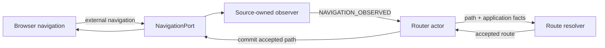

The functional core gave the router one place to decide which route the application accepts.

I still had to connect that decision to the browser.

I was using a newer Navigation API iteration of the beta router examples to test that boundary against native navigation.

My first version used an Ignite effect. When the accepted route changed, the effect called the browser's Navigation API. That preserved an important boundary: the resolver decided the route without importing `window`, and the effect handled the outward update.

For a single rendered element, that approach felt natural.

The problem became clearer when I followed everything else the router had to do. It needed to read the initial path, observe browser navigation, receive requests from several surfaces, commit accepted paths, record failures, and remove the observer when it stopped.

The route element was only one projection of that behavior. It was not the lifetime owner of the router.

## The effect solved direction, not ownership

The effect established the direction of the dependency. Router state changed first, then browser navigation followed.

It did not answer which running part of the system owned the browser relationship.

An earlier version started the shared router actor in one module and registered the browser observer beside it:

```ts
export const routerActor = createActor(routerMachine, {
  input: { path: currentPath() },
}).start();

onPopState((path) =>
  routerActor.send({
    type: "POPSTATE",
    path,
  }),
);
```

The Ignite effect handled the opposite direction by writing accepted paths back to browser history.

Each piece worked, but their lifetimes did not line up.

`onPopState` returned an unsubscribe function, and this call discarded it. Stopping the actor did not remove the observer. The Ignite effect belonged to a route element even though the shared actor and browser observer could outlive that element.

The nested router made this harder to ignore. Parent navigation, documentation sections, and settings panels all projected the same router source. If one of those elements connected or disconnected, it should not decide whether the application router was still observing the browser.

The question that helped me move forward was not, "Where should this code live?"

It was:

> Which parts of this behavior must start and stop together?

The router state, browser observation, accepted-path commits, failure handling, and cleanup described one running lifecycle. They needed an owner whose lifetime contained all of them.

## Removing `host` made the next boundary visible

The earlier API change also mattered here.

Once `host` was removed from `igniteCore` command and effect callbacks on the v3 beta line, the custom element could no longer act as an implicit path to browser capabilities. Commands received explicit application inputs. Effects had to use explicitly provided capabilities instead of discovering them through the element.

That was intentional, but it raised another design question: how should the router receive navigation without turning Ignite Element into a browser integration framework?

I considered introducing another Ignite abstraction, something like a driver or `igniteEnvironment`. The idea was to give effects and sources a standard place to find browser, storage, network, or other environment capabilities.

The more I worked through it, the less it fit.

Ignite Element already has a behavioral input: the source. That source may be an XState machine or actor, a Redux store, a MobX object, or another supported runtime. Adding a second behavior runtime to `igniteCore` would create more configuration while making Ignite Element responsible for how every state library provisions external capabilities.

XState already has its own composition tools, including machine provisioning with `.provide()`. Other sources have their own construction patterns. Ignite Element does not need to replace them.

The direction we landed on was simpler: provide the environment capability while constructing the source, then give the resulting source to `igniteCore`.

For the router, that capability became `NavigationPort`.

## The source owns navigation over time

The navigation port answers three questions the source has about its environment:

- What is the current path?
- How can the router observe external path changes?
- How can it commit a path the application accepted?

The browser implementation uses `window.navigation`. A memory implementation provides the same capability for headless tests. Neither implementation owns route matching, authentication redirects, or nested route policy.

Those decisions remain in the project resolver.

The source uses the port to assemble the running behavior. Its observer is expressed as XState callback actor logic:

```ts
observeNavigation: fromCallback<RouterEvent>(
  ({ sendBack }) =>
    navigation.observe((path) =>
      sendBack({
        type: "NAVIGATION_OBSERVED",
        path,
      }),
    ),
),
```

`navigation.observe` returns its cleanup function. Because the router invokes this callback actor at its root, observation begins when the router starts and cleanup runs when the router stops.

That is the lifecycle boundary I was missing in the first version.


```mermaid
flowchart LR
  Browser["Browser navigation"]
  Port["NavigationPort"]
  Observer["Source-owned observer"]
  Actor["Router actor"]
  Resolver["Route resolver"]

  Browser -->|"external navigation"| Port
  Port --> Observer
  Observer -->|"NAVIGATION_OBSERVED"| Actor
  Actor -->|"path + application facts"| Resolver
  Resolver -->|"accepted route"| Actor
  Actor -->|"commit accepted path"| Port
  Port --> Browser
```

The Ignite effect was useful because it showed that the browser update belonged outside the deterministic resolver. Moving navigation under the source answered the next question: the router's running owner, not the rendered element, should coordinate that update with observation and cleanup.

Ignite Element remains the projection boundary. It receives the source, derives the view, exposes commands, and renders components. The source owns behavior that must remain coherent even when a particular projection disconnects.

## The environment can change without rebuilding the router

Once navigation was supplied to the source, the same router behavior could run with browser and memory implementations:

```ts
const browserSource = createRouterSource({
  navigation: createBrowserNavigation(
    resolveBrowserNavigation(),
  ),
});

const memory = createMemoryNavigation("/");

const headlessSource = createRouterSource({
  navigation: memory.port,
});
```

This was important for dogfooding Ignite Element. The [headless runtime](https://0xjcf.github.io/ignite-element/api/headless-runtime/) should be able to exercise the same router behavior without fabricating a custom element or pretending to be a browser.

The memory implementation can report an externally observed path. It can also record paths the router asks it to commit. The browser implementation translates those operations into the native Navigation API.

Changing the implementation does not move route policy. It also does not move the observer lifetime. Both remain under the same source.

This is where ports became useful in a way that felt less abstract to me. The port is not another layer added for ceremony. It is the application-facing shape of a capability the source needs in more than one environment.

The adapter answers, "How does navigation work here?" The resolver answers, "Which route does this application accept?" The actor keeps those answers coherent as events arrive over time.

## The current commit protocol has a limit

The browser's Navigation API exposes more lifecycle detail than the current router port preserves. A call to `navigation.navigate()` provides separate `committed` and `finished` promises. One represents the URL and history entry changing. The other represents the navigation finishing, including intercepted work.

Our current `NavigationPort.commit()` returns `Promise<void>`.

The router resolves the accepted route, updates its context, and asks the port to commit the path. If the promise rejects, the source records the failure. If it resolves, the source does not receive a separate application fact.

That means router context currently represents the route accepted by application policy. It does not prove that the environment confirmed every part of the navigation lifecycle.

I think this is an important limit to keep visible without designing a larger protocol before the example needs one.

If a future application needs to distinguish accepted, browser-committed, and fully-finished navigation, the port and actor protocol will need to preserve the milestone that matters. We would also have to decide what happens when a second request arrives before the first one finishes and whether abandoned work can be cancelled.

The current dogfooding projects do not answer those questions. They demonstrate optimistic context updates, commit rejection handling, source-owned observation, and cleanup.

That is enough evidence for the boundary we changed. It is not evidence for a pending-route or confirmed-navigation protocol we have not implemented.

## Why the actor owns this behavior

The resolver can remain a function because its work ends when it returns an accepted route.

The router cannot end there. It remembers state, receives requests from multiple navigation surfaces, observes the browser while running, commits accepted paths, records failures, and releases its observer when it stops.

I use an actor because those responsibilities already form a protocol over time. The meaning of a request depends on current route and authentication state. Observation can arrive between application requests. Cleanup has to occur even if no route element remains connected.

That does not mean every router needs XState. An imperative controller with `start()`, `navigate()`, and `stop()` could own the same lifecycle in a smaller application.

The architectural requirement is narrower: the behavior that must remain coherent from start to stop needs one owner with the right lifetime.

For Ignite Element, this also protects the library boundary. `igniteCore` does not need `host` in commands or effects, and it does not need a new environment runtime. It receives a source whose behavior and capabilities were already composed using the tools native to that source.

That feels closer to the framework-agnostic design I want. Ignite Element projects behavior without quietly becoming its lifecycle authority.

## Next in the series

The router source now depends on a navigation capability without depending on `window.navigation` directly. The browser and memory implementations can change while route policy and lifecycle ownership remain in the same place.

The next article examines that capability boundary more closely: what belongs in a port, what belongs in an adapter, and how external values become application meaning without moving policy into the integration.

If you want to follow this work in the project itself, the [Ignite Element v3 beta documentation](https://0xjcf.github.io/ignite-element/) describes the current runtime model, and the [beta branch on GitHub](https://github.com/0xjcf/ignite-element/tree/beta) contains the source and dogfooding examples behind this series.
