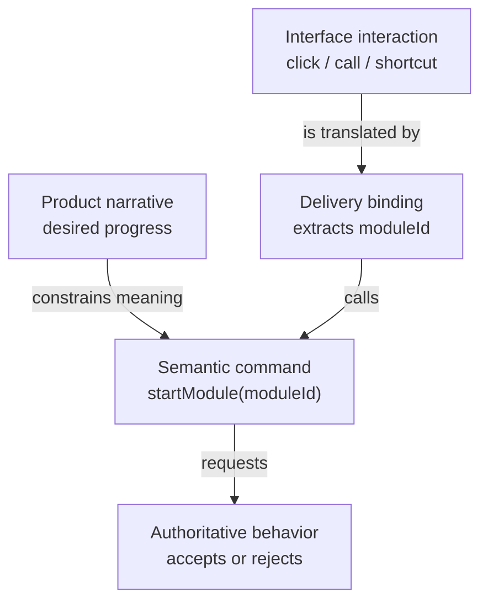

A product narrative is not yet a runtime contract.

Consider the narrative from the previous article:

> A developer wants to start a selected module while exercising the application from different interfaces. They should be able to identify the module directly instead of reconstructing how one browser view stores that value.

The paragraph preserves the person, their desired progress, and the presentation detail we want to keep outside the application contract.

But an actor cannot treat that paragraph as a deterministic protocol.

At the other extreme, a browser can give us a `MouseEvent`. That object can cross a function boundary, but it says almost nothing about the application request. It contains coordinates, targets, and browser state while leaving the behavior to reverse-engineer what the click meant.

The narrative has meaning but no protocol. The gesture has data but no application meaning.

The translation between them is where intent either survives or begins to leak.

This is where I use a semantic command: a request named in the application's vocabulary that carries the information its authority needs to consider it.

## The interface sees a gesture

In a browser, the interaction may begin with a click. In a test, it may begin with a direct function call. Another interface might use a keyboard shortcut, an HTTP request, or an agent action.

Those are delivery mechanisms. They are not the application intent.

If the command accepts a browser event, the interface becomes part of the application contract:

```ts
startModule(event: MouseEvent);
```

The behavior now has to discover what the click meant. It may inspect `event.currentTarget`, read a data attribute, or depend on a particular markup structure. A headless test must recreate enough of that interface to make the request.

The semantic command names the operation directly:

```ts
startModule(moduleId: string);
```

The browser binding can obtain the selected ID from its current view and pass it in. A headless test can use the same contract without creating a `MouseEvent` or an element.

This is not about removing context indiscriminately. It is about separating the context behavior needs from the mechanism that happened to capture it.

The behavior needs to know which module was requested. It does not need the click coordinates, target element, or markup structure.

The delivery boundary should translate the interaction. It should not ask the application to reverse-engineer the interface.

## A command is a compression boundary

I think of the semantic command as a form of deliberate compression.

The product narrative contains more context than the running behavior needs. The interface interaction contains more delivery detail than the application should know. The command preserves the smallest useful meaning between them.

| Form | What it preserves |
| --- | --- |
| Product narrative | Person, context, desired progress, and product intent |
| Interface interaction | How one interface observed or captured the request |
| Semantic command | The application request and the values behavior needs to consider it |
| Fact | What the application or external work determined actually happened |

Compression is useful only if we preserve the right information.

If we discard `moduleId`, the behavior cannot identify the requested module. If we carry the entire `MouseEvent`, the application inherits browser details it does not need. If we announce that the module started before authoritative behavior accepts the request, we have compressed a possibility into a false fact.

The goal is not the smallest payload. It is the smallest payload that preserves application meaning.

In a larger system, that may include an idempotency key, correlation ID, initiating actor, or provenance the application needs for consistency and audit. Those values are not automatically delivery noise. The question is whether authoritative behavior needs them to interpret the request, not whether they came from outside the current function.

## Carry the request to its authority

In the [Ignite Element v3 beta](https://0xjcf.github.io/ignite-element/), the command forwards the request to the actor:

```ts
commands: ({ actor }) => ({
  startModule: (moduleId: string) => {
    actor.send({
      type: "START_MODULE",
      moduleId,
    });
  },
});
```

The beta API makes the same boundary explicit: command callbacks receive the actor, not the custom-element `host`. A browser binding may still read from its element, but that translation happens before it calls the command.

Two small translations happen:

1. The delivery interface turns its interaction into `startModule(moduleId)`.
2. The command function turns that request into `START_MODULE` for the actor that owns the behavior.

The command does not decide whether the module may start. It does not update actor context directly or announce that the start succeeded. It carries the request to the part of the application allowed to interpret it.



The narrative constrains what the command means, but it does not execute the interface. The binding translates the current interaction. The command then crosses into authoritative behavior without carrying the interface with it.

That seam looks almost boring.

That is a good sign. A command should be easy to describe: receive application intent and carry it to its owner.

## A request is not a fact

The message name often reveals what we think the sender has authority to claim.

`START_MODULE` is a request. It says someone wants the behavior to consider starting a module.

`MODULE_STARTED` makes a different claim. It says the start already happened.

| Message | Meaning | Appropriate sender |
| --- | --- | --- |
| `START_MODULE` | Please consider starting this module | A caller allowed to request the behavior |
| `MODULE_STARTED` | The module has successfully started | The behavior or work that observed completion |

If an interface sends `MODULE_STARTED` because someone clicked a button, it announces an outcome it does not own. The current state may reject the request. The work may fail. Another module may already be running.

The actor may receive `START_MODULE`, reject it, begin work, and later receive or produce `MODULE_STARTED` after completion. Those messages describe different moments and require different authority.

This is why naming every event in the past tense can be as misleading as naming every event as an imperative. The useful question is not grammatical:

> What does the sender have the authority to claim?

## Translation can fail in two directions

A delivery boundary can translate too little.

Passing a `MouseEvent`, HTTP request, SDK object, or provider payload into behavior forces the application to understand an external contract. The command exists, but the delivery mechanism crossed with it.

The boundary can also translate too much.

If the command validates application policy, chooses an adapter, performs retries, changes state, and announces completion, it becomes a second behavior engine:

```ts
startModule: async (moduleId) => {
  if (!canStart(moduleId)) return;
  await retry(() => api.start(moduleId));
  actor.send({ type: "MODULE_STARTED", moduleId });
};
```

Some boundary validation is normal. A route parameter may need decoding. A form value may need to become an explicit application value. Structurally invalid input may need to be rejected before it enters the application.

But deciding whether a valid request is allowed now, which work should begin, and what a failure means belongs with authoritative behavior and policy.

The narrow path is:

- translate delivery details into application values
- preserve the context behavior actually needs
- carry the request without deciding its outcome

Too little translation leaks the interface inward. Too much translation moves behavior outward.

## The same boundary appears in navigation

Navigation makes the next problem easier to see.

A browser link produces a click. The application intent is to request a destination:

```ts
commands: ({ actor }) => ({
  navigate: (to: string) => {
    actor.send({
      type: "NAVIGATE_REQUESTED",
      to,
    });
  },
});
```

`NAVIGATE_REQUESTED` does not claim that the browser moved or that the destination is allowed. It asks the router's behavior to interpret a destination under the current policy.

The router still has to answer:

- Does the path match a route?
- Does the route require authentication?
- Should the request redirect?

Those answers should not depend on whether the request came from a link, a test, an HTTP route, or another delivery interface.

The semantic command gives each caller the same vocabulary. It does not guarantee the same outcome, because the current state and policy still matter.

That distinction is the reason the command remains a request.

## Use the smallest useful vocabulary

Semantic does not mean elaborate.

We do not need a command class, command bus, or generic envelope for every request. A typed function and a typed actor event may be enough.

I add structure when it protects a real distinction:

- interface interaction versus application intent
- request versus completed fact
- structural validation versus application policy
- caller responsibility versus behavior authority

For `startModule`, a string argument was enough to expose the hidden dependency. For navigation, `NAVIGATE_REQUESTED` gives the router one place to interpret the request.

The value is not the pattern name. It is that different callers can express the same intent without importing one interface's vocabulary or creating another policy owner.

## A semantic-command check

Before exposing a command, I ask:

- Is it named after what the caller wants rather than how one interface delivers it?
- Does it carry every value authoritative behavior needs to consider the request?
- Can another caller use it without fabricating UI, transport, or provider objects?
- Does the sender have authority to make the claim expressed by the message?
- Does the boundary translate structure without deciding application policy?
- Is the command still understandable without knowing the current interface?

If those answers are clear, the command forms a useful seam between delivery and behavior.

## Next in the series

`NAVIGATE_REQUESTED` gives the application a stable request, but a request is not yet a decision.

Something still has to interpret the destination under the current routes, authentication state, and navigation policy. That interpretation should produce the same answer for the same state and facts, regardless of which interface delivered the request.

The next post, [*The Functional Core*](/writing/functional-core/), isolates that deterministic decision before we add browser history, observers, or asynchronous commits.
