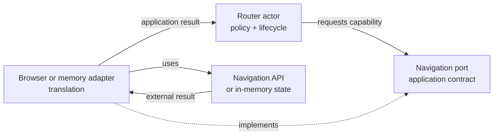

The router from the previous article receives a `navigation` implementation.

The actor owns route policy and lifecycle. The implementation reads, observes, and commits paths in a particular environment.

Calling that implementation an adapter is reasonable, but it leaves one question unanswered:

What exactly is it adapting to?

The answer is the port: an application-owned contract that names the capability the router needs.

## Start with the capability

The router does not need “the browser.” That phrase carries more surface area than the behavior actually uses.

It needs three capabilities:

- read the current path;
- observe external path changes;
- attempt to commit a path.

We can express those needs without mentioning `window`, the Navigation API, or an in-memory test implementation:

```ts
type NavigationInstruction = {
  path: string;
  history: "push" | "replace";
};

type NavigationCommit =
  | { ok: true; path: string }
  | {
      ok: false;
      reason: "aborted" | "unavailable";
      message: string;
    };

type NavigationPort = {
  currentPath(): string;
  observe(
    listener: (path: string) => void,
  ): () => void;
  commit(
    instruction: NavigationInstruction,
    signal: AbortSignal,
  ): Promise<NavigationCommit>;
};
```

This contract is a port because it is written from the application’s side of the boundary.

The router owns the words `path`, `push`, `replace`, `aborted`, and `unavailable`. A browser implementation may need to translate those words into a platform API. A memory implementation may not need a platform at all.

## A port is not the translation

Ports and translation are closely related, but they are not the same thing.

The port defines what the application needs and which results it understands.

The adapter performs the translation between that contract and a concrete environment.



The dashed arrow matters: the port does not call the adapter as a separate runtime hop. It is the contract the concrete adapter satisfies.

At assembly time, the application supplies an implementation to `createRouterSource`. At runtime, the source-owned actors call that implementation through the port.

## The browser adapter translates platform behavior

A browser adapter knows about platform details the router should not need to understand.

Its shape might look like this:

```ts
function createBrowserNavigation(
  browser: BrowserNavigation,
): NavigationPort {
  return {
    currentPath: () => browser.currentPath(),

    observe: (listener) =>
      browser.onPathChange(listener),

    commit: async (instruction, signal) => {
      try {
        const path = await browser.commit({
          path: instruction.path,
          replace:
            instruction.history === "replace",
          signal,
        });

        return { ok: true, path };
      } catch (error) {
        if (signal.aborted) {
          return {
            ok: false,
            reason: "aborted",
            message: "Navigation was replaced",
          };
        }

        return {
          ok: false,
          reason: "unavailable",
          message: toErrorMessage(error),
        };
      }
    },
  };
}
```

The exact platform calls are less important than the direction of translation.

The adapter receives an application instruction. It converts that instruction into platform work. It then converts the platform result or expected failure into a value the application understands.

The adapter does not decide whether `/dashboard` should redirect to `/login`. That decision has already been made by `resolveNavigation`.

## The memory adapter implements the same capability

A headless implementation can satisfy the same port without pretending to be a browser:

```ts
function createMemoryNavigation(
  initialPath: string,
) {
  let currentPath = initialPath;
  const listeners = new Set<
    (path: string) => void
  >();

  return {
    port: {
      currentPath: () => currentPath,

      observe: (listener) => {
        listeners.add(listener);
        return () => listeners.delete(listener);
      },

      commit: async ({ path }, signal) => {
        if (signal.aborted) {
          return {
            ok: false,
            reason: "aborted",
            message: "Navigation was replaced",
          };
        }

        currentPath = path;
        return { ok: true, path };
      },
    } satisfies NavigationPort,

    externalNavigate: (path: string) => {
      currentPath = path;
      listeners.forEach((listener) =>
        listener(path),
      );
    },
  };
}
```

The memory adapter is not a fake DOM. It is a real implementation of the smaller capability the router owns.

That makes the headless runtime useful for more than a unit test. It can exercise the same actor lifecycle and route policy while replacing only the environmental mechanism.

The separate `externalNavigate` test driver protects an important distinction. An application commit returns through `commit`; an independently observed change enters through `observe`. If the adapter echoes its own commit through both paths, the router may process one navigation twice. A browser adapter needs the equivalent distinction, often by recognizing notifications caused by its own programmatic commit.

## Expected failure should return to behavior

External APIs often throw. The application still needs to decide what an expected failure means.

That does not require banning exceptions everywhere.

The adapter can catch platform exceptions at the boundary and translate expected outcomes into an application result. An unexpected programming error may still reject and reach the actor’s unexpected-error path.

For navigation:

- an aborted commit may be expected when a newer request replaces it;
- an unavailable navigation service may move the router to `failed`;
- an impossible adapter invariant should remain loud.

The adapter identifies the environmental outcome. The actor interprets that outcome under its current policy.

This is the useful part of “errors as data”: expected failure returns through the contract instead of silently selecting a different control-flow owner.

## Where adapters start deciding too much

An adapter has crossed the boundary when it begins to answer application questions:

```ts
if (!authed && path === "/dashboard") {
  return commit("/login");
}
```

That branch may work, but route policy now lives in both the resolver and the browser adapter.

The same drift happens when an adapter:

- chooses whether a retry is allowed;
- maps provider status directly to UI state;
- reads actor context to special-case one machine state;
- publishes success before the external operation completes.

Mechanisms can still contain operational choices. An HTTP adapter may follow protocol redirects, and a database client may manage connection pooling. The boundary is crossed when those mechanisms start deciding application meaning.

## Not every dependency needs a port

A port is useful when the application needs to protect its vocabulary, run against more than one environment, or keep provider details from becoming policy.

It is not useful merely because an import exists.

If a library is already expressed in application terms, has no meaningful replacement or test seam, and does not pull environmental decisions inward, an extra interface may only make the call harder to follow.

The router earned a port because browser observation, memory observation, commit failures, and cleanup all needed the same application-facing contract.

## A ports-and-adapters check

When I review a boundary, I ask:

- Is the port named after a capability the behavior needs?
- Are its inputs and results expressed in application terms?
- Can an adapter implement it without importing behavior policy?
- Does the adapter translate expected environmental outcomes back into facts?
- Would a second implementation replace mechanism without redefining meaning?
- Does the running actor still own when the capability is used and what its result means?

If the last answer is no, the adapter has probably become another behavior owner.

## Next in the series

The port explains what the router needs, and the adapters explain how different environments provide it.

Something still has to choose the browser implementation, supply it to the source, start the root actor, and stop the application. The next article places that work in a small imperative shell without turning the shell into another workflow engine.
