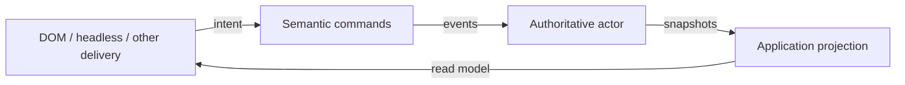

At this point, the router has an accepted policy, a running actor, a navigation port, concrete adapters, and an application shell.

The browser still needs to render something.

It could subscribe to the actor and inspect every state and context field directly. That is convenient, but it makes the current machine structure the public contract for every view.

Ignite Element gives us another choice: project the actor snapshot into a smaller application-facing state and expose semantic commands beside it.

## Projection is a deliberate public view

A projection is a deterministic transformation from authoritative state into the information a consumer is allowed to use.

For the router, an Ignite source might expose:

```ts
igniteCore({
  source: routerSource,

  states: ({ snapshot }) => ({
    path:
      snapshot.context.current?.path ?? "/",
    route:
      snapshot.context.current?.route ??
      "not-found",
    isNavigating:
      snapshot.matches("committing"),
    canRetry:
      snapshot.matches("failed"),
    error: snapshot.context.error,
  }),

  commands: ({ actor, command }) => ({
    navigate: command((to: string) => {
      actor.send({
        type: "NAVIGATE_REQUESTED",
        to,
      });
    }),
    retry: command(() => {
      actor.send({ type: "RETRY" });
    }),
  }),
});
```

The exact API will evolve with Ignite Element. The architectural point is the shape of the boundary:

- state flows out through a named projection;
- intent flows in through semantic commands;
- neither direction lets the delivery surface mutate actor state.

## Raw actor state is not automatically wrong

“Never expose raw state” is too absolute.

A small application may intentionally make an actor snapshot its public contract. Developer tooling may need the complete snapshot for inspection. A machine state such as `committing` may already be the clearest value a consumer can receive.

The question is whether that coupling is deliberate.

If every component reaches into `snapshot.context.pending.route.path`, a later change from `pending` to a queue affects every component. If the application contract exposes `isNavigating` and the last reconciled `path`, the internal lifecycle can change without forcing the delivery surface to reinterpret it.

Projection is useful when it protects consumers from details they do not own.

## Projection must not repair behavior

Suppose the router promotes a pending route before the browser commit succeeds.

A projection could hide the problem by continuing to display the previous path until another flag changes. That would make the UI look correct while the actor state remained contradictory.

The projection should not reconcile two competing sources of truth.

The actor owns whether a route is current. The projection reads that accepted fact:

```ts
path: snapshot.context.current?.path ?? "/"
```

It does not compare browser state, rerun authentication policy, or decide which pending route should win.

If projection needs enough logic to correct the behavior, the authority boundary is already split.

## Projection and presentation are different

Projection provides an application-facing read model.

Presentation decides how a particular interface renders that model.

For example, projection may expose:

```ts
{
  isNavigating: true,
  canRetry: false,
  error: null,
}
```

A web component might render a progress indicator. A speech interface might announce that navigation is in progress. A headless test might assert the same state without rendering anything.

The projection does not select CSS, markup, animation, or spoken wording. It gives those delivery surfaces a stable contract.

## Commands complete the boundary

Projection is often described only as data flowing outward. Ignite’s command binding makes the other direction equally important.



Commands and projection do not form another behavior loop.

The command carries intent to the actor. The projection carries accepted state back to consumers. Policy remains inside the behavior that owns the lifecycle.

This is why the `startModule(moduleId)` change from the first article mattered. The command could be shared by browser and headless delivery because it was not shaped like either one.

## Projection gives change a smaller surface

The router might later add:

- a `restoring` state during bootstrap;
- multiple internal commit substates;
- richer error provenance;
- an authentication refresh actor.

Consumers should only change if those additions alter the application contract they depend on.

A projection makes that contract reviewable. We can ask:

- Did the public route shape change?
- Can a caller still send the same semantic command?
- Does `isNavigating` retain the same meaning?
- Are new failure details meant for every delivery surface or only diagnostics?

Without that boundary, every internal refactor is also a delivery-contract review.

## Test the projection as a contract

A machine test proves the router reaches the expected snapshot.

A projection test proves consumers receive the expected public view:

```ts
expect(projectRouter(committingSnapshot)).toEqual({
  path: "/",
  route: "home",
  isNavigating: true,
  canRetry: false,
  error: null,
});
```

That test is intentionally narrower than rendering a web component. It tells us the projection follows its contract for a known actor snapshot.

An integration test can then verify that a delivery surface binds to that contract correctly.

Neither test proves that someone understands the navigation experience or completes their task. That is a different evidence question.

## A projection check

When I define a projection, I ask:

- Which actor state is authoritative?
- What does this consumer actually need to know?
- Is the projected value stable enough to become a contract?
- Am I exposing an internal detail because it is useful or merely because it is available?
- Is projection translating accepted state or compensating for incorrect state?
- Can another delivery surface use the same commands and read model?

Projection earns its place when those answers reduce the number of consumers that need to understand actor internals.

## Next in the series

We can now trace a narrative into a command, policy, lifecycle, capability, adapter, runtime, and projection.

Tests can prove that those pieces conform to their accepted contracts. They still cannot prove that the product decision helped the person described at the start.

The next article separates conformance evidence from product-outcome evidence and shows why the series needs both.
