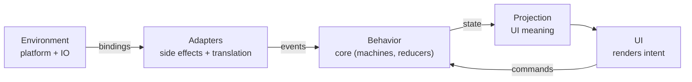

There was a time when writing code was the hard part.

You had to remember syntax.
You had to understand APIs.
You had to wire async logic carefully.

First it was nested callbacks, until you hit *callback hell*.
Then it was Promises, until they became hard to reason about.

Even now, with the elegance of async/await, asynchronous flow still demands respect.

That friction slowed us down just enough to think.

**It forced us to make fewer decisions — and to notice when those decisions mattered.**

That constraint is gone now.

---

## Before we go further

> **This post is not a tutorial.**
> It’s **not** a framework announcement.
> And it’s **not** about replacing tools.
>
> It’s about responsibility — how it moves, how it leaks, and how systems quietly lose clarity when boundaries aren’t explicit.
>
> This is the foundation post for the *Behavior & Boundaries* series.
> Everything that follows builds on the ideas named here.

*This matters because without a shared mental model of responsibility, every technical discussion collapses into tooling debates.*

---

## The bottleneck moved

Today, generating code is easy.

Shockingly easy.

You can ask an AI to scaffold a feature, wire async calls, and “handle loading and error states.”

And it will do it. Quickly. Confidently.

But something subtle changed when that friction disappeared.
I didn't notice it at first.

The hardest part of building software stopped being *writing the code itself*.

It became *understanding the system the code participates in*.
**And where responsibility is allowed to live.**

That shift is dangerous because responsibility is invisible unless you deliberately name it.
You only feel it later, when you try to change something.



*Architecture as boundary: where behavior lives — and where it doesn’t.*

---

## This is where systems start to break

The cracks usually appear around async behavior.

That’s not accidental.

Async work is where systems interact with things they don’t control — time, networks, failures, retries.

You’ll see state machines that look reasonable at first glance:

```ts
createMachine({
  initial: "idle",
  states: {
    idle: {
      on: { LOAD: "loading" }
    },
    loading: {
      invoke: {
        src: () => fetch("/api/data").then(r => r.json()),
        onDone: { target: "success" },
        onError: { target: "error" }
      }
    },
    success: {},
    error: {}
  }
});
```

This code is valid.
It even looks *well-structured*.

At first glance, nothing seems wrong.

But look closer — not at the syntax, but at the **responsibilities**.

This boundary does more than separate concerns.
It limits where decisions are allowed to exist.

When behavior is confined to a core, responsibility has fewer places to hide.
When it isn’t, decisions spread — quietly, incrementally — across the system.

The behavior of the system — the rules that decide *what happens next* — must remain pure, inspectable, and deterministic.

Everything that touches the outside world — networks, time, retries, IO — belongs in the shell.

When those concerns mix, behavior stops being something you can reason about and becomes something you can only observe.

That machine now knows about the network.
It depends on the browser.
It hides failure semantics inside an effect.
It can’t be replayed deterministically.

At some point, the machine stopped describing **behavior** and started executing **external interaction**.

That’s the fault line.

Once behavior depends on the environment, clarity disappears — even if the code still “works.”

---

## State machines helped us express behavior more clearly

But they also made it easier to blur the line between **describing behavior** and **executing it**

That line is architectural.

And crossing it doesn’t cause an error — it causes **drift**.

The system still runs.
Tests still pass.
But understanding decays.

---

## The insight that reshaped my work

While building ignite, I kept running into the same feeling:

> “The logic is correct… so why does this system feel unstable?”

That question mattered because correctness wasn’t the issue.

The answer wasn’t tooling.

It was responsibility.

I was mixing concerns that **evolve at different speeds** as if they were the same thing.

Behavior needs to remain stable over time.

Integrations don’t — they change as vendors, SDKs, and infrastructure change.

UI meaning and deployment environments evolve on their own timelines.

Treating them as peers guaranteed tension.

*In frontend code, this often shows up when integration details leak directly into UI behavior.*

```tsx
function AccountPanel() {
  const [status, setStatus] = useState<"idle" | "loading" | "error" | "ready">("idle");
  const [data, setData] = useState<any>(null);

  useEffect(() => {
    setStatus("loading");

    fetch("/api/user")
      .then(async (r) => {
        const json = await r.json();
        // Integration churn leaks into behavior here:
        // a backend shape change forces UI + state logic to change together.
        setData(json.user);
        setStatus("ready");
      })
      .catch(() => setStatus("error"));
  }, []);

  if (status === "loading") return <Spinner />;
  if (status === "error") return <ErrorBanner />;
  return <AccountView user={data} />;
}
```

*When API shape, retries, and UI transitions live in the same place, changes stop being local and start cascading through the system.*

That mismatch was the instability.

---

## The mental model I design around now

Eventually, it all collapsed into a single idea:

• **Behavior lives in the core** — because behavior must remain deterministic.  
  *(Functional Core / Imperative Shell)*  
  [Learn more →](https://youtu.be/P1vES9AgfC4?si=UGbUEGexlkK9axkG)

• **External interaction lives behind adapters** — because integrations change faster than intent.  
  *(Hexagonal Architecture / Ports & Adapters)*  
  [Learn more →](https://alistair.cockburn.us/hexagonal-architecture/)

• **Projection translates internal state into meaning** — because humans don’t think in transitions.  
  *(Presentation Model)*  
  [Learn more →](https://martinfowler.com/eaaDev/PresentationModel.html)

• **Environments only change the bindings** — because deployment should never redefine behavior.  
  *(OTP design principles / supervision mindset)*  
  [Learn more →](https://www.erlang.org/doc/design_principles/des_princ.html)

This isn’t a framework rule.
It’s a systems rule.

---

## Design comes before code

What changed for me wasn’t a new tool.

It was the **order** in which I make decisions.

Today, I don’t start with components, APIs, or databases.

I start by clarifying intent and behavior — because everything else depends on those being stable.

My design process looks like this:

1. **User stories**: what someone is trying to accomplish
2. **Workflows**: how that intent unfolds over time
3. **Actors**: where state and responsibility must live
4. **Contracts**: commands, events, and observable state
5. **Adapters**: where side effects and environment concerns belong
6. **Projections**: how internal state becomes meaning for the UI

Only after those steps do I write code.

This order matters because each step constrains the next — and prevents accidental coupling.

---

## Boundaries aren’t just separation; they assign responsibility

In actor-based systems, boundaries aren’t about isolation for its own sake.

They’re how responsibility is assigned — and limited.

Once a boundary is drawn, the actor inside it becomes fully responsible for what happens there, and explicitly **not** responsible for anything outside it.

That refusal matters.

An actor exists when something has its own lifecycle.

If a part of the system needs to load, retry, fail, recover, or stay consistent while other things change, it earns a boundary.

If it doesn’t have a lifecycle, it usually doesn’t need to be an actor.

This single rule has prevented more over-engineering than any framework ever could.

---

## What that looks like in practice

The machine becomes boring again.  
In a good way.

```ts
createMachine({
  initial: "idle",
  context: {
    data: null,
    error: null
  },
  states: {
    idle: {
      on: { LOAD: "loading" }
    },
    loading: {
      on: {
        DATA_LOADED: {
          target: "success",
          actions: assign({
            data: ({ event }) => event.data,
            error: () => null
          })
        },
        FAILED: {
          target: "error",
          actions: assign({
            error: ({ event }) => event.error
          })
        }
      }
    },
    success: {},
    error: {}
  }
});
````

No `fetch`.  
No side effects.  
Just behavior.  

Deterministic.  
Inspectable.  
Replayable.  

Something else handles the messy world and reports facts back.

```ts
fetchData()
  .then((data) => {
    actor.send({ type: "DATA_LOADED", data });
  })
  .catch((error) => {
    actor.send({ type: "FAILED", error });
  });
```

The machine never calls this.

It only reacts to events.
That’s why it remains stable even when the world isn’t.

This boundary is often described as Functional Core / Imperative Shell.  

I’ll use those terms more explicitly later in the series.  

For now, it’s enough to notice the shape.  
Behavior decides what should happen, coordination moves things along, and execution touches the outside world.

---

## Projection is the missing layer

Most applications skip this step entirely.

That’s costly because it forces UI code to understand internal state.

A projection layer exists so the UI never has to reason about raw state or transitions:

```ts
igniteCore({
  source: actor,

  states: ({ snapshot }) => ({
    mode: snapshot.value,
    data: snapshot.context.data
  }),

  commands: ({ actor }) => ({
    load: () => actor.send({ type: "LOAD" })
  })
});
```

The UI doesn’t see internals.

It sees *meaning* — which is the only thing it should care about.

>If you want to see how this looks in a real project, this example uses `igniteCore` from ignite-element.
>The concepts stand on their own, but the docs walk through a full component step by step:
><https://0xjcf.github.io/ignite-element/getting-started/first-component/>

---

## A moment of recognition

If your system:

* behaves differently depending on timing
* requires “knowing the history” to debug
* passes tests but still feels risky to change

you’re already paying this cost — whether you’ve named it or not.  

It’s the cost of a system that’s harder to reason about than it should be.

---

## Why this matters now

AI is excellent at generating code that *works*.

It accelerates scaffolding, refactors, and experimentation.

What it does not provide is judgment about:

* what should remain stable
* what should be isolated
* what parts of the system are allowed to depend on others

Those decisions are architectural.

And they can be learned.

---

## Final thought

AI didn’t change how systems work.

It just removed the friction that used to hide bad boundaries.

---

## Series continuation

This essay opens the *Behavior & Boundaries* series.

The next piece explores why adapters exist and how they protect behavior.

<!-- CTA disabled until business site is ready.
If this resonated, there is a short diagnostic to help you tell whether this pain is structural or accidental. [(external) When Code Is Cheap Diagnostic](https://bluejf.llc/products/when-code-is-cheap-diagnostic)
-->
