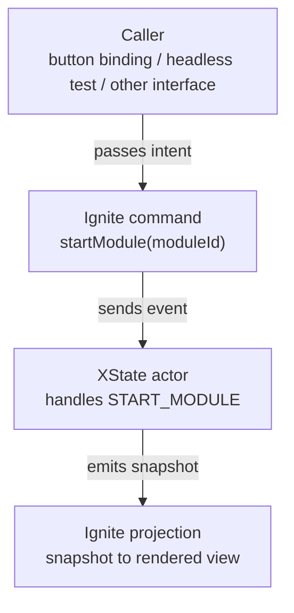

There was a time when writing the code was the hard part.

You had to remember the syntax, learn an unfamiliar API, and wire asynchronous logic carefully enough that it would survive timing, failure, and retries. I do not miss callback hell, but that friction did limit how quickly a vague decision could become part of a system.

Today, I can describe a feature and receive a plausible implementation in seconds. It may include loading states, error handling, retries, and tests. Sometimes it is shockingly good.

But I started noticing a different kind of failure.

The logic looked correct, yet the system still felt unstable. A small change required knowledge from several files. Tests passed, but the code felt risky to touch. Replacing an integration changed behavior that should have had nothing to do with the provider.

The problem was not syntax. It was not even the tool.

It was ownership.

## The bottleneck moved

AI is very good at completing the local story.

Ask it to load some data and it must decide where loading state lives, who calls the API, how errors are translated, and whether a retry belongs in the component, machine, or request helper. If those decisions are missing from the request, the implementation still has to put them somewhere.

Usually, it chooses the nearest convenient place.

That does not make the generated code inherently bad. A human working quickly will make the same choice. The difference is that we can now repeat the choice across a codebase much faster than we can inspect its consequences.

AI did not create unclear responsibility. It made unclear responsibility cheaper to multiply.

This is why I think the bottleneck moved. Producing a possible implementation is becoming easier. Deciding which part of the system is allowed to know, choose, mutate, start, stop, retry, and clean up is still design work.

That is the architectural work I care about.

## A small command with a hidden decision

I ran into this while dogfooding [Ignite Element](https://0xjcf.github.io/ignite-element/), a component runtime that projects actor state into Web Components.

As the maintainer, I often build small projects to stress-test the API against realistic behavior. These projects are not client case studies. They give me a place to see whether Ignite Element's contracts still make sense when the same behavior is exercised through a rendered interface and a headless runtime.

One of those projects included a screen that lists several modules. Each module has a Start button, an XState actor tracks which one is running, and Ignite Element renders the resulting state.

The first version of the command discovered the module ID from the rendered element:

```ts
commands: ({ actor, host }) => ({
  startModule: () =>
    actor.send({
      type: "START_MODULE",
      moduleId: host.dataset.moduleId ?? "missing",
    }),
});
```

Nothing about this looked alarming. It worked in the browser because the element contained the expected `data-module-id`. The `"missing"` fallback even looked defensive.

As part of that stress test, I tried to exercise the same behavior through the headless runtime.

The test did not need a DOM element. It only needed to say which module should start. But the command contract forced the test to create an element and attach data to it before it could express that intent.

That awkward setup was useful evidence.

When a test has to impersonate an unrelated boundary, the production contract may be giving that boundary too much responsibility.

Starting a module requires a module ID whether the request comes from a button, a test, a keyboard shortcut, or another interface. Reading `dataset` is only one way a browser view might find that value. It is not part of the application intent.

The command became:

```ts
commands: ({ actor }) => ({
  startModule: (moduleId: string) => {
    actor.send({ type: "START_MODULE", moduleId });
  },
});
```

The important change is not the extra parameter. It is the decision that disappeared from the command.

The caller now supplies `moduleId`. A browser binding may read it from the current view. A headless test can pass it directly. The command carries the request into the actor, and the machine defines whether that request is allowed in the current state.

That callback shape also became part of the Ignite Element v3 beta. The beta removes `host` from command and effect callbacks, so a callback no longer receives the rendered element as an implicit dependency. Commands receive explicit application inputs, while effects receive or close over the capabilities they need.

The tool sees a missing value and fills it. The architecture decides who was allowed to provide that value in the first place.


```mermaid
flowchart TB
  Caller["Caller<br/>button binding / headless test / other interface"]
  Command["Ignite command<br/>startModule(moduleId)"]
  Actor["XState actor<br/>handles START_MODULE"]
  View["Ignite projection<br/>snapshot to rendered view"]

  Caller -->|"passes intent"| Command
  Command -->|"sends event"| Actor
  Actor -->|"emits snapshot"| View
```

## The logic was correct. The boundary was not

The original command worked. That is what made the problem easy to miss.

Architecture problems rarely announce themselves with a syntax error. They appear later as knowledge that spreads farther than the change should require.

In this example, the ownership problem is concrete. The command knew how one browser view stored `moduleId`, and the headless test exposed that dependency by forcing us to recreate the view just to express the same intent.

That gives us a more useful question to ask during review:

> Does this part of the system know something because the behavior requires it, or only because one interface happens to provide it that way?

The behavior required a module ID. It did not require a `dataset`. That detail belonged to the browser binding.

Product policy should change when the product decision changes. An integration should change when the provider changes. Presentation should change when the experience changes. When those responsibilities are mixed, a change in one part travels through all three.

That is often the feeling behind, "The code works, so why is this so difficult to change?"

## Architecture distributes authority

When I say architecture, I am not talking about folder names, diagrams, or a prescribed number of layers. Those things can record a decision, but they cannot make the decision for us.

I am talking about the distribution of authority through a system:

- Who may interpret an intent?
- Who may decide whether it is valid now?
- Who may change state?
- Who may start external work?
- Who owns the result, failure, retry, and cleanup?

Responsibility and authority are related, but they are not the same.

**Responsibility** is what a part must do. **Authority** is what that part alone is allowed to decide.

In the Ignite example, the caller supplies the module it wants to start. The command translates that request into an actor event. The machine defines the legal transition. The running actor owns the state and lifecycle. The view renders the result.

The command is responsible for carrying intent, but it does not have authority to invent a transition. The view is responsible for presentation, but it does not have authority to mutate actor state. The actor owns the lifecycle, but it should not have to understand how a particular button encoded the request.

Once those rules are explicit, generated code has something concrete to follow. We can review whether a new implementation respects an existing owner instead of judging each callback in isolation.

## Why state machines help, and where they stop

[XState](https://stately.ai/docs/xstate) is useful here because it makes part of this authority executable.

States name the modes the system can be in. Events name the messages it can receive. Transitions say which changes are legal. When the machine runs, its actor owns the current state and processes those events over time.

That gives us concrete questions during review:

- Does this event exist in the protocol?
- Is it allowed in the current state?
- Which transition handles it?
- Which actor owns the resulting lifecycle?

There is an important caveat: making a contract executable does not make it a good contract.

A machine can faithfully accept a `MouseEvent` that should have remained in the UI. It can expose a provider payload that should have been translated at the boundary. It can divide one policy decision across several guards, actions, and adapters.

Invoking external work from a state is not automatically the problem either. A machine may own when and why work begins while a supplied actor or adapter owns how one attempt is performed. The boundary becomes useful when those responsibilities are explicit and the result returns as a fact the application understands.

XState helps us see the contract. It cannot choose the contract for us.

It also does not mean every function needs a machine. A pure calculation or stateless transformation may already have a clear owner. Actors become useful when behavior changes over time and the state, work, results, and cleanup need to remain coherent.

## How to recognize an ownership leak

The leak usually appears as friction around a change:

- A test must recreate a UI, provider, or runtime just to express application intent.
- The same decision appears in a component, handler, adapter, and state machine.
- Changing an API response forces unrelated behavior and presentation changes.
- Timing or message order changes the meaning of a result.
- The system works, but changing it safely requires someone who remembers its history.

None of these observations proves the boundary is wrong. They are signals that responsibility may be distributed more widely than the behavior requires.

That is enough reason to pause and ask who actually owns the decision.

## A responsibility check before implementation

Before I ask for more code, I now try to answer a few questions in plain language:

- Who is trying to make progress, and in what context?
- What observable result would tell us the behavior helped?
- What intent enters the system?
- Which part decides whether the request is valid now?
- Which part is allowed to change state?
- Which details belong only to the current UI, provider, or runtime?
- Could another caller express the same intent without pretending to be that interface?

Then I check whether the code tells the same story.

In the Ignite example, the answer is visible in the command signature and the event it sends. The caller provides `moduleId`. The actor receives `START_MODULE`. The machine defines the legal transition, and the running actor owns its execution over time.

This does not mean every dependency needs an adapter or every decision needs another interface. A boundary is useful when it stops one part from making a decision that belongs somewhere else. If it does not protect a meaningful decision, the extra abstraction probably makes the system harder to understand.

## The first draft is cheap

Faster implementation is a real advantage. I can explore an idea, discover where it breaks, and discard it without losing a day.

But the time saved by generation should create more room for judgment, not less.

AI did not change how systems work. It changed how quickly an unnamed assumption can become a dependency.

I do not think architecture matters more because AI writes worse code. It matters more because we can multiply ownership decisions faster than we notice them.

The first draft is becoming cheap. A coherent answer to who owns what is not.

## Next in the series

The project gave me a concrete behavior for stress-testing the Ignite Element API. Passing `moduleId` directly made `startModule` easier to exercise from both a browser binding and a headless test. That gives us evidence that the command no longer depends on one view's markup.

It does not prove that starting a module is the right feature for a client's product, and that was not the question this project could answer. The immediate question was whether Ignite Element lets a developer express the same intent across supported environments without carrying one view's markup into the command.

Before we model a command, actor, or port, we need to understand who is trying to make progress, what is getting in their way, and what evidence would show that the behavior helped.

That is where the next post, [*Product Framing Before Software Design: Deciding What to Build*](/writing/before-behavior-product-frame/), begins.

The examples in this series come from dogfooding Ignite Element. You can [read the v3 beta documentation](https://0xjcf.github.io/ignite-element/) or [follow the implementation and examples on GitHub](https://github.com/0xjcf/ignite-element/tree/beta).

<!-- CTA disabled until business site is ready.

If this resonated, there is a short diagnostic to help you determine whether the pain is structural or accidental.

[(external) When Code Is Cheap Diagnostic](https://bluejf.llc/products/when-code-is-cheap-diagnostic)

-->