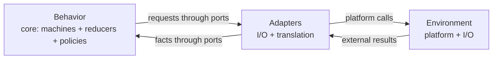

Earlier in my career, getting the implementation written was often the main constraint. Remembering syntax, learning unfamiliar APIs, and wiring asynchronous logic so it wouldn’t collapse under timing issues, failures, or retries took real effort.

Nested callbacks could turn control flow into a mess. Promises helped. Then `async` and `await` made the code easier to read. But none of those tools removed the need to understand what the system was actually doing.

Getting comfortable with JavaScript meant slowing down and learning what the language was really doing with objects, prototypes, functions, and inheritance. Copying the right syntax wasn’t enough. I wanted to understand why the code behaved the way it did.

That kind of knowledge still matters, but that has changed. Knowing every bit of syntax is no longer the thing that determines how quickly I can get a feature on the screen.

That slower process wasn’t inherently better, but a feature took long enough to build that I had more chances to notice which code owned a transition, what an error meant, and how external systems were allowed to affect it.

AI shortened the time between a request and a working first version.

I can now ask a model for a plausible implementation and receive one in seconds, often including loading states, error handling, and basic tests.

The harder work is deciding which part may change application state, call external systems, interpret failures, and own cleanup.

That is the claim behind the title. I don’t mean every feature needs more layers, interfaces, or diagrams. I mean those ownership rules determine how many places we have to change when a feature evolves.

That speed is useful. I can try an idea, see where it breaks, and discard it without losing a day.

Generated code is not inherently worse than handwritten code. The risk is that it can spread an unresolved ownership decision before we notice it. If an API lets several layers change the same workflow, every new use inherits that ambiguity.

The feature can look clean and pass its first tests even though no single part clearly owns failure, retry, or cleanup.

In my experience, that ownership problem becomes visible when a provider changes, a second interface needs the same behavior, or a failure no longer fits the assumptions of the first implementation.

We ran into this while building Ignite Element, a component runtime I’m working on. Imagine a screen that lists several modules, each with a Start button. An XState actor tracks which module is running, and Ignite Element renders that state.

Our first command did not receive the module ID directly. It found the ID on the rendered HTML element:

```ts
commands: ({ actor, host }) => ({
  startModule: () => {
    const moduleId = host.dataset.moduleId;
    actor.send({ type: "START_MODULE", moduleId });
  },
});
```

This worked in the browser because the element contained the expected `data-module-id`. It became awkward when we tested the same behavior without a browser. There was no HTML element to read, so the test had to construct one just to tell the command which module to start.

That was the clue. Starting a module was application intent, but its input was hidden inside the current presentation.

We changed the command to receive that intent explicitly:

```ts
commands: ({ actor, command }) => ({
  startModule: command((moduleId: string) => {
    actor.send({ type: "START_MODULE", moduleId });
  }),
});
```

The important change is the function signature. `moduleId` is now an argument instead of data discovered in HTML.

Now a button, test, command-line tool, or agent can provide the same module ID. The command forwards the request. The actor handles it according to the machine’s transitions, and the view displays the resulting state.

AI didn’t create that contract. It made it easier to produce reasonable-looking uses of every capability the contract exposed before we had decided which layer should own each decision.

## Architecture is about who owns what

When I say architecture, I don’t mean folder structure, diagrams, or a prescribed number of layers. Those things can record a decision, but they don’t make the decision for us.

I use architecture to answer two practical questions: which part owns each behavior, and what is that part allowed to decide?

Here, behavior means the rules that decide how the application responds to an event: whether a transition is allowed, how state changes, what work begins, and how a result is interpreted. Responsibility is what a part must do. Authority is which decisions only that part may make.

In the Ignite example, the view may expose a `startModule` command and display the resulting state. It cannot mutate actor state or add a transition that the machine does not define.

Once those rules are explicit, we can review whether generated code follows them: commands may send intent but cannot read the DOM; adapters may call external APIs but must translate their results; views may render state but cannot change actor state.

When the rules are implicit, each new implementation makes the decision locally. One callback may retry a failure while another treats it as final. A later change then requires tracing the same policy through several files.

This way of thinking isn’t new. Software design has always had to ask who is responsible for what and who is allowed to decide.


```mermaid
flowchart LR
  BEH["Behavior<br/>core: machines + reducers + policies"]
  AD["Adapters<br/>I/O + translation"]
  ENV["Environment<br/>platform + I/O"]

  BEH -->|requests through ports| AD
  AD -->|facts through ports| BEH
  AD -->|platform calls| ENV
  ENV -->|external results| AD
```

In this model, the machine or reducer owns application decisions. The adapter owns I/O and translation. The environment supplies mechanisms such as `fetch`, a database, a filesystem, or a clock.

A port names what the application may ask the environment to do and what result it expects back. In the loader example below, `loadData` names the requested work and `Data` describes the expected result. The adapter implements that contract with `fetch` and converts network responses into application data or errors.

The diagram shows ports on the arrows rather than as another runtime box. In TypeScript, a port and its adapter may each be a single function, which is why they can look like the same thing. The port defines the request and result. The adapter performs the I/O and translation for a browser, server, or test.

The adapter calls those mechanisms and maps their results into application types. Behavior decides what happens next. In the small example below, every failed load enters `error`, where `RETRY` is allowed.

Requests and results cross the adapter in both directions. That lets us replace an HTTP adapter with a test implementation without moving the retry rule out of the behavior.

The useful test is not whether the diagram has three boxes. It is whether the code prevents one layer from making another layer’s decision.

If a boundary does not restrict a decision, prevent an unwanted dependency, or translate data, it has only added another interface to maintain.

## What XState makes explicit

With [XState](https://stately.ai/docs/xstate), those ownership rules become executable: states name the modes, events name the messages, transitions say which changes are legal, and actors run the behavior over time.

I had often seen asynchronous behavior split across callbacks, flags, and component hooks. A machine puts the transition rules in one place that can be inspected and tested.

A statechart also gives generated handlers rules we can check: Does this event exist? Is it allowed in the current state? Which state owns the resulting work?

The first example only needs a simple machine.

You don’t need an actor-model background to follow the example. For now, three ideas are enough:

- A **machine** describes behavior.
- A **machine actor** is that behavior running. It owns its state, receives events, and changes over time.
- An **invoked actor** is child work started by a state and stopped when that state is exited.

Start with the story, not the notation: the actor is idle, receives `LOAD`, starts some work, and then succeeds or fails. In this example, `loadData` performs one attempt. The machine decides whether another attempt may begin.

```ts
import { createActor, createMachine, fromPromise } from "xstate";

const dataMachine = createMachine({
  initial: "idle",
  states: {
    idle: {
      on: {
        LOAD: "loading",
      },
    },
    loading: {
      invoke: {
        src: "loadData",
        onDone: {
          target: "success",
        },
        onError: {
          target: "error",
        },
      },
    },
    success: {
      on: {
        RELOAD: "loading",
      },
    },
    error: {
      on: {
        RETRY: "loading",
      },
    },
  },
});
```

Read it from top to bottom:

1. An actor created from this machine starts in `idle`.
2. A `LOAD` event moves it to `loading`.
3. Entering `loading` starts the `loadData` actor.
4. Completion moves the workflow to `success`; failure moves it to `error`.
5. `RETRY` or `RELOAD` starts a new attempt.
6. Leaving `loading` stops the invoked actor if it is still active.

That is the complete lifecycle represented by this small example. The machine owns this sequence without choosing a transport or provider.

The machine definition declares that entering `loading` starts the [`loadData` actor](https://stately.ai/docs/invoke). Exiting `loading` tells the XState runtime to stop it.

That doesn’t mean cancellation happens by magic. Stopping a [promise actor](https://stately.ai/docs/promise-actors#stopping-promise-actors) discards a late result, but the underlying operation still has to participate. For `fetch`, the promise actor can pass XState’s `AbortSignal` to the request. A [callback actor](https://stately.ai/docs/callback-actors) can return cleanup logic.

`loadData` names the work without hardcoding how it is performed. A provided actor can use HTTP, a queue, a local file, or a test fixture while the machine keeps the same states and events.

Because the machine does not import platform APIs, we can use it in a browser, a Node process, or a test and provide different `loadData` actor logic in each.

Let’s say `apiLoadData` is the production actor logic—maybe a promise actor created with `fromPromise`. The production and test versions both return the same application-level `Data` shape. Here, a contract simply means what the machine is allowed to expect:

```ts
type Data = {
  items: string[];
};

type ApiResponse = {
  records: Array<{ label: string }>;
};

function hasLabel(value: unknown): value is { label: string } {
  return (
    typeof value === "object" &&
    value !== null &&
    "label" in value &&
    typeof value.label === "string"
  );
}

function parseApiResponse(value: unknown): ApiResponse {
  if (
    typeof value !== "object" ||
    value === null ||
    !("records" in value) ||
    !Array.isArray(value.records) ||
    !value.records.every(hasLabel)
  ) {
    throw new Error("Invalid data response");
  }

  return { records: value.records };
}

const apiLoadData = fromPromise<Data>(async ({ signal }) => {
  const response = await fetch("/api/data", { signal });

  if (!response.ok) {
    throw new Error("Could not load data");
  }

  const result = parseApiResponse(await response.json());

  return {
    items: result.records.map((record) => record.label),
  };
});

const productionMachine = dataMachine.provide({
  actors: {
    loadData: apiLoadData,
  },
});

const testMachine = dataMachine.provide({
  actors: {
    loadData: fromPromise(async (): Promise<Data> => ({
      items: ["fixture"],
    })),
  },
});

const dataActor = createActor(productionMachine).start();

dataActor.send({ type: "LOAD" });
```

`parseApiResponse` checks the unknown JSON before the adapter maps it into `Data`. The machine receives application data or an error, never a raw `Response` or provider payload.

`.provide()` supplies the HTTP actor in production and an in-memory actor in tests. The machine’s states and start-and-stop rules stay the same, and the test exercises its transitions without making a network request.

If you’ve used dependency injection, that part will feel familiar. The machine definition also shows which state invokes the work and when the runtime stops that actor.

In the earlier diagram, `dataMachine` is behavior, `apiLoadData` is an adapter packaged as XState actor logic, and the network is the environment. `onDone` and `onError` turn the result into a success or error transition.

XState also lets guards, actions, delays, and actors be referenced by name and [supplied as implementations](https://stately.ai/docs/machines#providing-implementations). A guard decides whether a transition is allowed. An action runs as part of a transition but does not own an independent lifecycle. In this example, work whose completion, failure, or cancellation changes behavior belongs in an actor.

Those primitives do not decide where every rule belongs. The machine may own both workflow and domain policy, or it may call a pure function or another actor for a domain decision.

A real system may distinguish retryable failures from final ones. The adapter should translate transport failures into application-level error facts; the machine or a pure policy function should make the retry decision.

Through its [inspection API](https://stately.ai/docs/inspection), XState can report actor creation, sent events, snapshots, and transition steps. Its [graph utilities](https://stately.ai/docs/graph) can derive possible paths through the machine.

The same machine definition can be reviewed before execution, run in production, and inspected in tests. That reduces the chance that the design, implementation, and tests describe different workflows.

XState does not prevent a poor contract.

If `loadData` exposes raw provider responses or transport-specific errors, the statechart may still become coupled to details that should have been translated first. If two actors both decide what the same failure means, naming them does not resolve the split authority.

XState shows which actor owns a transition. It cannot tell us whether that actor should own it.

Not every small application needs a state machine, and not every asynchronous function needs its own actor. A function may be enough when its caller can own invocation, cancellation, cleanup, and result handling without giving the work an independent lifecycle.

### What I carried into Actor-Web

I use the same ownership rules in [Actor-Web](https://0xjcf.github.io/actor-web/), a JavaScript runtime I’m building for actors that communicate through messages.

Actor-Web can run an XState machine directly. A behavior with only a few state-and-event transitions can use a smaller transition map. In either case, one owner decides which transitions are legal, actors exchange messages, and adapters call the network, DOM, filesystem, or transport.

## A quick responsibility check

Before asking for an implementation, I write down which part may change state, which adapter touches the network or DOM, and what result comes back. I ask:

- Can I point to the machine or function that decides whether each event causes a transition?
- Can I list the code allowed to call the network, filesystem, clock, or DOM?
- Do adapter outputs use application types instead of provider responses?
- Can I replace a provider without changing transition rules?
- Which trace or test covers the start, success, failure, and cancellation paths?

The answers can be checked in imports, callback types, and tests: which modules call `fetch`, which callbacks send actor events, and which data types cross a boundary.

Not every dependency needs an adapter. Not every internal decision needs a new abstraction.

One sign a boundary is useful is that we can replace one API client with another, or a browser adapter with a test implementation, without rewriting the behavior itself. If every change still crosses the boundary, the abstraction is not helping.

## Next in the series

Finding the same retry or error rule in a component, adapter, and test tells us ownership is unclear. It does not tell us where that responsibility begins and ends.

Structure alone rarely answers that. One useful clue is lifecycle: what starts, changes, fails, recovers, and must remain coherent as time passes.

That’s the question the next post, [*Lifecycle Is the Real Boundary*](/writing/lifecycle-is-the-real-boundary/), takes up.

<!-- CTA disabled until business site is ready.

If this resonated, there is a short diagnostic to help you determine whether the pain is structural or accidental.

[(external) When Code Is Cheap Diagnostic](https://bluejf.llc/products/when-code-is-cheap-diagnostic)

-->
